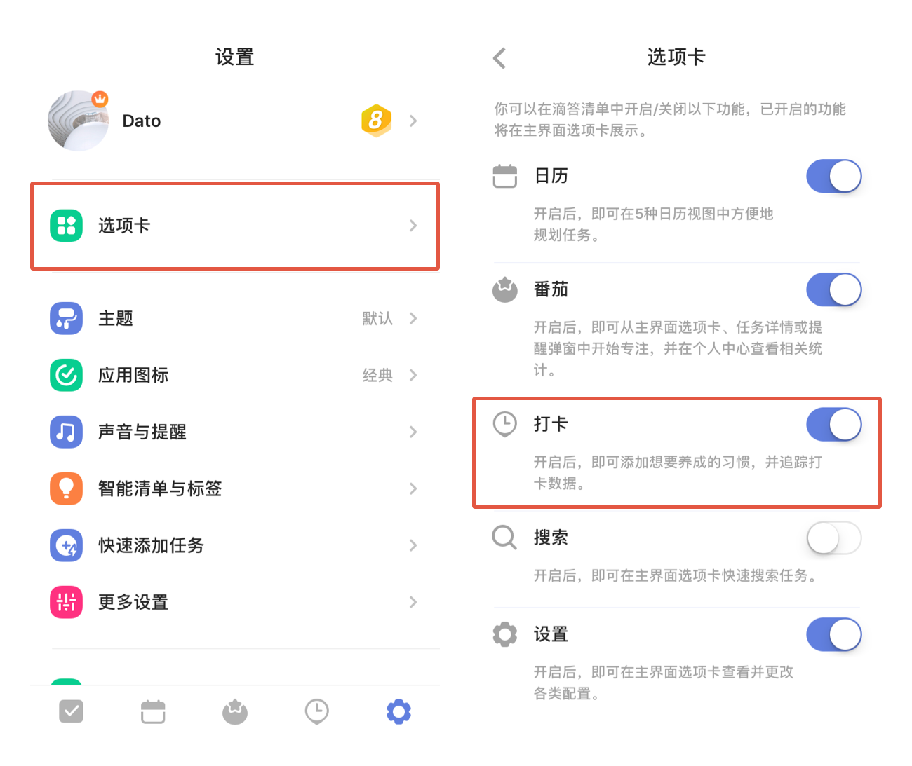
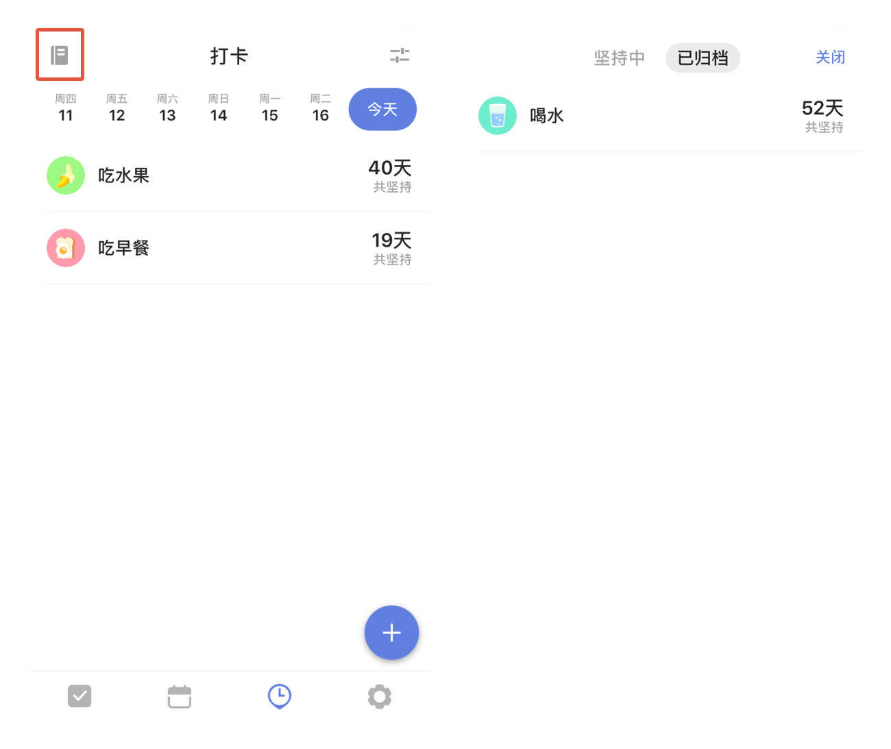
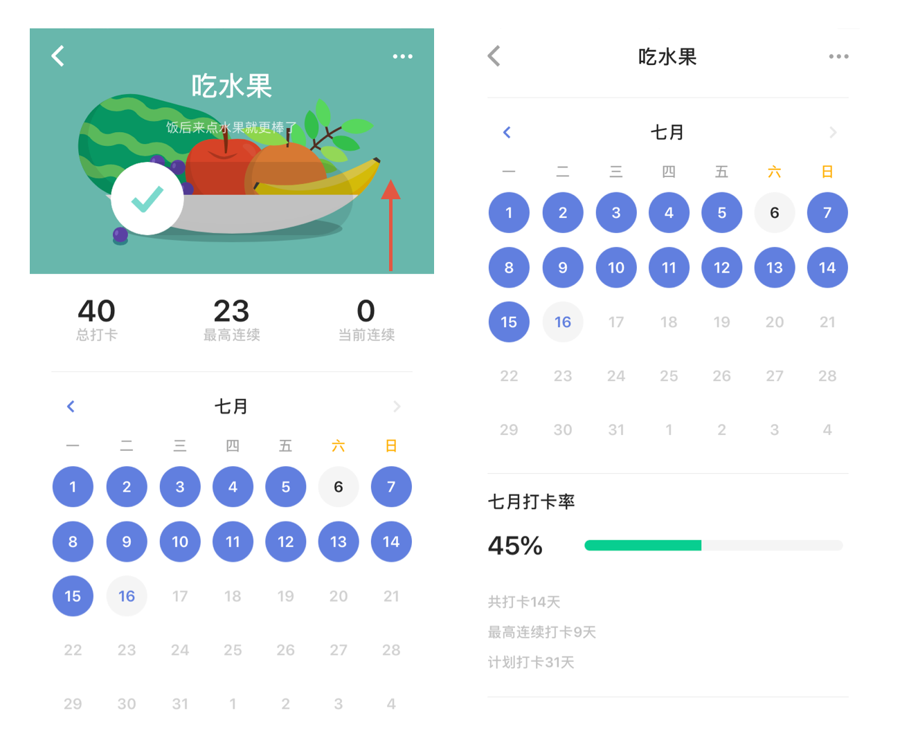

## 添加打卡
#### 开启/关闭
进入「设置」-「选项卡」- 打开「打卡」，主界面底部 TAB 栏将会出现打卡选项（打卡默认关闭）。

#### 添加习惯

在习惯界面点击「+」键，弹出习惯库，在习惯库中选择想要创建的习惯，或者另行创建自定义习惯。
`注：普通账户最多只可设置 3 个习惯，高级账户无限制。`

#### 编辑习惯

将习惯向**左滑**即可编辑习惯，修改习惯**名称**、**图标**、**鼓励语**。
还可以设置习惯打卡的**频率**（**按天**或者**按周**计算）和**提醒时间**（可以添加多个提醒）。
同时也可以设定自己的习惯目标，比如**一天阅读五页书籍**

####打卡归档

可以将暂时不需要打卡的习惯进行归档。
点进该习惯主界面，点击右上角的「···」，选择「归档」即可。
`注：如果选择「删除」，那么该习惯的所有打卡数据都将删除，且无法恢复`。

另外，可以点击打卡主界面左上角的图标，查看「已归档」的习惯，左滑该归档习惯可以选择**恢复打卡** 或者**删除习惯**。

####打卡统计

可以点击习惯，在打卡动画界面中上滑，即可呼出该习惯的打卡统计。
`注：今天之前的日期都可以进行补打卡操作。`

####习惯显示 & 打卡日志

点击打卡主界面右上角的图标，可以设置打卡的**铃声**，是否显示打卡日志以及选择是否在**日历**和**智能清单**“今天”、“最近7天”中显示。

