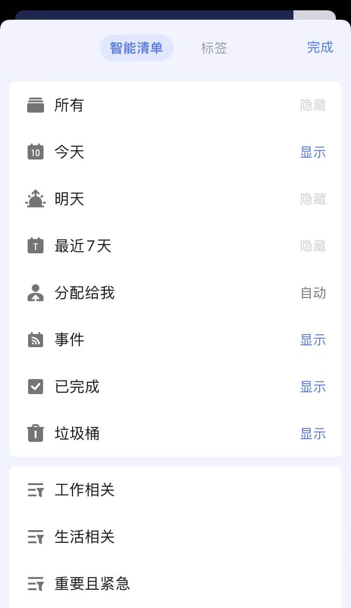

## 智能清单

### 管理智能清单

「今天」「明天」「最近七天」「分配给我」等清单属于智能清单，您可以直接将任务创建到智能清单中，任务将会自动设置成对应的日期。  `注：智能清单是不能被分享、不能被排序的。「分配给我」中不能直接创建任务。`

在主页面中点击下方「设置」-「智能清单与标签」，即可对智能清单进行管理。

### 自定义智能清单

点击「设置」-「智能清单与标签」-「添加智能清单」即可添加自定义智能清单。

按**普通**方式添加，即根据「清单」「日期」「优先级」「标签」「分配给」五个筛选条件对任务进行筛选条件，创建新的智能清单。  `注：如果当前没有带标签任务和共享清单时，「标签」和「分配给」将不显示。`

按**高级**方式添加，即根据「清单」「日期」「优先级」「标签」「分配给」五个筛选条件和「没有逻辑」「且」「或」三个逻辑进行筛选，创建个性化的智能清单。

您也可以对自定义智能清单进行编辑和删除。 删除自定义智能清单时，其中的任务不会被删除。

### 自定义智能清单特殊规则

滴答清单提供了一些逻辑运算符，通过简单的逻辑关联，帮助你准确的筛选出需要的任务。

#### 逻辑关联

你可以使用“且”逻辑、“或”逻辑来关联前后两个筛选条件。并且，在同一个筛选条件（仅标签支持）内，也可以选择使用“且”逻辑、“或”逻辑。

#### 常用筛选规则示例

| 规则 | 说明 |
| --- | :---: |
| 今天 **或** 高优先级 | 显示“今天”或“高优先级”的任务 |
| 最近7天 **且** 分配给我 | 显示“最近7天”里分配给我的任务 |
| (今天 **或** 已过期) **且** 高优先级 | 显示“今天”或“已过期”里高优先级的任务 |
| (#电脑旁 **且** #工作) | 显示同时包含标签“#电脑旁”和“#工作”的任务 |
| 收集箱 **且** 没有日期 | 显示收集箱清单里的没有日期的任务 |
| (工作 **或** 团队) **且** 高优先级 | 显示“工作”或“团队”清单里高优先级的任务 |
