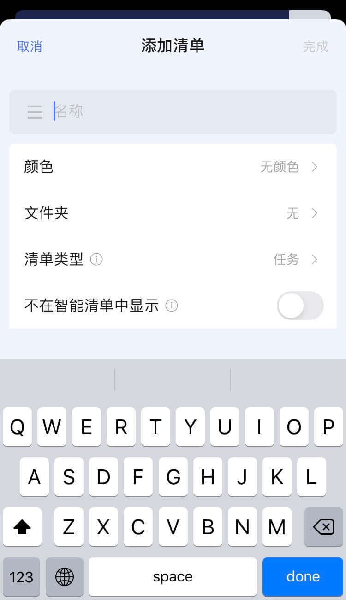
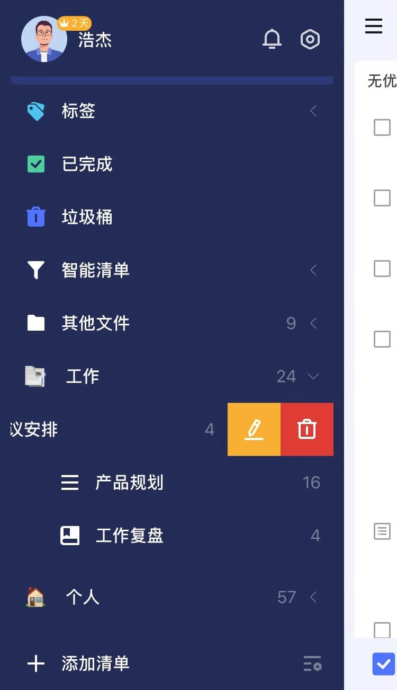

## 创建与管理清单

### 新建清单

点击左侧边栏底部「添加清单」，即可创建一个新的清单。滴答清单支持用 Emoji 创建清单名，同时可使用 Emoji 作为清单标识。

您可以为清单命名，设置清单颜色，将清单添加到清单文件夹，也可以隐藏该清单。 开启「不在智能清单中显示」后，该清单的任务将不会出现在「所有」「今天」「最近七天」等智能清单中，但到期仍会提醒。

### 编辑清单

对已经创建好的清单，需要更改名字、颜色和所属文件夹等属性，只需进行以下操作：

* 在左侧边栏中，对需要操作的清单向左滑动 - 点击「铅笔」图标，可以对清单进行编辑。
* 

### 文件夹

随着清单数量越来越多，可以使用清单文件夹来整理您的清单。

适用场景： 例如，购物文件夹中可以整理出超市购物清单、商场购物单、网购清单等；读书文件夹可以分出小说清单、学习书单等。将相同类型或者是同一项目的清单放在一个文件夹中，会让您的清单列表看上去更加整洁有条理。

* **创建文件夹**：长按一个清单拖动到另一个清单至重叠，松手后在弹窗内输入文件夹名称即可创建一个新的清单文件夹。或者在清单编辑界面中来创建新的文件夹。 在清单列表可以直接拖动清单到文件夹，也可以拖动清单移出文件夹。

* **编辑文件夹**：对需要操作的清单向左滑动，选择铅笔图标，可以对文件夹进行编辑。

* **解散文件夹**：对需要操作的清单向左滑动，点击解散图标即可解散文件夹。解散后，文件夹中的清单不会被删除，会独立出来显示在左侧边栏。
  
### 清单排序

在左侧边栏中，可以直接拖动智能清单、普通清单和自定义智能清单进行排序。

### 分享清单

将清单以及清单内的任务标题和时间以文字或图片的形式分享出去，适用于交代行程安排和项目进度。

在左侧边栏中，点击清单进入清单列表 - 点击右上角「···」，选择「分享」。在跳转的界面选择分享途径和对象，确认即可分享。

### 共享协作

如果您需要邀请他人协作，可以与他们进行清单共享。 共享清单中的任务可以指派给参与共享的成员。

在侧边栏中，点击清单进入清单列表 - 点击右上角「···」，选择「共享协作」- 在跳转页面选择「邀请新成员」，即可选择成员进行共享，更多详情参见[共享协作](/iOS/collabration/sharedlist.md))。

### 隐藏清单

进入清单编辑界面，启用「不在智能清单中显示」即可。共享清单隐藏后，如果没有分配给您的任务，将不会有团队任务出现在「所有」「今天」「最近七天」等智能清单中，但是还是会提醒。要开启「勿扰」开关后，清单中没有分配给自己的任务才不会提醒。

### 关闭清单

为了保持界面清爽，同时提高应用运行速度，您可以将不常用的或者不活跃的清单暂时关闭。在左侧边栏中，对需要操作的清单向左滑动 - 点击「铅笔」图标，启用「关闭清单」按钮，该清单即会被关闭。

关闭清单后，清单内任务将不再出现在「所有」「今天」「最近7天」等智能清单和搜索结果中，清单中的任务也不会再收到提醒。

### 删除清单

在左侧边栏中，对需要操作的清单向左滑动，选择「删除」图标；或者进入清单编辑界面，点击页面尾部的「删除清单」，该清单就会被删除。 清单和清单下的任务会同时被删除。

共享清单只有发起者可以删除，共享成员不能删除清单，只能点击「退出共享清单」。

