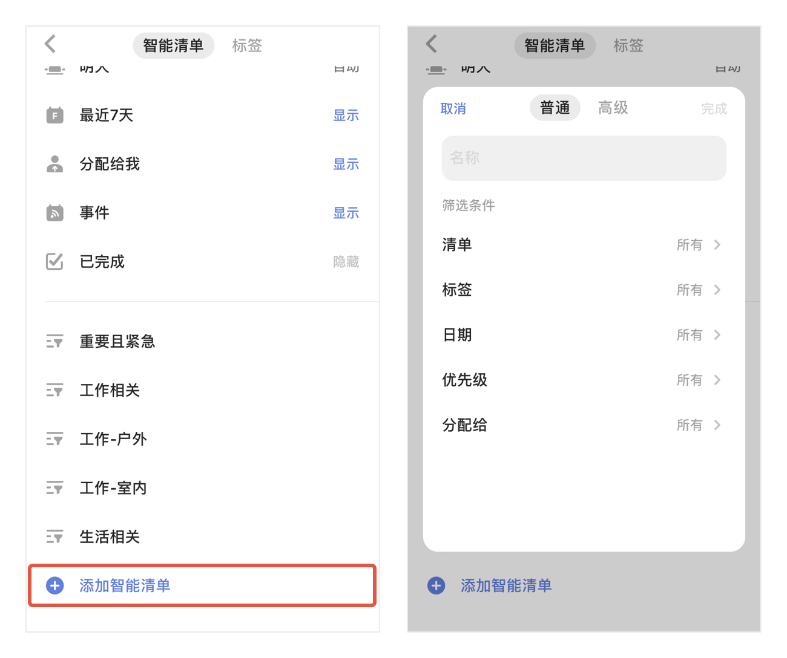
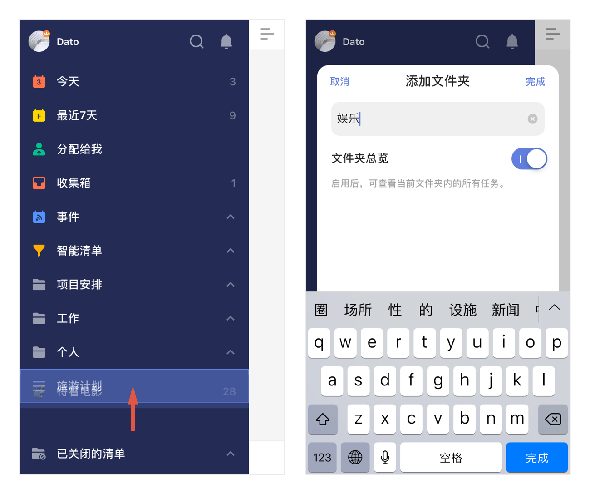

### 创建清单

清单是最常用的一种任务管理方式，可以根据类别、地点或使用目的自由创建。

#### 新建清单

* 在侧边栏中，点击最下端「添加清单」。
* 输入清单名称，设置颜色，清单属于个人/团队，清单所属文件夹以及是否在智能清单中显示，即可创建一个清单。
   `注：开启「不在智能清单中显示」开关，则该清单的任务不再显示在智能清单中，但到期仍会提醒。`
* 新的清单建立好后，在清单内创建的任务会默认属于该清单。  
* `注：免费账户的普通清单，限制为 9 个。`

 `注：滴答清单支持用 Emoji 创建清单名，同时在清单名前输入 emoji，也可使用该 emoji 作为清单标识。`

#### 编辑清单

对已经创建好的清单，需要更改名字、颜色和所属文件夹等属性，只需进行以下操作：

* 在侧边栏中，对需要操作的清单向左滑动 - 点击「铅笔」图标，可以对清单进行编辑。

#### 智能清单

「今天」「明天」「最近七天」「分配给我」等清单，是智能清单。

可以直接将任务创建到智能清单，会依据清单的相应属性直接为任务设定到期时间。  `注：智能清单是不能被分享、不能被排序的。`  `注：「分配给我」中是不能直接创建任务的。`

如果要管理这些清单，需要进行以下操作：

* 在主页面中，点击下方「设置」-「智能清单与标签」，点击需要操作的清单名称至显示、隐藏、自动，保存设置即可。
   `注：若「明天」智能清单选择自动，当有日期为明天的任务时，「明天」智能清单才会在侧边栏上显示。`

##### 自定义智能清单：

###### 普通智能清单
在「设置」-「智能清单与标签」中，点击下方「添加智能清单」-「普通」，可以根据「清单」、「标签」、「日期」、「优先级」、「分配给」五个筛选条件创建智能清单。  `如当前没有带标签的任务，则筛选项不含「标签」；如当前没有共享清单，则筛选项不含「分配给」。`

###### 高级智能清单
在「设置」-「智能清单与标签」中，点击下方「添加智能清单」-「高级」，可以根据「清单」、「标签」、「日期」、「优先级」、「分配给」五个筛选条件，以及「没有逻辑」、「且」和「或」三个逻辑来创建高级智能清单。

#### 隐藏清单

你也可以将不常用的清单隐藏起来，被隐藏的清单会显示在左侧边栏，到期任务依然会提醒，但是清单中的任务不会出现在智能清单中。

* 在侧边栏中，对需要操作的清单向左滑动 - 点击「铅笔」图标，可以对清单进行编辑。
* 启用「不在智能清单中显示」按钮，该清单即会被隐藏。  
   `注：若隐藏共享清单，则清单中没有分配给自己的任务，不会在智能清单中显示，但是还是会提醒。要开启「勿扰」开关后，清单中没有分配给自己的任务才不会提醒。`

#### 关闭清单

为了保持界面清爽, 同时提高应用运行速度, 你可以将不常用的或者不活跃的清单暂时关闭。  `注：关闭清单后，清单内任务将不再出现在「所有」「今天」「最近7天」等智能清单和搜索结果中。同时，清单中的任务也不会再收到提醒。`

* 在侧边栏中，对需要操作的清单向左滑动 - 点击「铅笔」图标，可以对清单进行编辑。
* 启用「关闭清单」按钮，该清单即会被关闭。

#### 删除清单

在侧边栏中，对需要操作的清单向左滑动，选择「删除」图标；或者进入清单编辑界面，点击页面尾部的「删除清单」，该清单就会被删除。  `注：清单和清单下的任务会同时被删除。`  
共享清单只有发起者可以删除，共享成员不能删除清单，只能点击「退出共享清单」。

#### 分享清单

将清单以及清单内的任务标以文字或图片的形式分享出去，适用于交代行程安排、项目进度等事件。

* 在左侧边栏中，点击清单进入清单列表 - 点击右上角「···」图标，选择「分享」。
* 在跳转的界面选择分享途径和对象，确认分享。

#### 共享协作

如果你需要邀请好友、家人或同事协作，可以共享清单给他们。

* 在侧边栏中，点击清单进入清单列表 - 点击右上角「···」图标，选择「共享协作」- 在跳转页面选择「邀请新成员」，可以通过三种方式进行邀请：

  * **联系人**：显示最近几个联系人，可以选择一个或者多个。也可以输入好友的邮箱地址，可以是之前没有注册过滴答清单的邮箱。我们会将分享邀请发送至该邮箱地址，通过点击邮箱内的链接来激活共享。
  * **通过共享链接**：点击即创建一个链接共享清单。直接选择分享途径或者是复制链接发送给自己的好友。好友确认后会发送一个申请加入清单的通知到你的滴答清单账户。只有你确认同意该申请之后，这个清单才被成功分享。
  * **通过微信二维码**：通过扫描二维码加入共享清单，也可以邀请微信好友加入共享清单。

详情请参照[共享和协作](../collaboration.md)。

#### 文件夹

随着清单列表越来越长，有时不得不下拉到底部查看清单内容，可以使用清单文件夹整理你的清单列表。

* 创建文件夹：  
  长按一个清单拖动到另一个清单上至重叠，松手后可以创建一个新的清单文件夹，输入清单文件夹名字即可。或者通过将清单编辑界面中的文件夹来添加新的清单。拖动清单至文件夹中或者拖动将清单从文件夹中移出。
   `注：新建清单默认为展开状态，单击清单文件夹名称可以折叠收起。`
	

* 编辑文件夹：  
  对需要操作的清单向左滑动，选择铅笔图标，可以修改文件夹名字。

* 解散文件夹：  
  对需要操作的清单向左滑动，选择解散图标，解散清单文件夹其中的清单不会被删除。
	 `注：解散文件夹后，其中的清单会独立出来显示在左侧边栏。`
	
	#### 清单排序

在侧边栏中，智能清单、普通清单和自定义智能清单可以在自己的区域内直接拖动排序。

