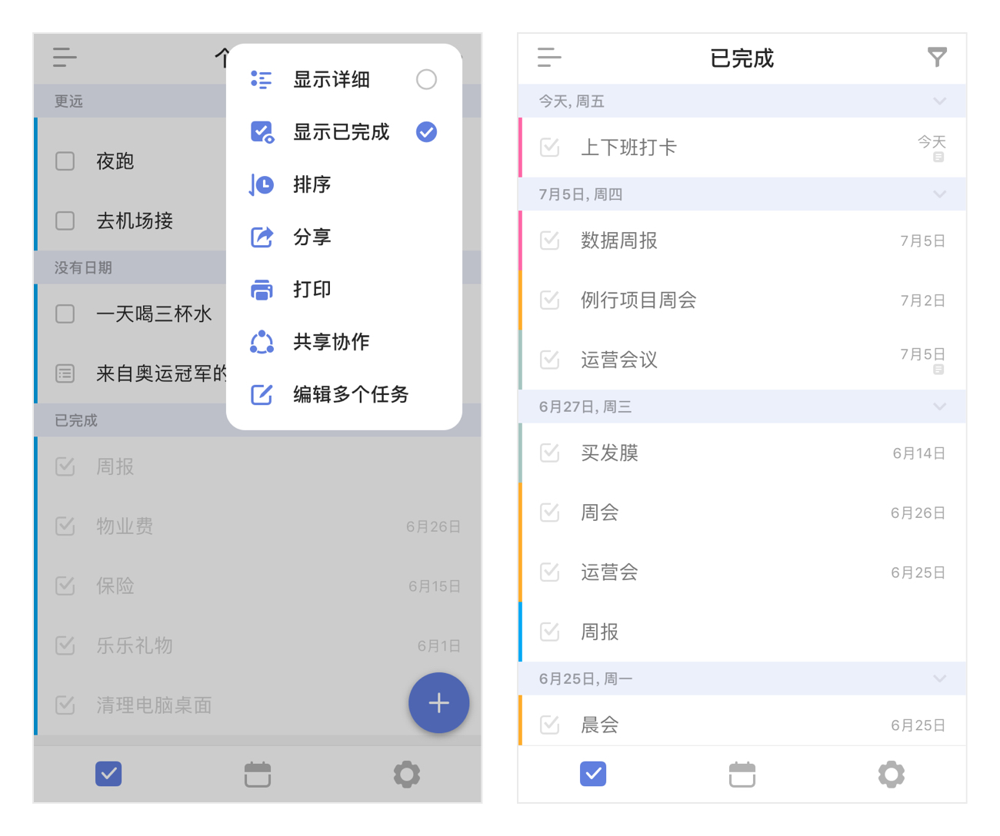
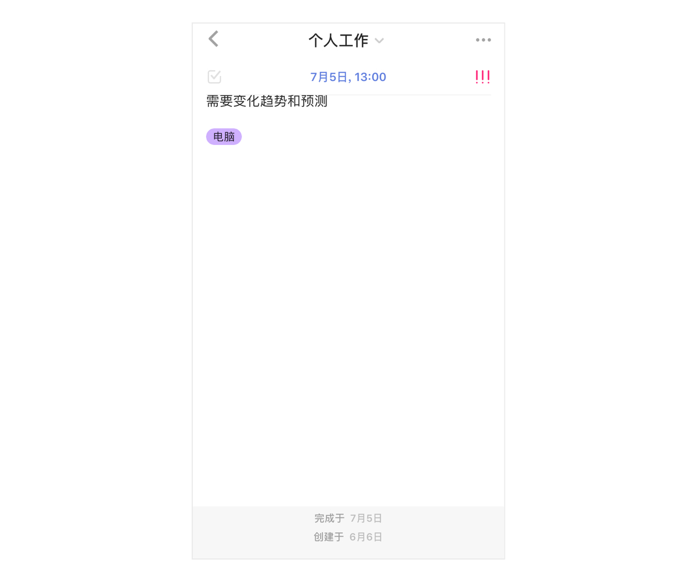
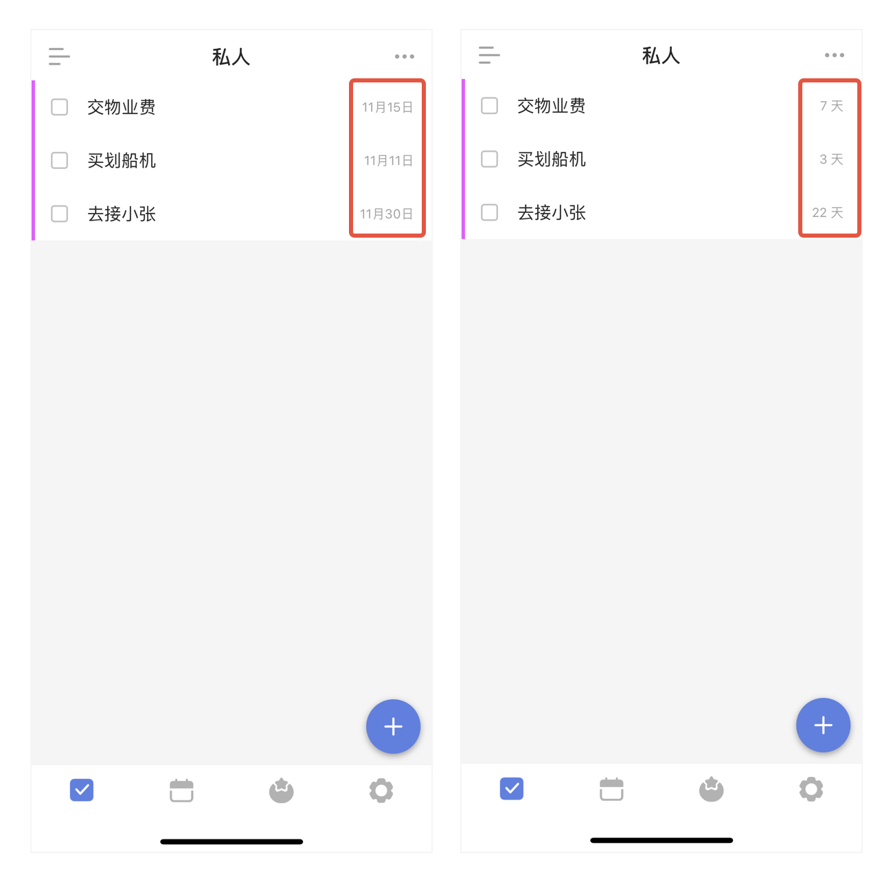

## 管理任务

滴答清单为您提供了多种不同的方式来管理您的任务，让您的生活变得井井有条。

### 移动任务

进入任务的详情页，点击页面上方的所属清单，即可更改任务所属的清单。 或者您可以通过在列表页左滑任务来快捷移动清单。

### 删除

进入任务详情页，点击右上角「···」- 选择「删除」，或在任务列表页上左滑任务点击「垃圾桶」图标，来删除任务。若误删任务，可以点击弹出的「撤销」按钮来恢复任务。 如果是共享清单中的任务，则所有共享者清单中的该任务都会被删除。

### 对任务排序

为了清晰地查看自己的任务，滴答清单提供了以下排序方法：

* **按自定义排序**：该排序模式下，长按拖动根据自己的需求排序；
* **按时间排序**：该排序下会将任务按「已过期」「今天」「最近7天」「更远」区分排序。长按任务可以拖动排序，拖到对应的时间区域，智能设置时间；
* **按标题排序**：按任务标题的首字母排序；
* **按标签排序**：按任务所携带的标签进行排序；
* **按优先级排序**：该排序下会将任务按高、中、低、无优先级四个等级排序。长按拖动任务从一个等级区域到另一个等级区域，智能更改任务的优先级；
* **按指派人排序**：只在共享清单中会使用此种排序方式。为了合作完成某个项目而共享清单时可以使用这种排序方式，按任务的指派人排序，清晰明确每人的任务；
* **按清单排序**：只在智能清单、自定义智能清单以及清单文件夹「所有任务」清单中有「按清单排序」。方便区分个人任务和工作任务，同时可以了解各个清单下的任务情况。

在任务列表中，点击右上角「···」，选择「排序」即可。在按日期排序、按优先级排序和按自定义排序的模式下，还可以通过长按任务拖动来调整顺序。

### 搜索任务

支持任务搜索功能。在搜索框中输入关键字，即可搜索任务。在任务列表界面轻轻下拉，清单标题下方将出现搜索栏。

或者点击「设置」-「功能模块」-「搜索」，即会在主界面底部显示「搜索」选项卡，可直接在此处进行搜索。

### 批量操作

当任务较多，需要进行相同的设置操作时，可以通过批量操作来进行。 

进入任务列表页，点击右上角「···」，选择「编辑多个任务」，选中需要编辑的任务就可以快速编辑了。可以批量修改优先级、修改标签、分享、复制任务、合并任务。 

若选中2个及以上任务，可以合并任务成新任务，新任务将以子任务形式呈现，默认合并到「收集箱」。 合并成的新任务不再保留原任务的附件和评论信息，且原任务将被删除。

### 分享任务

将任务以文字或图片的形式发送出去，适用于通知、共享资料等需要分享任务内容的事件。

进入任务详情页，点击右上角「···」，选择「分享」，选择发送途径和对象，确认发送即可。

### 隐藏已完成的任务

完成任务之后，如需要，可以隐藏已完成任务。

进入清单页，点击右上角「···」，不选中「显示已完成」即可。隐藏之后，可以在「已完成」智能清单中查看任务。

`注：「已完成清单」是智能清单且默认隐藏，需要在智能清单中开启显示后才能查看。设置 - 智能清单 - 显示「已完成」。`

### 计划

进入「今天」智能清单，点击右上角小圆圈，可以一次性对到期日为今天的任务和子任务、过期的任务和子任务和收集箱中无日期任务进行处理。

底边栏有「完成」、「今天」、「以后」、「删除」、「下一条」五个按钮，能够灵活修改任务到期日和提醒时间。 

如果是今天或过期的子任务，底边栏显示的是「完成子任务」。如果子选择了隐藏子任务，子任务是不会显示在计划中的。

### 任务进度

进入任务详情页，左右拖拽日期栏，可对任务设置进度条百分比。如果是列表任务，会根据已完成子任务所占的比例自动计算任务进度。

### 任务动态

你可以在任务详情中查看任务动态，了解任务每一次改动的信息。滴答清单提供两种方式查看任务动态：动态概要和完整动态。

#### 查看动态概要

进入任务详情后，向上轻拉界面，即可在底部查看以下动态信息：

* 任务的创建日期；
* 任务的完成日期。

#### 查看完整动态（高级功能）

进入任务详情后，点击右上角「···」，点击「动态」即可进入完整的动态界面，你可以在这里查看以下动态信息：

* 任务的创建日期；
* 任务的标题/内容改动记录；
* 任务的日期改动记录；
* 附件的上传/删除记录；
* 指派人改动记录；
* 任务的完成日期。

### 任务倒数日

在任务列表找到想要查看倒数日的任务，点击任务下方的截止日期，会自动切换到任务倒数日。 不需要时，可以再次点击任务右侧的倒数日，切换回截止日期的显示。

