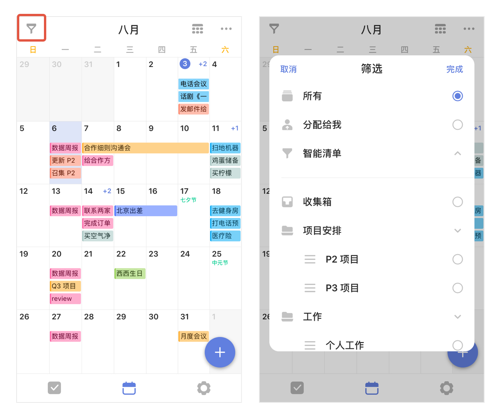

### 日历

日历视图可以帮助你更直观地查看自己的任务计划，安排日程。

在主页面下方点击【日历】tab，进入日历页面，默认显示列表视图。

#### 筛选日历中的任务

在日历视图中，点击左上角按钮，可以选择在日历中显示某一清单中的任务。

#### 切换月视图/周视图

当每日任务比较多的时候，可以在列表视图中向上滑动，切换至周视图，下方区域可以显示更多的任务。

#### 切换列表视图/月视图/三日视图

点击日历右上角的切换按钮可以切换列表视图、月视图、日视图、三日视图和周视图，直观显示月度计划，或按照时间轴查看最近三天的任务安排。  `注：月视图、日视图、三日视图和周视图为高级账户功能。`

#### 显示任务内容

您可以在日历视图的右上角点击“...”，点击【显示详细】使任务的一些属性如时间、所属清单、地点等。

点击【显示已完成】，会使已完成的任务也出现在日历视图中。

点击【显示子任务】，已经设定好时间的子任务也会出现在日历视图中。

点击【显示所有重复周期】，设置重复提醒的任务会在日历中的重复周期内显示出来。

#### 双指缩放时间轴

在时间轴日历视图中，「双指捏合」或「双指张开」，即可更改时间轴的高度。

双指捏合时，时间轴的高度将变矮，你就可以在一屏内查看更多的任务;双指张开时，时间轴的高度将变高，当某个任务标题较长时，你就能看到更多的标题内容。

#### 安排任务

只需要在日历视图中从屏幕右侧边缘向左滑动，即可滑出「安排任务」区域。那些尚未设置日期的任务，将在此区域内展示。

您可以点击底部的“筛选清单”并选择特定清单下的任务进行安排。

筛选完成后，回到日历视图。长按安排任务区域内的任一任务，将它拖拽到日历视图上来设置日期和时间。

`注：已经拖拽起来的任务，如果想要取消本次操作，可以将任务拖拽到右下角的「取消」区域。` 
`注：长按拖动已经在日历上的任务，选择合适的日期再松手，也可修改任务时间。` 
`注：完成后，向右滑动屏幕即可收起安排任务区域。`

