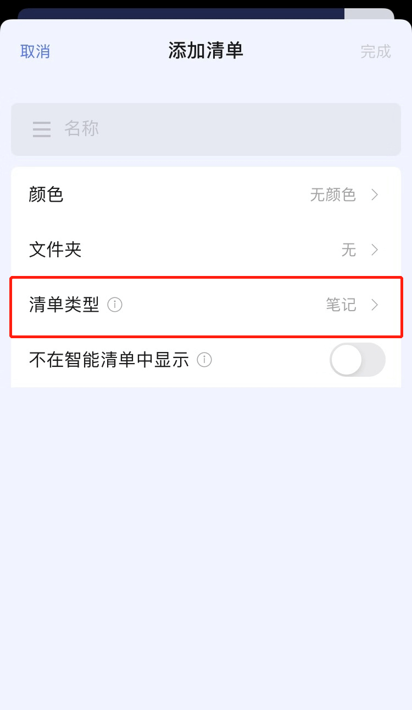
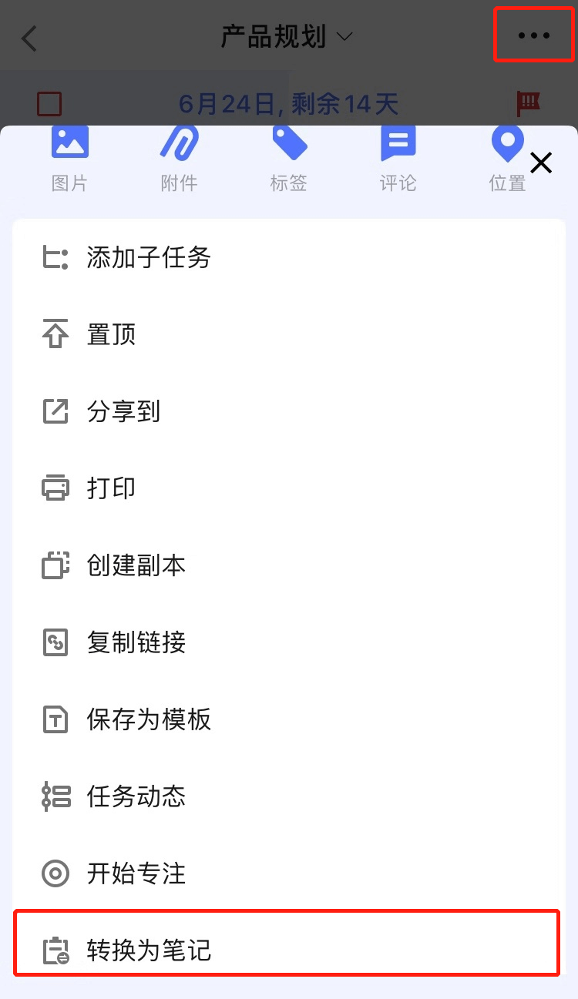
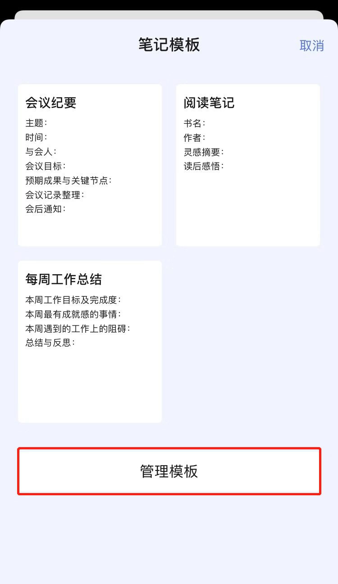

## 如何添加笔记

### 添加笔记清单

在侧边栏点击「添加清单」 - 在「清单类型」一栏中选择「笔记」即可创建一个笔记类型的清单了。

创建「笔记清单」之后就可以去到任务的描述界面 - 点击右上角「···」按钮 -  点击「转换为笔记」来将当前任务转换为笔记。

注：任务转换为笔记之后不会自动去到笔记清单内，仍然会保留在原来的清单当中，且带有「子任务」的任务无法转换为笔记。

### 添加笔记

在「笔记清单」中，点击右下角添加按钮即可直接点击笔记。

在编辑笔记界面，点击「使用模板」字样即可使用模板来创建笔记。

点击右上角的「管理模板」字样即可进入模板管理界面，您也可以去到「设置」 - 「更多设置」 - 「管理模板」- 「笔记」 中管理笔记模板。

