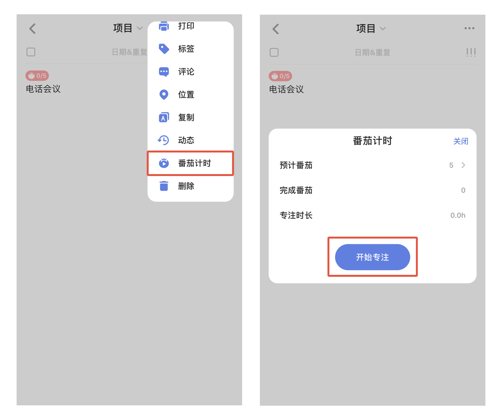
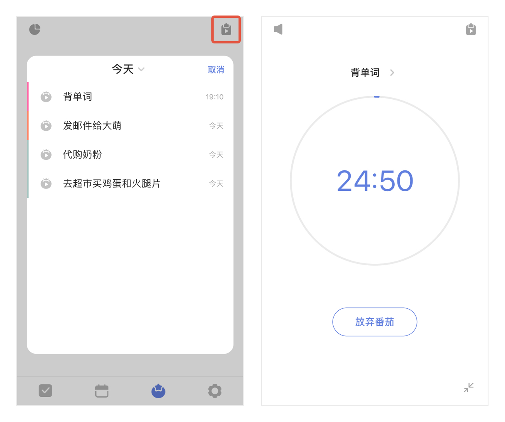
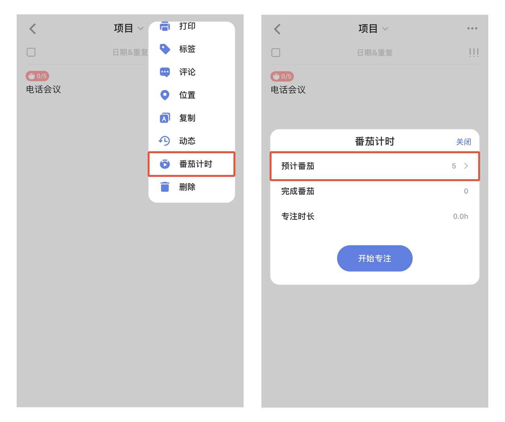

## 专注

### 开启/关闭番茄计时

进入「设置」-「功能模块」-打开「计时」，主界面底部 TAB 栏将会出现计时选项。（计时默认是关闭）

### 专注设置

进入计时后，点击右上角的设置图标，可以对计时进行个性化配置：

* **每日专注目标**：可设置每天计划收获多少番茄和计划每天专注多少时间。
* **番茄时长**：每个番茄倒计时的时长。
* **短休息时长**：但番茄结束后，休息倒计时的时长。
* **长休息时长**：每完成一定数量的番茄后，进入长休息，长休息倒计时的时长。
* **长休息间隔番茄数**：每完成多少个番茄后，进入长休息。
* 开启/关闭“**自动开始下个番茄**”：休息结束后，自动开始番茄倒计时。
* 开启/关闭“**自动休息**”：番茄结束后，自动开始休息倒计时。
* **番茄铃声**：选择一个自己喜欢的番茄铃声吧
* **休息铃声**：选择一个自己喜欢的休息铃声吧
* 开启/关闭“**屏幕常亮**”：专注过程中，阻止系统锁屏。
* 开启/关闭“**专注模式**”：开启后，在番茄进程中退出应用将视为放弃当前番茄。
* 开启/关闭“**记录到苹果健康正念**”：开启后，你的专注时长将同步到苹果健康的正念时间中。

### 开始专注

启用番茄计时后，你可以从主界面底部 TAB 栏、任务详情、提醒弹窗开始专注。

* 主界面 TAB 栏：点击「专注」图进入专注界面，点击「开始」进入专注状态。
* 任务详情：点击任务进入详情，点击右上角「···」图标，点击「开始番茄」进入专注状态。
* 提醒弹窗：提醒响起时，点击提醒弹窗中「开始」进入专注状态。

### 在专注过程中选择/更改任务

进入专注界面后，点击屏幕中部任务切换btn，在弹窗内点击任务，即可在专注界面显示这条任务的标题。在选择任务的弹窗内点击「选择其他」，你可以

* 直接点击任务选中
* 点击弹窗正上方的「今天」切换清单
* 下拉弹窗，将 出现搜索栏，即可搜索任务

选定任务后，再次点击屏幕中部任务切换btn，可以更改任务。

### 专注白噪音

在专注进行中，可以选择一个白噪音作为背景音播放，进而获得更好的专注体验。

点击「开始」开始专注后。或点击右上角图标进入任务列表，选择一个任务开始番茄后，点击界面右上角，统计图标下的白噪音图标，进行设置。

番茄背景音默认为无声音，可在“无声音”、“时钟”、“夏夜”、“春雨”、“雨天”、“雷雨”、“泉水”、“溪水”和“海浪”等中选择一个声音，番茄进行过程中支持随时更换白噪音。 `注：一次只能选择一个白噪音，不可叠加多个声音。` `注：除“普通”白噪音外，其他白噪音均为高级功能。`

### 最小化专注

在专注过程中，点击左上角btn，可将专注最小化到底部TAB栏，方便临时添加任务或者在滴答中完成其他工作。

最小化后仍可以从主界面TAB栏上番茄图标的主题色动态环判断番茄的状态。当一个番茄结束进入休息界面时，TAB栏上的番茄图标也会变成绿色，并且弹出休息提示弹窗。

`注：如在最小化时退出了滴答清单，但滴答清单仍运行在后台，番茄结束后休息提示弹窗不会出现。`

### 预计时长

为任务设置预计需要的番茄数量，帮助更加合理的安排每日计划。进入任务详情页，点击右上角「···」图标，选择「开始专注」-「预计时长」，在弹窗中输入时长，即可进行任务预计专注时长的设置。

设置成功后，任务详情页内任务优先级的图标下方，以及清单列表页开启「显示详情」后，都会出现设置的预计番茄。

### 专注统计

进入「专注」界面后，点击左上角「统计」图标，可分别按**概览**、**天**和**周**进行番茄数和专注时长的统计。

