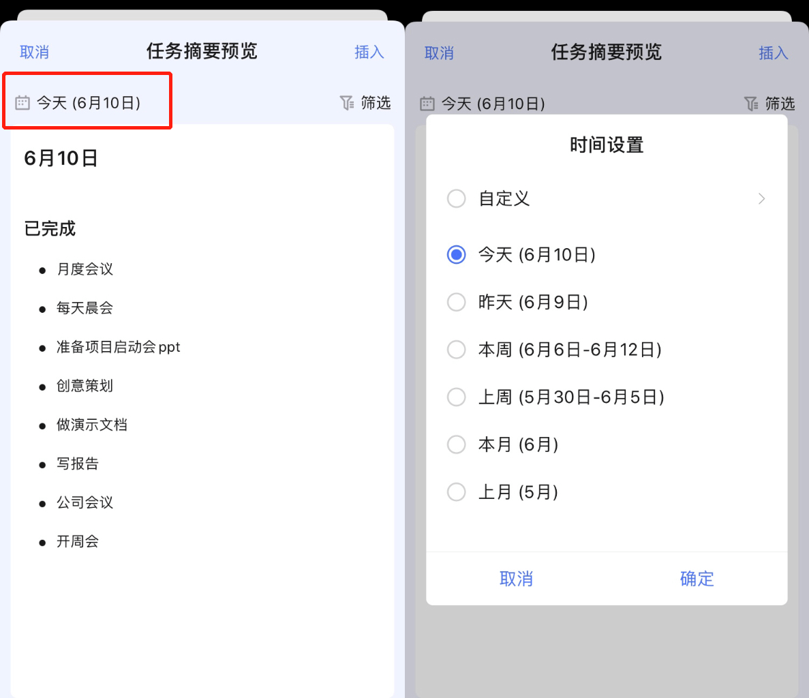
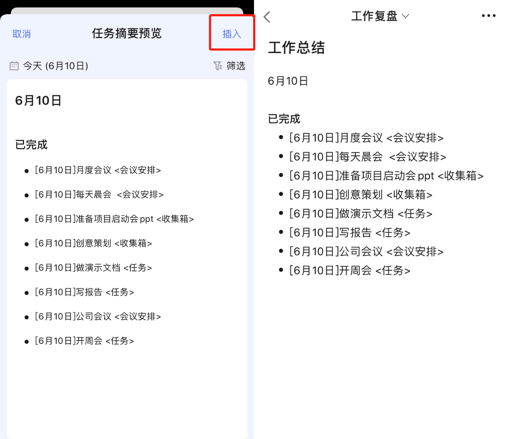
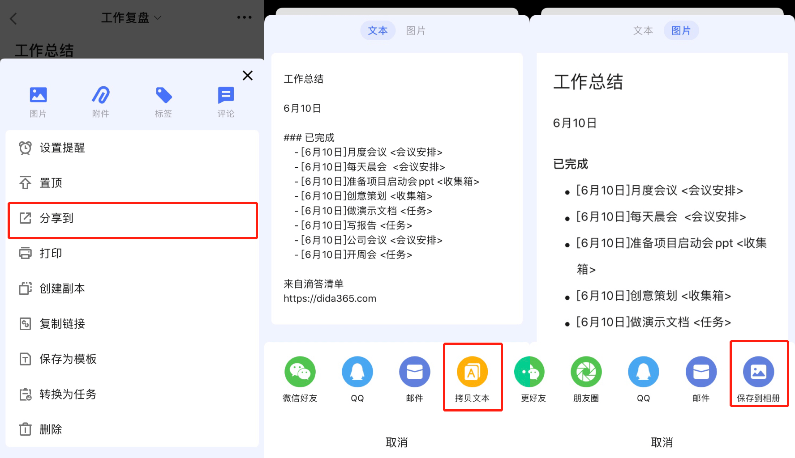

## 移动端摘要

移动端摘要功能和笔记功能进行了整合，请您根据[笔记教程](https://guide.dida365.com/iOS/note/note.html)来了解如何创建笔记清单。

###设置摘要

在笔记清单中点击 「+ 」图标来创建新的笔记，编辑完笔记标题后将光标移动到下方笔记描述区域点击图中的「摘要预览」图标进入「任务摘要预览」。

在「任务摘要预览中」，您可以点击左上方日期来选择摘要筛选的日期范围；

点击右上角「筛选」按钮可以使用其他条件（清单、标签、分配给）对摘要内容进行进一步筛选；

点击「排序」即可选择摘要中任务的排序方式，可以选择按任务完成度、按清单、按完成时间、按任务日期、按优先级、按指派人等方式排序；

点击「显示更多」可以选择任务在摘要中需要显示的额外信息，您可以选择让任务在摘要中显示完成日期、进度、详细内容、专注数据以及所在清单；

最后点击「插入」就可以将摘要内容插入到当前创建的笔记中保存了。

###导出摘要

如果需要导出摘要，您可以在该笔记中点击右上角「...」- 「分享」来以文本或图片的形式导出摘要。

