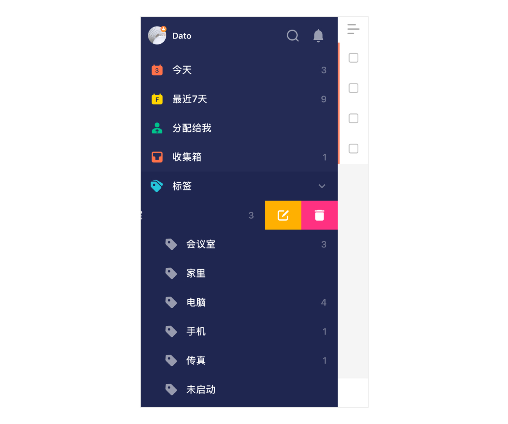

#### 标签的编辑与删除

当需要为标签编辑名字或删除时，可以在左侧边栏通过左滑该标签名，然后选择【编辑】或【删除】。

设置页面内，找到【智能清单与标签】-【标签】，也可以对标签进行编辑或删除。

成功操作后，所有包含这个标签的任务都会对应更新。如果选择删除某标签，该标签会从之前所分配的任务中移除，任务并不会被删除。

`注：标签颜色也可以在编辑界面进行设置。` `注：编辑“标签”并将其设置为“自动”状态时，任务数为0的标签将不会在侧边栏显示。`

