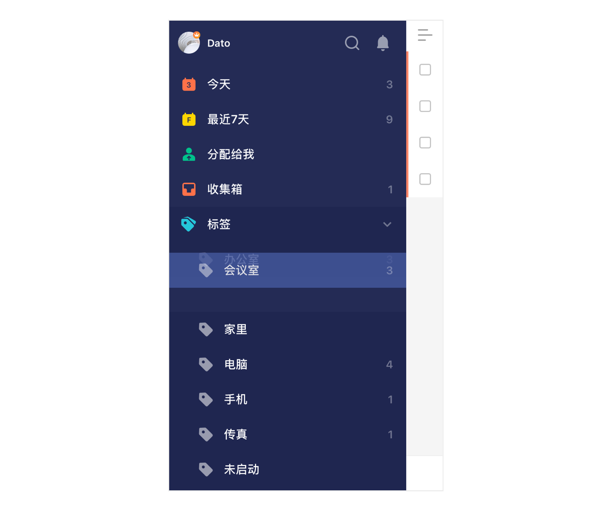
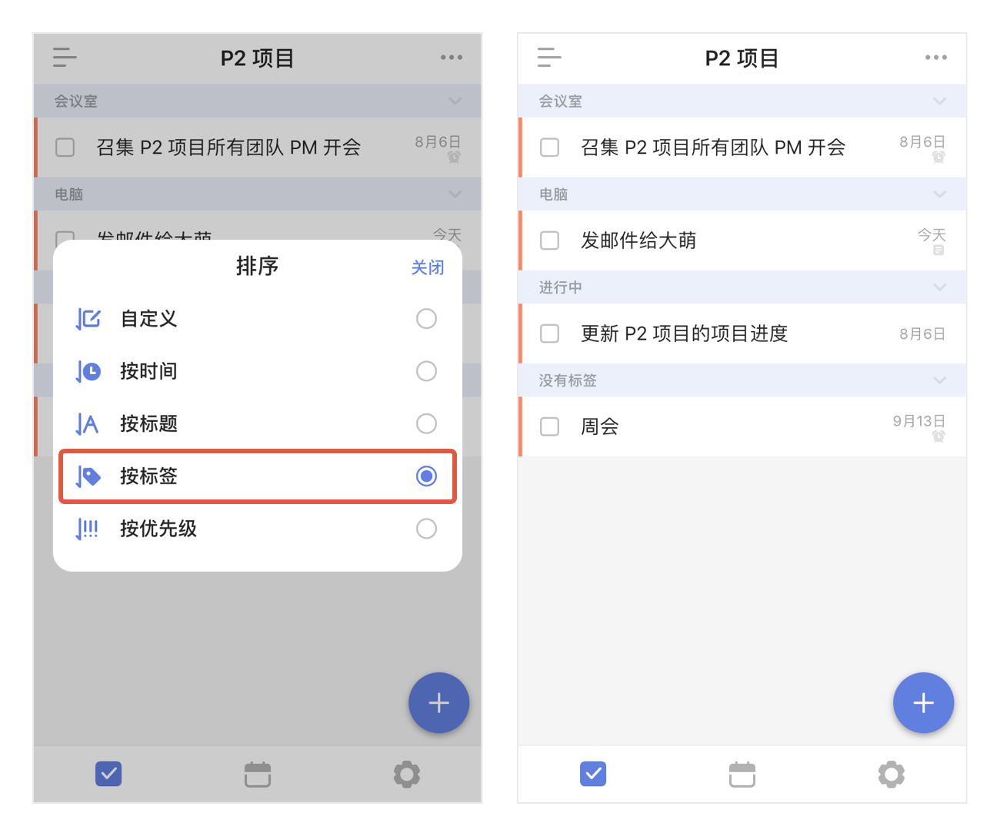

#### 标签排序

一千个使用标签的用户，可能就有一千种为标签排序的方法，不管是将常用标签排在前面，还是按照特定的规则进行排序，你都能在侧边栏长按标签拖拽来实现。

同时，你也可以在任务列表中选择【按标签排序】，为任务进行以标签为维度的排序，帮助更加快速智能的了解自己的日程安排。

`注：除了通过排序来查看各标签下的任务外，在任务列表的【详细模式】下查看任务时，标签信息会展现成独立的一行，你可以很快了解到哪些任务有标签、这些任务分别有什么标签，无需进入任务详情查看。`

