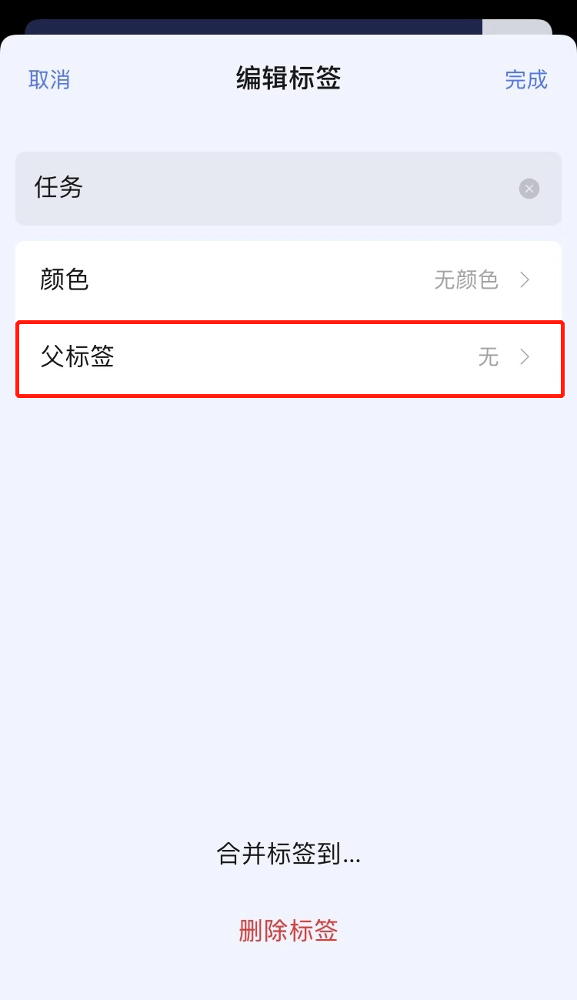

### 管理标签

在侧边栏长按某个标签，放手后触发「编辑」和「删除」选项。点击「编辑」按钮，即可进入标签编辑页面。

您也可以在左侧边栏底部点击「管理清单和标签」-「标签」，进入对应标签的编辑页面。

#### 创建二级标签
标签系统支持创建二级标签。在左侧边栏中拖动标签并与另一标签重叠，即可为选中标签创建父标签。

#### 标签的编辑与删除

当需要编辑或删除标签时，可以在左侧边栏中通过左滑该标签，选择「编辑」或「删除」。

也可以在设置页面内，点击「智能清单与标签」-「标签」，对标签进行编辑或删除。

成功操作后，所有包含这个标签的任务都会对应更新。如果选择删除某标签，该标签会从任务中移除，但任务并不会被删除。

#### 标签排序

滴答清单支持用户对标签进行自定义排序，通过在左侧边栏长按标签即可进行拖拽。