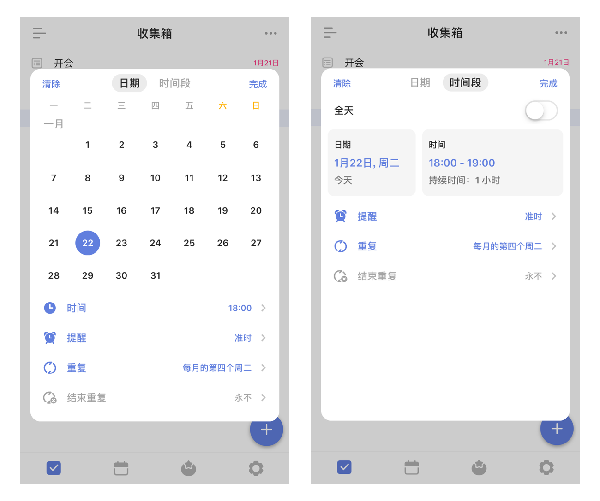
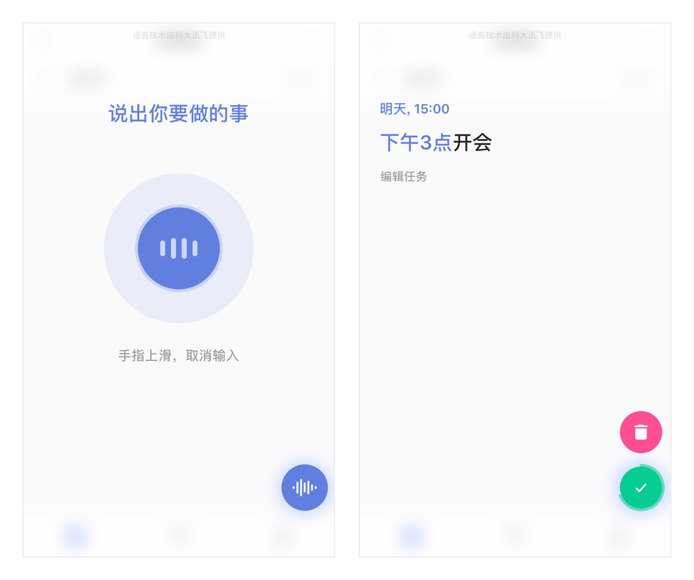
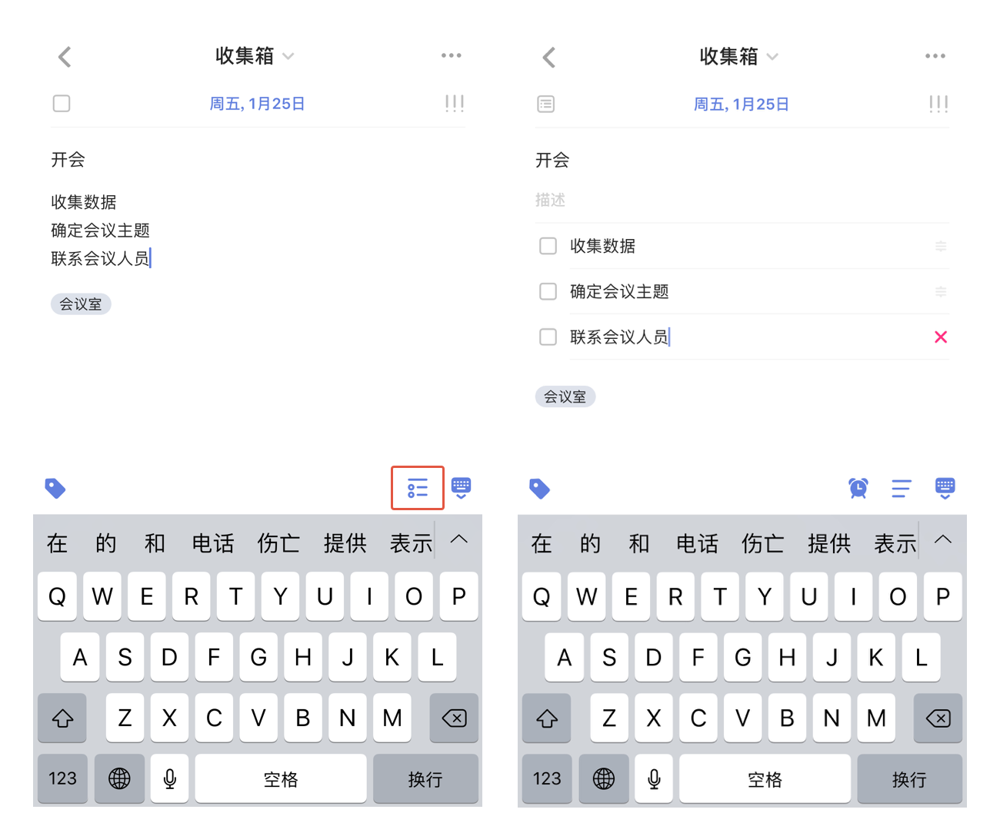

## 创建任务

iOS 端支持多种方式添加任务：

### 客户端创建任务

#### 快速添加任务

在清单列表点击“+”键，呼出快速添加条，输入任务内容，点击「飞机」图标即可创建任务。
`注：在智能清单以及收集箱内创建任务时，任务会保存在收集箱中；如果在其它清单中创建，则会保存到对应的清单下。`

点击输入框下方的日历图标，可以给任务设置任务日期及时间点。
 

点击向下箭头，可以设置任务提醒时间、任务重复周期。
`注：高级会员可以设置时间段`

设置任务的优先级：点击日期图标右侧的优先级图标设置任务的优先级。

#### 关闭快速添加条

「快速添加」默认开启，可以通过「设置」-「高级选项」来关闭「快速添加」，在清单列表点击“+”键，直接进入任务详情页创建任务。

#### 使用Markdown编辑任务描述

点击任务进入任务描述界面，点击Markdown入口「<u>A</u>」即可使用Markdown功能进行编辑。

该功能支持加标题、加粗、高亮、斜体、下划线、删除线、加备注、左右缩进等文本格式，还支持多种方式添加有序列表。不仅可以添加外部链接，还可以在任务内关联其他任务以便快速跳转。

#### 语音输入

长按“+”键可以进入语音输入状态，说话即可创建任务。

* **智能识别时间信息**：当语句中带有“今天3点”“明天下午”这样的时间信息时，可以智能识别出来并为你创建带有这个时间的任务。
* **取消输入**：如果不小心说错了，将手指上滑再松开，即可取消当前输入。
* **快速修改**：提醒任创建务成功后，发现创建内容有误，可以点击编辑任务，即可进入任务编辑界面。如果在显示创建成功后2秒内无操作，视为识别无误。

#### 自然语言识别

在「设置」-「更多设置」-「智能识别」中可以开启「智能识别日期」，开启后在快速添加栏输入任务时，日期和时间会高亮显示，自动为任务设定到期日和提醒时间。

不想在文本中显示日期和时间，可以在「设置」-「更多设置」-「智能识别」中开启「移除任务文本中的日期」即可。

#### 文本/列表任务

支持文本任务和列表任务之间快速切换。

将任务详情转为列表任务：点击键盘上的切换图标，可以将文本任务转为列表任务。

点击键盘上方的切换图标，即可切换列表视图和文本视图。  `注：列表模式下，换行即可创建新子任务。`

选择一条子任务，可以直接编辑，或者点击右边的删除图标，将其删除。

按住右边的拖动图标，待浮起后可以对子任务进行排序。  `高级帐号每个任务下不限子任务数（免费账户最多19个）。`  `注：高级帐号可以给列表任务添加描述。`

#### 添加照片和附件

通过以下操作可以添加照片到任务中：
* 在任务详情页-右上角「···」-「照片」。

可以将拍照、录音和文件作为附件加入到任务中：

* 点击任务进入任务详情界面 - 点击右上角「···」-「附件」，可以选择以下3种附件类型上传。

 
  * **拍摄**：会打开您的相机，拍照结束后点击「使用照片」，将照片上传成附件。
  * **录音**：会打开您的麦克风，请允许滴答清单访问您的麦克风。录音结束后就会上传成为您的附件。 
  * **文件**：可选择设备中的文件作为附件插入到任务中。

附件上传成功后会自动同步到各个平台，每个附件的大小限制为**10MB**。  `注：高级帐号一天最多可上传99个附件，免费帐号一天限制上传 1 个`

### 微信创建任务

关注并绑定微信公众号，可以通过微信在滴答清单中创建任务。

更多与微信公众号相关的内容请参考 [3.13 玩转微信公众号](../wechat.md)

### Siri创建任务

在「设置」-「Siri」中开启「通过Siri添加任务」，即可通过 Siri 创建任务。具体沟通句式见「Siri」-「使用说明」。

在「使用说明」中开启「从提醒事项自动导入」，滴答清单将在每次打开时自动导入“提醒事项”默认列表中的任务。

「Siri捷径」中，可以将常见操作添加到Siri作为语音指令，以后只需对Siri发出语音指令，Siri就能帮你自动执行。

iOS 11 可以使用 Siri 捷径直接创建任务和清单到滴答清单应用，还可以将任务添加进指定清单中。
`注：此功能为高级账户功能。`

### Widget

下拉通知栏，在「编辑」中添加滴答清单插件。  ios 8 和 ios 9 中可以显示今天和已过期的任务，以及任务数量；点击可以快速标记完成；点击「新建」跳转至新建任务界面，默认到期时间为今天。  ios 10 和 ios 11 中widget分为列表widget和日历widget。

列表widget点击「选择清单」跳转到「小组件清单」页面，可以选择显示在widget上的清单列表;在widget中点击「添加」按钮跳转至新建任务界面，默认到期时间根据选择的清单列表。

日历widget默认显示本周的任务，点击日期，显示任务列表;点击「添加」按钮跳转至新建任务界面，默认到期时间为日历widget上选中的时间。

`注：显示在列表widget上的清单列表还可以在应用中通过「设置」- 「高级设置」 - 「小部件清单」进行设置。`

### 邮件创建任务

你可以通过发送邮件到指定邮箱来创建任务，如果邮件标题中带有时间或者重复信息，会被智能识别并自动设置提醒。
可以发送邮件到 todo@mail.dida365.com（仅限于使用你的注册邮箱）或者专用的邮箱地址（适用任何邮箱）。
查看专用邮箱地址请登录网页版[滴答清单](https://www.dida365.com/)：右上角头像—「设置」—「日历订阅＆邮件」服务。

