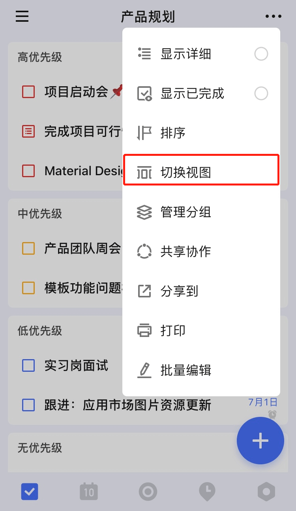

## 看板模式管理任务

### 看板模式

将清单从列表模式切换到看板模式后，任务将被自动分为**未完成**和**进行中**两个看板模块，您可以按自己的需求来组建新的看板模块，方便您更直观地来统筹任务。

### 列表模式和看板模式的切换

在**普通清单**的任务列表页，点击右上角的「···」- 「切换模式」，选择「看板模式」。

切换到看板模式后，会有两个默认的分组：

* 「未完成」：此处将显示未完成任务。
* 「进行中」：此处将显示正在进行的任务。

### 编辑分组

点击分组右上角「···」，即可对该分组进行**编辑**和**管理**，并可以选择在该分组左侧、右侧**添加分组**。

### 拖动排序

长按任务进行拖动，即可调整任务在该分组的排序。也可将其拖入底部的「拖动到此处更改分组」中，将任务移到其他分组。

### 查看任务详情

点击任意任务，即可进入任务详情页。

