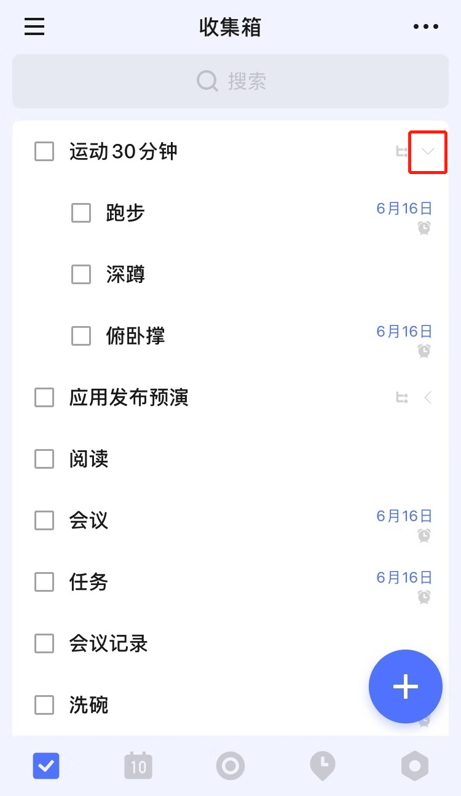
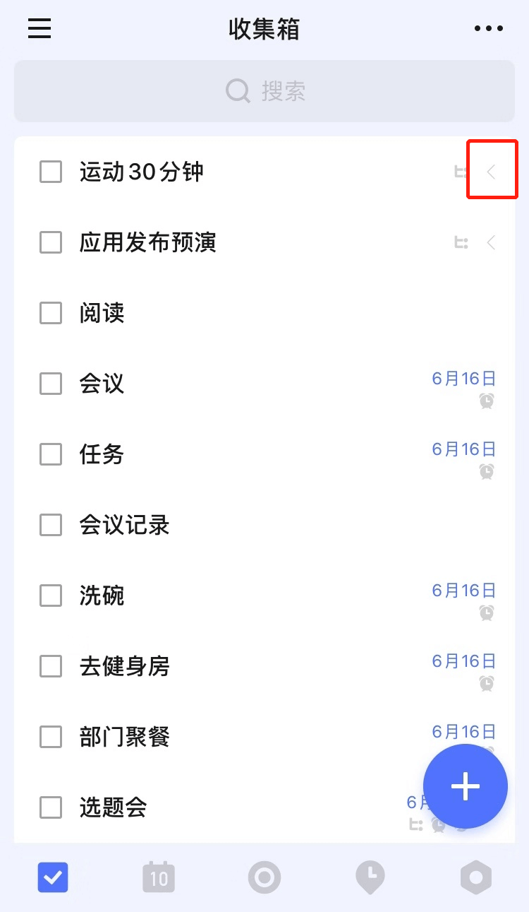
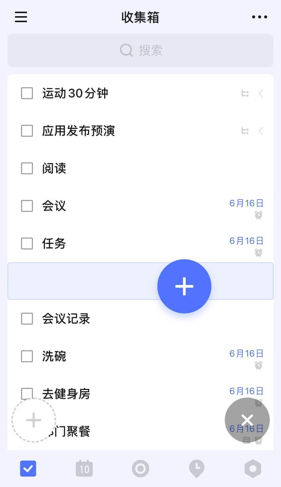

## 多级任务

在 iOS 端，点击进入「任务详情」 - 点击右上「···」 - 点击「添加子任务」就可以在这个任务下添加子任务了。

在输入框完成输入子任务标题之后，可以点击「纸飞机」图标完成创建，也可以点击键盘右下角的换行来完成创建当前子任务并且自动开始创建下一个子任务。

点击子任务即可进入「子任务详情」，在子任务详情中点击「···」- 点击「创建子任务」就可以再次在子任务下创建新一层级的子任务，最多可创建五个不同层级的任务。

可以在子任务详情中点击子任务标题上方的父任务标题来跳转到父任务详情页。

在任务列表中，可以点击主任务右侧的箭头图标来展开或者收起任务下的所有子任务。

可以通过拖动加号键到任务下方偏右一点的位置来在这个任务下快速创建子任务。

`注：这一功能在「今天」、「最近七天」等智能清单中不可用，只可以在「收集箱」以及自己创建的普通清单中可用。`

每一个层级的子任务在功能上都与普通任务相同，即子任务可以设置时间和时间段、进行专注、在其下写任务详情、删除之后可以在「垃圾桶」中恢复、设置标签和优先级以及分配给其他人。