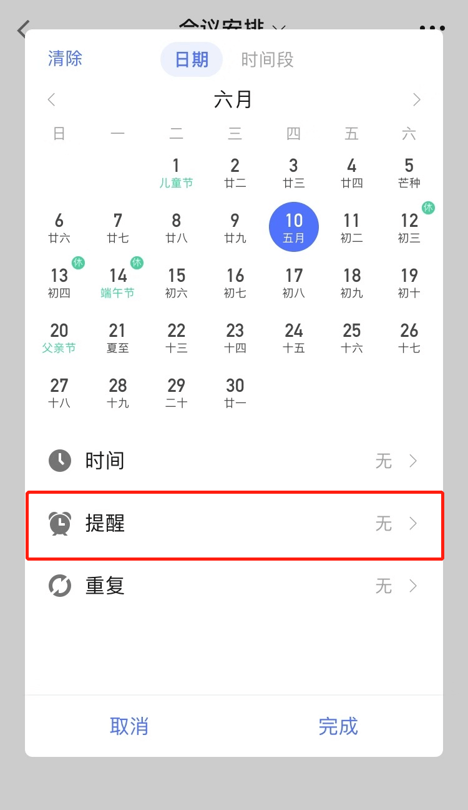

## 设置提醒

为任务设置提醒时间后，滴答清单将按时提醒您，避免您错过重要的任务。

### 设置任务时间和提醒

您可以为您的任务添加提醒时间，或者到期时间：进入任务详情页 - 点击「日期&重复」 - 选择您需要的提醒日期和时间 - 点击「完成」即可。

在任务条上左滑，点击最右边的「日历」图标，可以快速设置日期。

在快速设置日期框中长按各选项可以对快捷日期进行配置。 

「选择日期」：可以修改/添加任务的日期。
「清除日期」：可以清除任务的日期。

为任务设置日期后，会根据具体情况出现在「今天」「最近7天」等智能清单。如果您开启了「每日提醒」功能，则会在每天固定时间对您进行提醒。

### 位置提醒

滴答清单支持苹果地图的位置识别，可以设置在到达某地或离开某地被提醒。

进入任务详情页，点击右上角「···」-「位置」- 选择提醒类型 ，在地图中直接选择您想要被提醒的地理位置，或直接在地址栏输入地址即可。

滴答清单提供「当离开」或「当到达」位置提醒类型。

为了保证地点提醒功能能够顺利工作，您首先需要确认您的手机中「设置」-「隐私」-「定位服务」已经打开，并且滴答清单的定位服务也已被打开。

