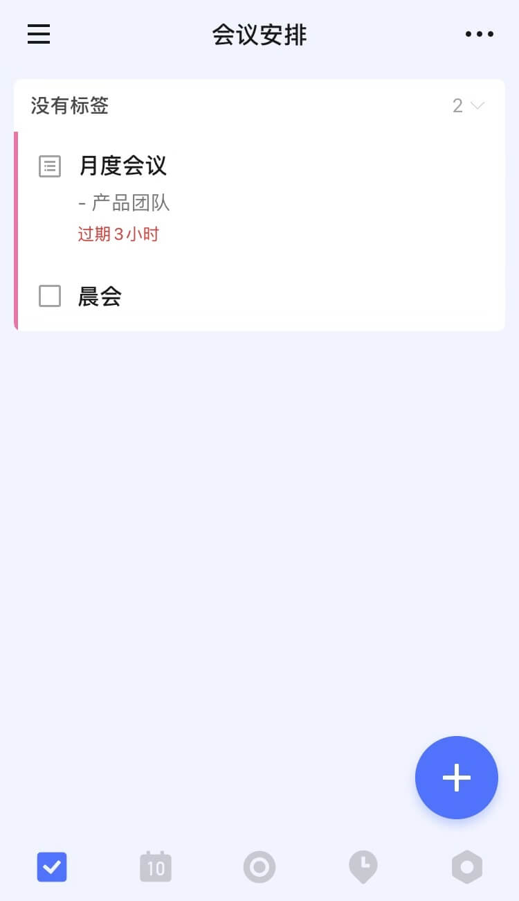
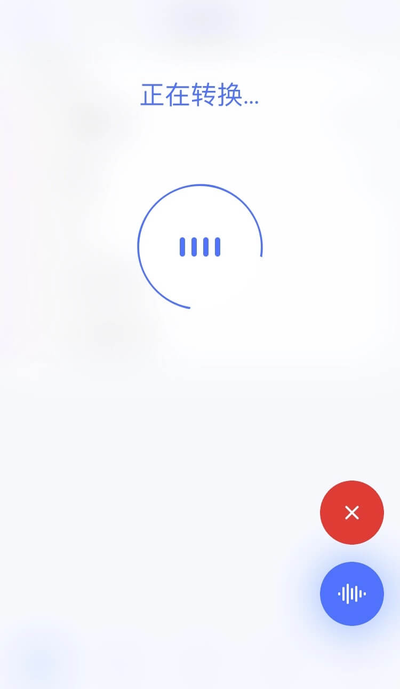
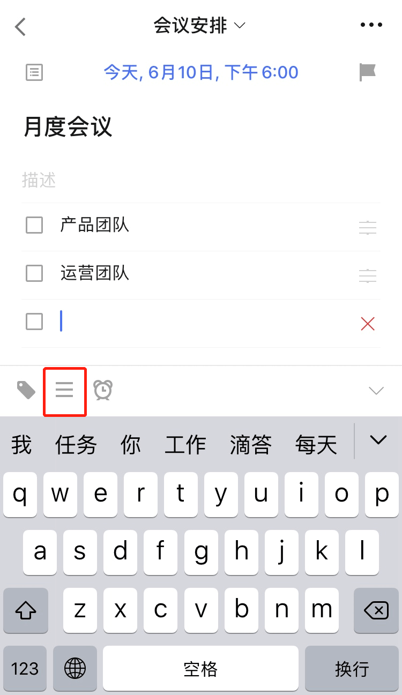
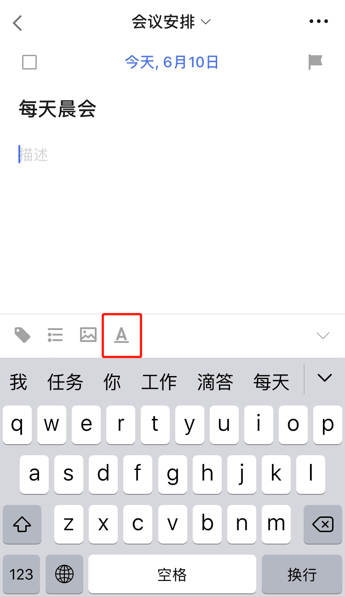
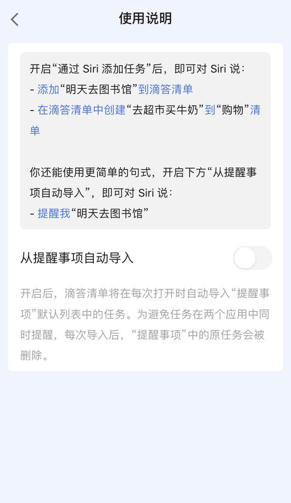
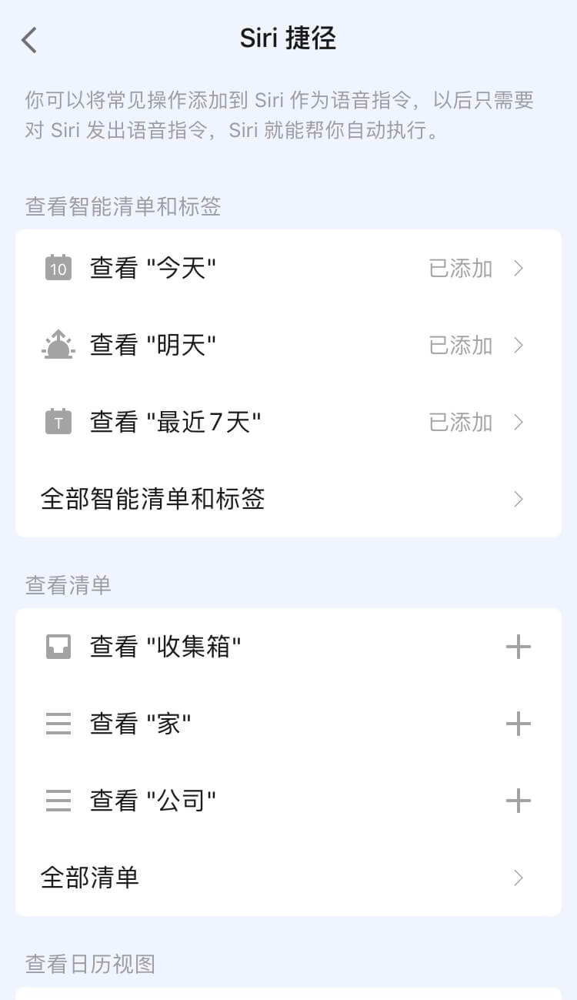

## 创建任务

滴答清单支持客户端、微信、Siri、Widget 和邮件添加等多种任务添加形式。任务创建成功后，可以对任务设置提醒和重复周期等。

### 客户端创建任务

#### 快速添加任务

【快速添加】默认开启，在清单列表页面点击「+」，呼出快速添加条，输入任务内容并保存即可创建。您还可以给任务设定「优先级」和「任务时间和提醒]」 。

在「设置」-「快速添加任务」中可选择关闭「快速添加」。关闭后在清单列表点击「+」键，直接进入任务详情页创建任务。

#### 语音输入

长按右下角「+」键进入语音输入状态。

* **智能识别时间信息**：当语句中带有“今天3点”“明天下午”这样的时间信息时，可以智能识别出来并为您创建带有这个时间的任务。
* **取消输入**：如果不小心说错了，将手指上滑再松开，即可取消当前输入。
* **快速修改**：提醒任创建务成功后，发现创建内容有误，可以点击编辑任务，即可进入任务编辑界面。如果在显示创建成功后2秒内无操作，视为识别无误。

#### 自然语言识别

在「设置」-「更多设置」-「智能识别」中可以开启「智能识别日期」，开启后在快速添加栏输入任务时，日期和时间会高亮显示，自动为任务设定日期和时间。

不想在文本中显示日期和时间，可以在「设置」-「更多设置」-「智能识别」中开启「移除任务文本中的日期」即可。

#### 任务文本内容与检查事项切换

滴答清单支持任务文本内容和检查事项之间进行切换。点击紧贴键盘上方右边的的切换按钮，即可切换。在检查事项模式下，换行即可创建一条新的子任务。

* 编辑和管理检查事项：
   选择一条检查事项，可以直接进行编辑，或点击右侧的删除按钮，可将整条任务都删除；
   长按右边的「≡」可以对检查事项进行拖动排序；
	 在检查事项编辑状态下点击键盘上方**时钟**按钮可以对检查事项设置提醒时间。

#### 使用Markdown编辑任务描述

点击任务进入任务详情界面，点击Markdown入口「<u>A</u>」即可使用Markdown功能进行编辑。

该功能支持加标题、加粗、高亮、斜体、下划线、删除线、加备注、左右缩进等文本格式，还支持多种方式添加有序列表。不仅可以添加外部链接，还可以在任务内关联其他任务以便快速跳转。

#### 添加附件
点击任务进入任务详情界面 - 点击右上角「···」-「附件」，可以选择以下3种附件类型上传。

 
* 相机：打开您的相机，拍照结束后点击「使用照片」，上传照片成为附件。
* 图片 ：调用手机相册中的照片作为附件上传。
* 录音：会打开您的麦克风，录音结束后音频文件就会上传成为您的附件。
* 其他：可以上传doc、xls、ppt、txt和keynote等常用文档。

`注：每个附件的大小限制为 10MB 。 `

### 微信创建任务

绑定微信并关注”滴答清单“微信公众号，可以通过微信公众号在滴答清单中创建任务。更多相关内容请参考 [玩转微信公众号](../wechat.md)

### Siri创建任务

在「设置」-「Siri」中开启「通过Siri添加任务」，即可通过 Siri 创建任务。具体沟通句式见「Siri」-「使用说明」。

在「使用说明」中开启「从提醒事项自动导入」，滴答清单将在每次打开时自动导入“提醒事项”默认列表中的任务。

「Siri捷径」中，可以将常见操作添加到Siri作为语音指令，以后只需对Siri发出语音指令，Siri就能帮您自动执行。

### Widget

在下拉通知栏的「编辑」中添加滴答清单插件。

列表 widget 点击「选择清单」跳转到「小组件清单」页面，可以选择显示在 widget 上的清单列表；在 widget 中点击「添加」按钮跳转至新建任务界面。

日历 widget 默认显示本周的任务，点击日期，显示任务列表；点击「添加」按钮跳转至新建任务界面，默认到期时间为日历 widget 上选中的时间。

显示在列表 widget 上的清单列表还可以在应用中通过「设置」- 「高级设置」 - 「小部件清单」中进行设置。

### 邮件创建任务

您可以通过发送邮件到指定邮箱来创建任务，如果邮件标题中带有时间或者重复信息，会被智能识别并据此创建任务。

可以使用您的注册邮箱发送邮件到todo@mail.dida365.com，或者使用任意邮箱发送邮件到您的专用邮箱地址。

查看专用邮箱地址请登录网页版[滴答清单](https://www.dida365.com/)：点击左上角头像进入「设置」，在「日历订阅＆邮件」中查看。

