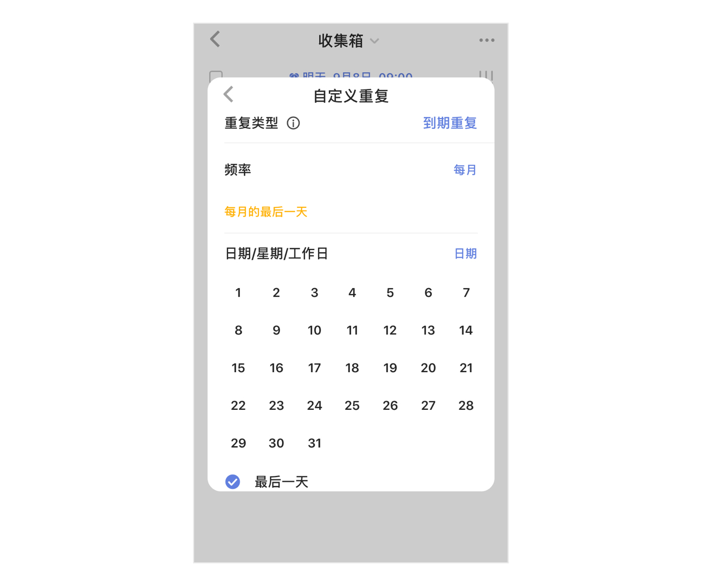
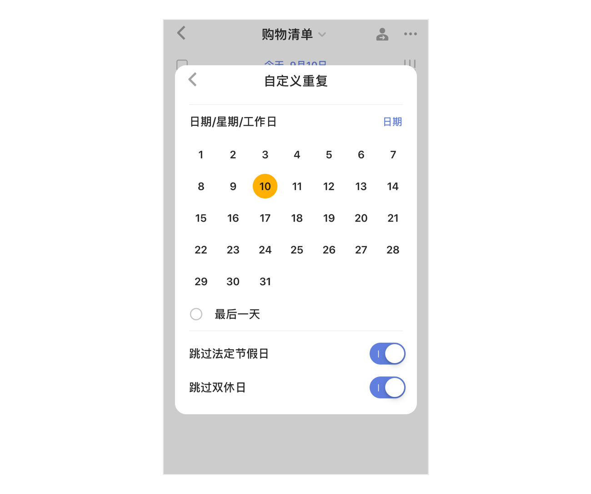

### 设置重复任务

#### 常见重复

进入任务详情页，点击「日期&重复」，选择「重复」，即可看到多种重复方式：每天/周/月/年/法定工作日/艾宾浩斯记忆法来重复。 

注：艾宾浩斯记忆法的重复周期按照1，2，4，7，15，15，15，15，15，15，15，15……循环`

#### 自定义重复

如果常见重复不能满足自己的需求，可以设置自定义重复。

进入任务详情页 - 点击「日期&重复」-「重复」- 选择「自定义」，即可根据自己的需求调整重复类型和重复频率。

还有两种重复设置可选择：

* **到期重复**
   例子：设置一个每周五提醒的到期重复，不论哪天打勾完成任务，下一条都是在周五。

* **完成重复**
   例子：设置每三天重复一次的任务，规则是按照完成重复，假设在星期二完成了任务，下一条任务将在星期五出现；假设星期三才完成该条任务，那么下一条任务会在星期六。

* 「跳过双休日」：当以天/月为频率单位进行设置时，会出现「跳过双休日」选项。

#### 结束重复

在设置好重复之后，默认选择「永不」结束重复任务。可设置「按日期结束重复」和「按次数结束重复」结束重复任务。

* 按日期结束重复：设置一个重复任务不再执行的日期，到了该日期，完成任务后不会再自动创建下一周期的任务。
* 
* 按次数结束重复：设置一个重复任务不再执行的次数，完成该重复次数以后，不会再自动创建下一周期的任务。