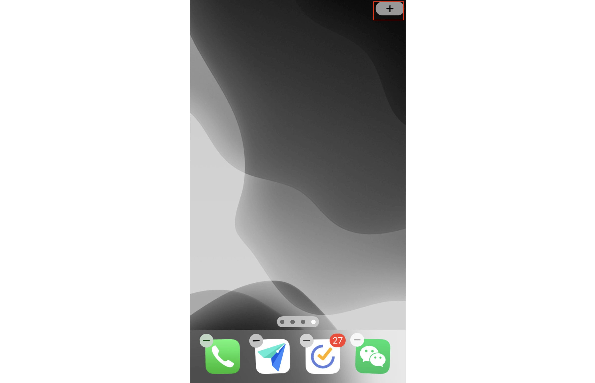
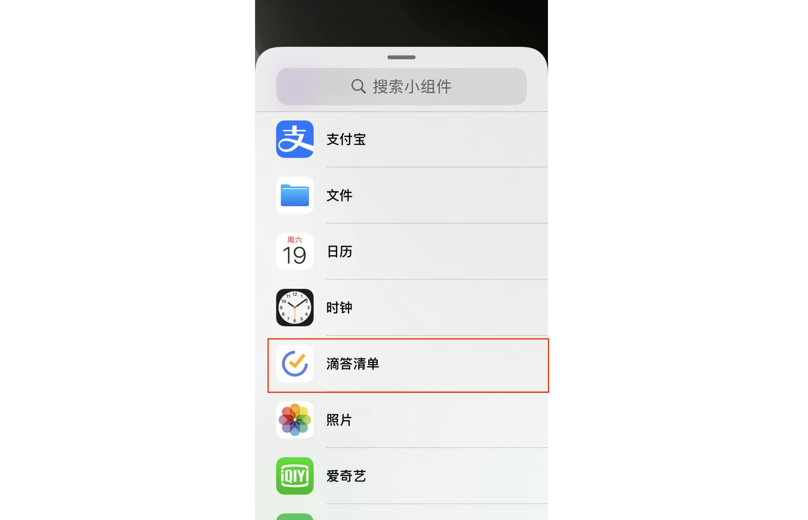
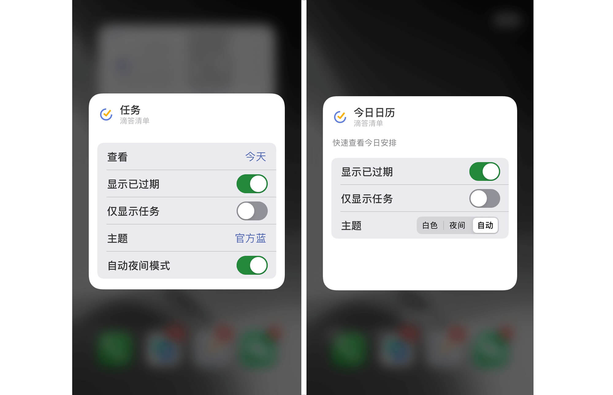

## iOS14 小组件配置

### 添加小组件

如需在 iOS 14上添加新版滴答清单小组件，请先在手机屏幕空白处长按，之后点击右上角加号键来进入小组件选择列表。

 

进入列表后找到并点击「滴答清单」就能查看到滴答清单所有小组件了。

滴答清单共提供四种不同小组件：「任务」、「今日习惯」、「日历月视图」和「今日日历」。其中「任务」和「今日习惯」两个小组件提供小、中、大三个不同尺寸，「日历月视图」提供中和大两个尺寸，而「今日日历」仅一个尺寸。您可以选择好想要的小组件和尺寸之后点击下方「添加小组件」来将它添加到桌面。

### 编辑小组件

四种小组件中有「任务」和「今日日历」小组支持编辑操作。可以在桌面上长按小组件之后点击「编辑小组件」来进行编辑操作。「今日日历」小组件支持设置是否显示已过期任务，「任务」小组件支持设置显示清单、显示主是否显示已过期以及是否自动切换到夜间模式。

`注：由于 iOS 14的系统限制，小部件上不允许进行交互操作，点击小部件上只会跳转到滴答清单内的相应位置。`