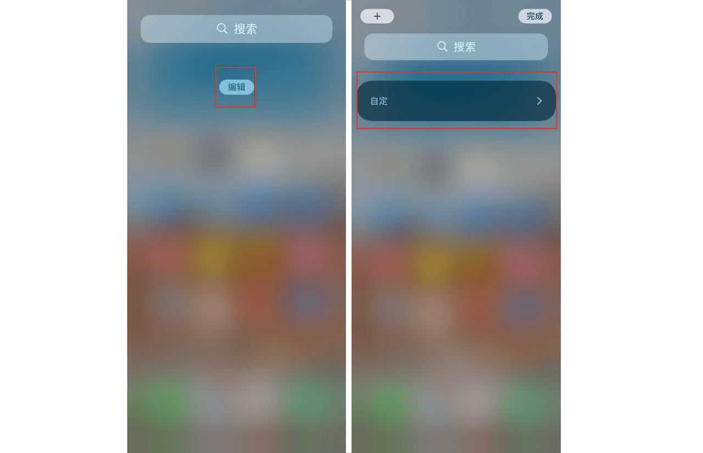
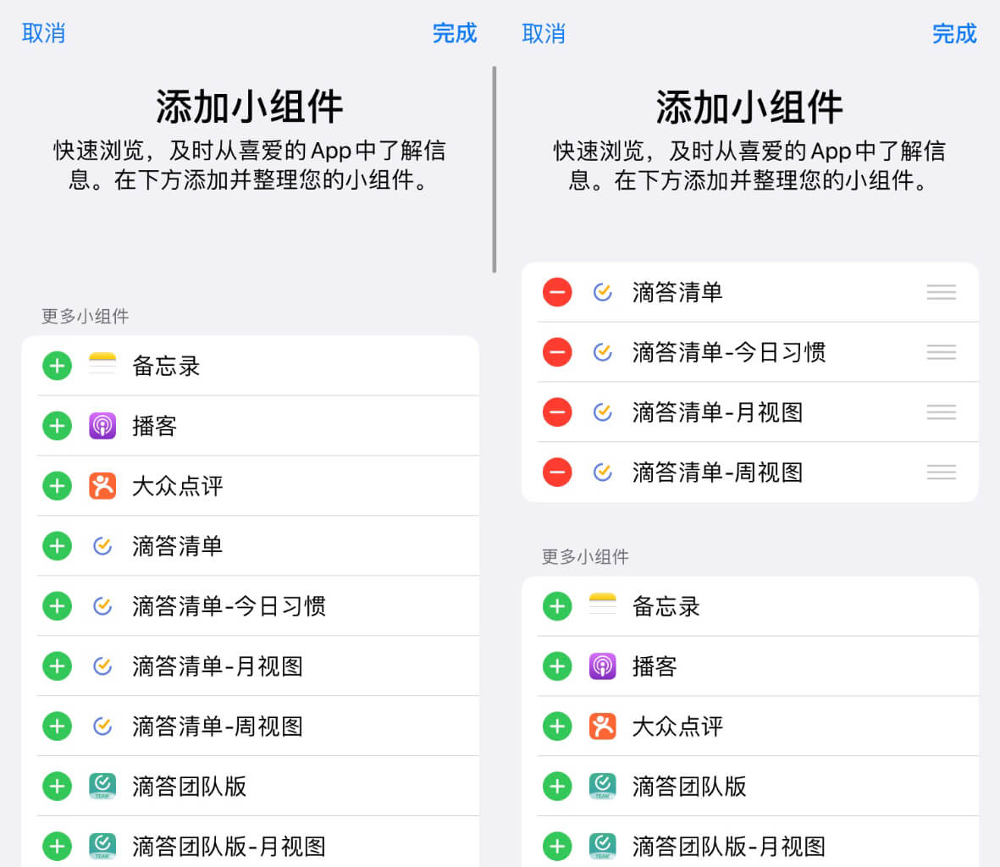
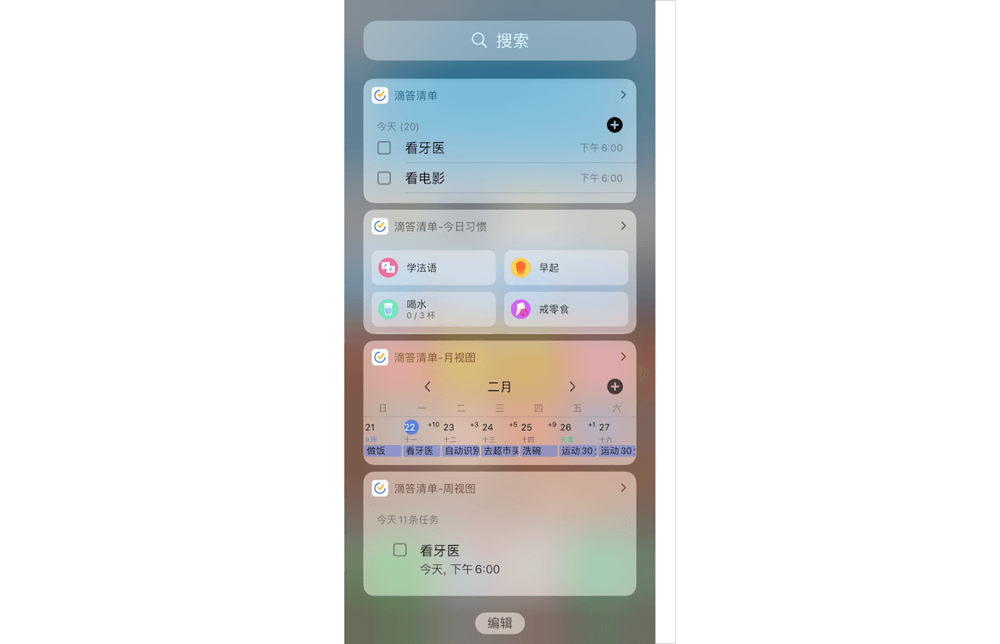
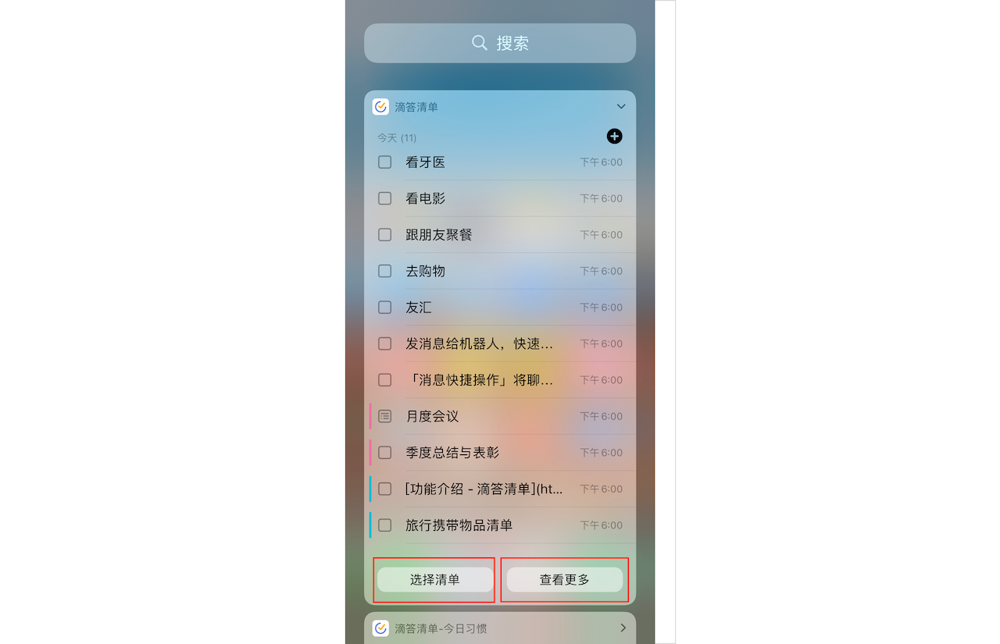

## 配置负一屏小部件

### 添加小组件

在主屏幕往左滑动打开左侧负一屏，之后点击「编辑」- 「自定」就能进入负一屏小部件列表。

iOS 版滴答清单提供多种的小部件，点击「+」图标就能添加该小部件，点击「-」就能删除已添加的小部件。

添加完之后点击右上角「完成」即可完成添加小部件。

### 滴答清单 

显示今日任务。

### 滴答清单-今日习惯

显示今日习惯。

### 滴答清单-月视图

显示当月每一天的任务和习惯。

### 滴答清单-周视图

显示本周每一天的任务和习惯。

### 编辑小部件

所有负一屏小部件均支持点击右边「>」图标来展开，其中「滴答清单」小部件在展开后支持点击「选择清单」选择其他清单进行显示，点击「查看更多」即可跳转到「今天」清单内查看整个清单。

