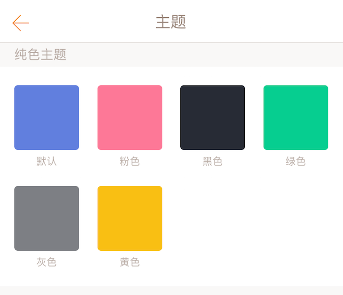
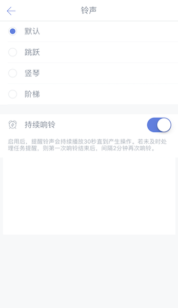
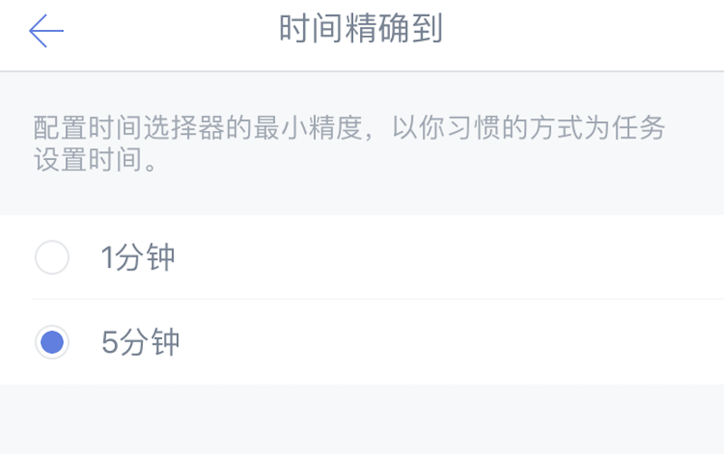
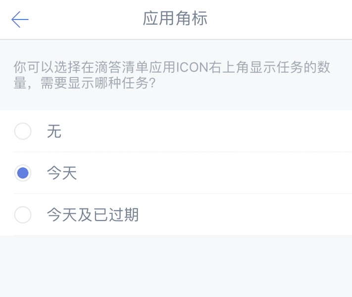

###偏好设置

####主题
提供以下主题：
 纯色主题：默认（蓝色）、夜间（pro）、粉色、黑色、绿色、灰色、黄色、白色。

 城市系列主题：北京、东京、杭州、旧金山、伦敦、莫斯科、上海、首尔、悉尼。

 季节系列主题：春季、夏季、秋季、冬季。

 摄影系列主题：蔚蓝湖泊、暮色、慵懒猫。

`注：白色主题和摄影系列主题是拿成就值换取的，当你赚取越来越多的成就值，成就等级也会提升，就能领取对应的主题奖励。`

####语言

滴答清单默认跟随系统语言，如果您希望使用其他语言，可以手动选择。

####铃声
您可以根据喜好选择铃声。  
若您希望提醒铃声时间更长，可以在此开启「持续响铃」。
 开启后，提醒铃声会持续播放 30 秒直到产生操作。若在 30 秒未及时处理任务，则会在两分钟后再次响铃。

`注：iOS 10 上，当系统通知样式选中“横幅”时，持续响铃会失效；只有系统通知样式选中“提醒”或者“无”时，即可正常持续响铃`

####每日提醒

你可以选择一个固定时间，滴答清单将会在这个时间提醒你今天及已过期的任务，点击「每日提醒」即可设定提醒时间。
 `注：你也可以自定义每日提醒的时间。`

####时间精确到
你可以为任务设置时间所用的时间滚轮选择最小精度，如果你有一些任务需要精确到分钟，比如上午9：18 的任务，那么建议你将「时间精确到」选择为 1 分钟。
 `注：默认最小精度为 5 分钟。`

####快捷日期

你可以左滑任务设置快速日期，如果快捷日期中没有你常用的时间，那么进入「设置」-「偏好设置」-「快捷日期」中，可以对快捷日期进行配置。
* 显示快捷日期：显示哪些智能时间
* 设置智能时间的时间，滴答会根据当前的时间显示其中最近的两个  
例如：上午八点时你对任务进行左滑，那么会显示出早上 9：00 和下午 13：00 两个智能时间。
* 设置符合自己习惯的下周：是“下周一”还是“7天后”

####字体大小
滴答清单提供两种大小的字体供您选择。

####星期开始于

进入「设置」-「偏好设置」-「星期开始于」中，根据个人习惯不同，可以选择周一、周日、周六。 

####应用角标

进入「设置」-「偏好设置」-「应用角标」，根据你的使用习惯，可以选择无、今天、今天及已过期、已过期四种角标。

角标会在应用图标上直观显示出待办事项数，即使不进入应用也能够随时了解任务量。

####农历

进入「设置」-「偏好设置」-「农历与节假日」中就可以开启农历。

开启之后在日历中就会显示出农历日期，为任务设置重复时，也会出现农历日期的重复选项。

