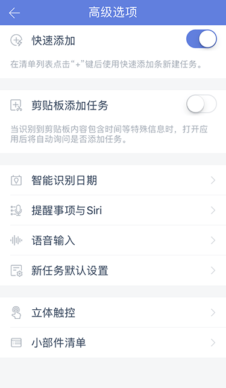
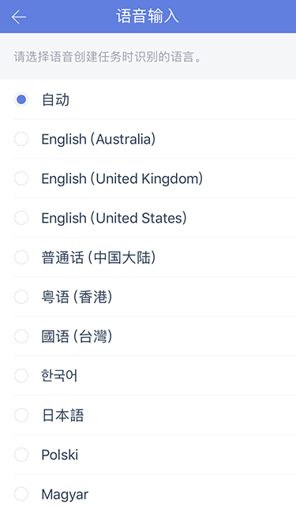
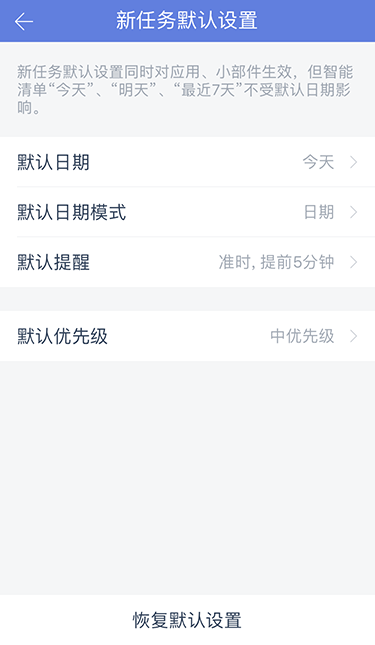
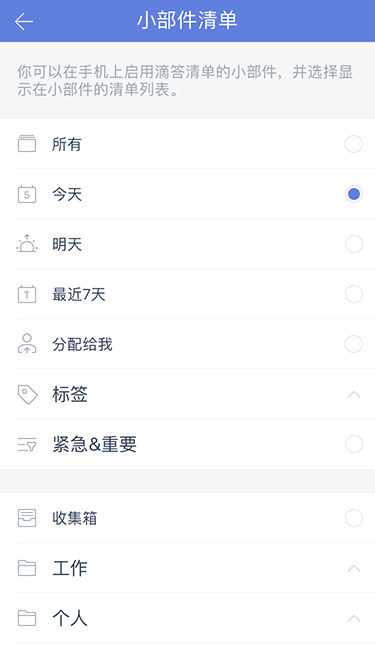

## 高级选项

####快速添加

【快速添加】默认开启，在清单列表点击“+”键，呼出快速添加条，输入任务内容并保存即可创建。
长按“+”号键支持语音输入任务。

在主页面，进入【设置】-【高级选项】，关闭【快速添加】，在清单列表点击“+”键，直接进入任务详情页创建任务。

####剪贴板添加任务

在主页面，进入【设置】-【高级选项】，启用【剪贴板添加任务】。

开启此功能后，当您的剪贴板内容包含时间等信息时，进入滴答清单，将自动询问您是否需要创建任务。

####智能识别日期

在主页面，进入【设置】-【高级选项】-【智能识别日期】，可以启用【文本输入识别】。

 启用后，当您通过【快速添加】创建任务时，滴答清单能够自动识别任务中的时间信息，并为任务设置提醒。

同时，您还可以选择开启【移除任务文本中的日期】，开启后，日期文本将从任务中被删去。

若文本误识别，点击一下高亮文本即可取消识别。

`例如：创建「今天上午十点开会」的任务，创建成功后任务会显示为「开会」，任务到期时间将会设定为「今天上午十点」。`

####提醒事项与 Siri 
进入【设置】-【高级选项】-【提醒事项与 Siri】，即可在打开滴答清单时，自动将 Siri 创建的、或直接在提醒事项中创建的任务移到滴答清单的收集箱中，并从提醒事项中删除。  

你也可以点击页面下方的「导入已有任务」来将「提醒事项」中已经有的任务移到滴答清单中。

iOS 11 可以使用Siri直接创建任务和清单到滴答清单应用，还可以将任务添加进指定清单中，请参考以下示例：
1.    提醒我“今天下午3点”购买火车票
2.    添加“明晚演唱会”到滴答清单
3.    在滴答清单中添加“工作”清单
4.    在滴答清单中创建“去超市买牛奶”到“购物”清单
`注：本功能为高级账户功能。`

####语音输入

你可以在主页面中，进入【设置】-【高级选项】，选择【语音输入】，来设置自己在语音输入时使用的语言。  
滴答清单可以识别多种语言。

####新任务默认设置

您可以根据您的需要对新任务的日期、日期模式、提醒和优先级进行设置，添加新任务的时候就会带上这些默认设置。
新任务默认设置对应用、小部件都生效，但智能清单“今天”、“明天”、“最近7天”、日历以及带日期的自定义智能清单不受默认日期的影响。
 `日期模式分为日期和时间段,默认选中日期。提醒默认为准时，可以设置多个提醒。`

####立体触控

配置常用的选项，在主屏幕上按压app的Icon可以进行快速操作。

####小部件清单

ios 10以上系统的手机，可以选择列表widget中显示的清单列表。

