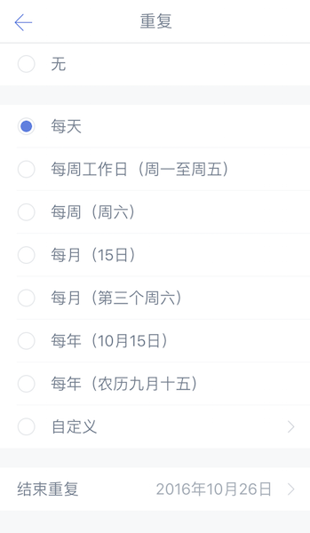
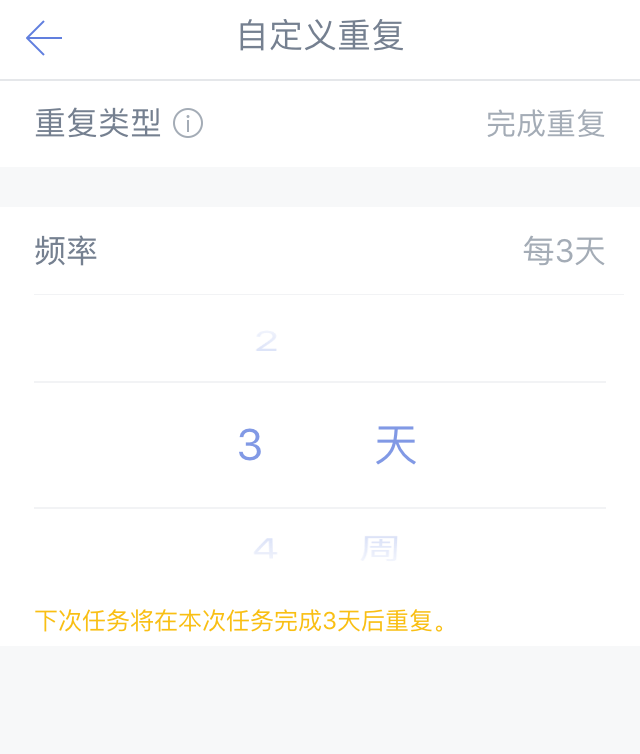

###设置重复任务

如果任务每天、每月或者每年都循环出现，可以设置为重复任务。

####常见重复
进入任务详情页，点击日期栏，选择【设置重复】，即可看到多种重复方式：每天/周/月/年或法定工作日来重复。

####自定义重复
如果常见重复不能满足自己的需求，可以设置自定义重复。

进入任务详情页-点击【设置日期】-【重复】-选择【自定义】，即可根据自己的需求调整重复类型和重复频率。

这里有两种重复类型可供选择：

* 到期重复：是按照日期进行重复：
 例子：小明需要每周五下午安排下周工作，所以设置一个每周五下午都会提醒的到期重复。

 

* 完成重复：是按照周期进行重复：
 例子：小明想要每三天去一次健身房跑步，这一次是星期二，那么下一次会在星期五提醒他；但他星期五没有去成，星期日完成了这个任务，下一次的提醒时间是星期三，而不是星期一。

 
