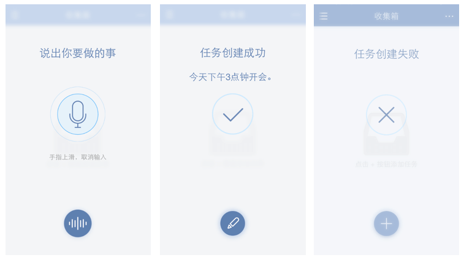

##创建新的任务
滴答清单能帮您随时随地记录并同步工作、生活中的所有任务，能灵巧、清晰的管理您分派的每一个任务，让您在管理和规划未来的时间中事半功倍！
 为了让你更加方便地创建任务，目前iOS支持的添加形式有：微信添加任务、邮箱添加任务、客户端添加任务、网页端添加任务。。。

###创建新的任务
创建新的任务，在页面底部的输入框输入任务内容并点击完成即可，同时还能通过左边的『』给任务设置提醒。
 在智能清单以及收集箱内时，新任务将会创建到收集箱中；如果你在其它清单中创建，则会保存到对应的清单下。
 *任务创建后，就会自动保存到滴答清单并同步到所有设备中。*
 **新建任务界面**：
 
1. **设置日期**：点击『设置日期』可以设置任务到期时间、任务提醒时间以及任务重复周期。
2. **设置任务的优先级**：点击设置任务的优先级。
3. **转为列表任务**：点击键盘上的，可以将文本任务转为列表任务。
4. **快速添加标签**：点击键盘上方的『#』可以快速添加标签。标签的使用请参考[使用标签](ios_app/3_manage_tasks_tags.md)

####关闭快速添加条
默认开启『快速添加』，即底部输入框的形式，可以通过设置->高级选项来关闭『快速添加』，更换成底部加号键的形式。
 **快速添加和常规添加区别**
 
####语音输入
长按应用主界面下方的『按住说话』或者长按加号键，可以进入语音输入状态，即说话就能创建任务。
 常见界面如下图：
 
- **智能识别时间信息**：当语句中带有“今天3点”“明天下午”这样的时间信息时，可以智能识别出来并为你创建带有这个时间的任务。
- **取消输入**：如果不小心说错了，将手指上滑再松开，即可取消当前输入。
- **快速修改**：提醒任创建务成功后，发现创建内容有误，可以点击编辑任务，即可进入任务编辑界面。如果在显示创建成功后2秒内无操作，视为识别无误。
- **创建失败**：如果网络太差或者说话时间过短，会导致任务创建失败。

####创建子任务/列表任务
支持文本任务和列表任务之间快速切换。
 只需要使用列表任务时点击键盘上方的图标，即可切换成列表任务。
 同样，需要使用文本任务时，点击键盘上方的图标，即可切换成文本任务。
 `列表模式下，换行即创建了一条新的子任务。`
####编辑和管理子任务
选择一条子任务，可以直接编辑，或者点击右边的图标，将其整条都删除。
 按住右边的图标，待浮起后可以对子任务进行排序。
 `高级账户每个任务下最多可以创建299个子任务（免费账户最多19个）。`

####添加附件
可以将手机相册内的照片或者拍照或者录音作为附件加入到任务中。
给任务添加附件，仅需以下操作：
1. 点击任务进入任务详情界面
2. 点击右上角「···」，可以选择3种附件类型上传：

   - **照片**：调用手机相册中的照片作为附件上传。
   - **拍摄**：会打开你的相机，拍照结束后点击「使用照片」，将照片上传成附件。
   - **录音**：会打开你的麦克风，请允许滴答清单访问你的麦克风。录音结束后就会上传成为你的附件。

 附件上传成功后会自动同步到各个平台
 每个附件的大小限制为__5MB__。
 `高级账户一天最多可上传99个附件（免费账户一天仅限一个)`

####微信创建任务
关注并绑定微信公众号，可以通过微信在滴答清单中创建创建任务
更多与微信公众号相关的内容请参考 [微信公众号](wechat/README.md)

####Siri集成
开启Siri集成功能，提醒事项一键移入滴答清单，Siri也能为滴答清单创建任务。
 操作：设置->高级选项->提醒事项与Siri。
 开启集成siri之后，再用Siri创建的提醒事项会加入滴答清单。
点击下方的“导入已有任务”，可以把手机里已经存在提醒事项导入滴答清单。

####Today Widget
滴答清单有Today Widget：下拉通知栏，在「编辑」中添加滴答清单插件。
 它可以显示今天已经已过期的任务，以及任务数量；点击可以快速标记完成；点击跳转至新建任务界面，默认到期时间为今天。同时可以通过它来新建任务。

####邮件创建任务
你可以通过发送邮件到指定邮箱来创建任务，如果邮件标题中带有时间或者重复信息，会智能识别并创建任务。
可以发送邮件到todo@mail.dida365.com（仅限于使用你的注册邮箱）或者专用的邮箱地址（适用任何邮箱）。
查看专用邮箱地址请登录网页版[滴答清单](https://www.dida365.com/)：右上角头像—>设置—>邮箱服务。

