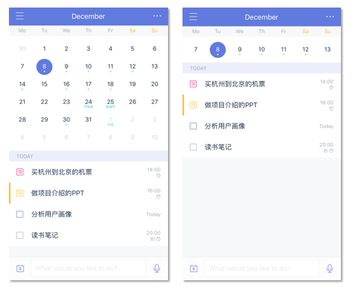
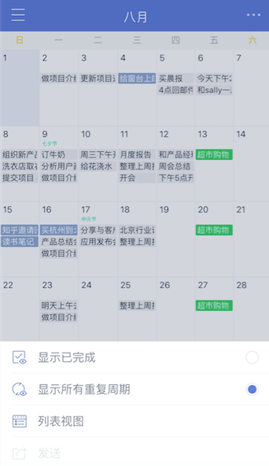

###日历
日历视图可以帮助你更直观地查看自己的任务计划，安排日程。

在主页面下方点击【日历】tab，进入日历页面，默认显示列表视图。

####拖动安排任务
长按需要修改日期的任务，把任务拖动到日历区域，选择合适的日期再松手，即可修改任务时间。

####切换月视图/周视图
当每日任务比较多的时候，可以在列表视图中向上滑动，切换至周视图，下方区域可以显示更多的任务。
 

####切换列表视图/月视图/三日视图

点击日历右上角的切换按钮可以切换列表视图、月视图、日视图、三日视图和周视图，直观显示月度计划，或按照时间轴查看最近三天的任务安排。
 `注：月视图、日视图、三日视图和周视图为高级账户功能。`

