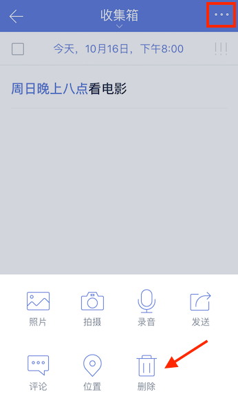
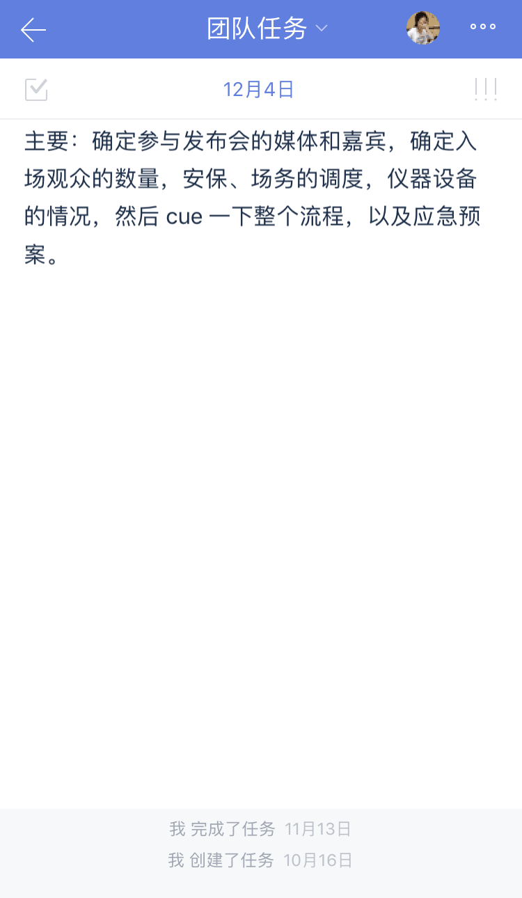
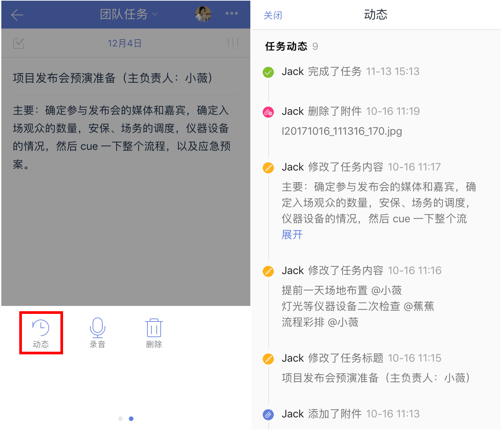

##管理任务

滴答清单为你提供了多种的方式管理你的任务，让你的生活变得井井有条。

####移动任务
进入任务的详情页，点击页面上方的所属清单-选择对应清单，即可一键改变任务的所属清单。
 或者你可以在列表页左滑快捷操作移动清单。

####删除
列表页上任务左滑点击【垃圾桶】图标，任务会被删除。若误删任务，可以点击弹出的提示中【撤销】按钮来恢复任务。
 `如果是共享清单中的任务，则所有共享者的清单中该任务都会被删除。`

进入任务详情页，点击右上角「···」-选择【删除】。

####对任务排序
为了清晰地查看自己的任务，我们提供了6种排序方法：
* 按自定义排序（收集箱和普通清单才有自定义排序）
* 按到期时间排序
* 按标题排序
* 按优先级排序
* 按指派人排序（共享清单中才会出现）
* 按清单排序（智能清单、自定义智能清单和文件件所有任务清单中才会出现）。

在侧边栏中，点击清单进入清单列表，点击右上角「···」，选择【排序】即可。
 `注：在按日期排序、按优先级排序和按自定义排序的模式下，还可以通过长按任务拖动来调整顺序。`

* 如果是团队共享的任务清单，由各个团队成员的任务组成的，可以选择使用按指派人排序。
* 个人工作安排就可以按优先级或者时间排序。
* 只有智能清单、自定义智能清单和文件件所有任务清单中可以使用按清单排序。

####搜索任务
在滴答清单中，可以搜索任务的内容、标题和标签。

在侧边栏中，点击账户信息旁边的放大镜图标，输入关键词或者标签，即可搜索所有已完成和未完成的任务。

####快速操作
支持手势滑动任务进行快速操作。将任务往左滑动，短距离可以调出【移动到】【删除】和【时间设置】三个快捷设置；长距离滑动可以直接为任务设置时间。

####批量操作
当任务较多，需要进行相同的设置操作时，可以通过批量操作来进行。
进入清单页，点击右上角「···」，选择【编辑多个任务】，选中需要编辑的任务就可以快速编辑了。可以批量修改日期、移动到其它清单、删除和修改优先级。
若选中2个及以上任务，可以合并任务成新任务，新任务将以子任务形式呈现，默认合并到【收集箱】。
 `注：合并成的新任务不再保留原任务的附件和评论信息，且原任务将被删除。`

####添加标签
给任务添加标签有便于更加快捷的管理同一类别的任务。

一个任务可以添加一个或者多个标签，标签常常和类别、记忆或者地点关联。

直接在任务中输入「#标签」，就可以创建新标签，也可以点击「#」按钮创建新标签或选择已经建立的标签。

输入新标签后，需要空一格，标签即可创建成功。

####发送任务
将任务以文字或图片的形式发送出去，适用于通知、共享资料等需要分享任务内容的事件。

进入任务详情页，点击右上角「···」，选择【发送】，选择发送途径和对象，确认发送即可。

####隐藏已完成的任务
完成任务之后，为了保持清单列表的整洁和清爽，可以隐藏已完成任务。

进入清单页，点击右上角「···」，不选中【显示已完成】即可。

隐藏之后，如果要查看任务，可以选择【显示已完成】或到【已完成】智能清单中查看。

 `注：【已完成清单】是智能清单且默认隐藏，需要在智能清单中开启显示后才能查看。设置-智能清单-显示【已完成】。`

####计划
进入【今天】智能清单，点击右上角小圆圈，可以一次性对到期日为今天的任务和子任务、过期的任务和子任务和收集箱中无日期任务进行处理。

底边栏有【完成】、【今天】、【以后】、【删除】、【下一条】五个按钮，能够灵活修改任务到期日和提醒时间。
 `注：如果是今天或过期的子任务，底边栏显示的是【完成子任务】。如果子任务在【今天】中隐藏子任务，子任务是不会显示在计划中的。`

####任务进度 
 进入任务详情页，按住日期栏并左右拖动即可对任务设置进度条百分比。 

####任务动态

你可以在任务详情中查看任务动态，了解任务每一次改动的信息。滴答清单提供两种方式查看任务动态：动态概要和完整动态。

#####查看动态概要

进入任务详情后，向上轻拉界面，即可在底部查看以下动态信息：

* 任务的创建日期
* 任务的完成日期

`注：高级会员还能通过概要查看任务是被谁创建、被谁完成的`

#####查看完整动态（高级功能）

进入任务详情后，点击右上角【菜单】图标，点击【动态】即可进入完整的动态界面，你可以在这里查看以下动态信息：

* 任务的创建日期
* 任务的标题/内容改动记录
* 任务的日期改动记录
* 附件的上传/删除记录
* 指派人改动记录
* 任务的完成日期

