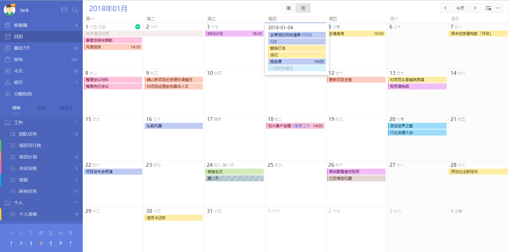
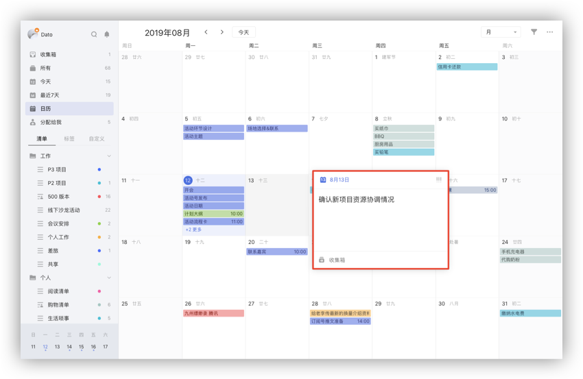
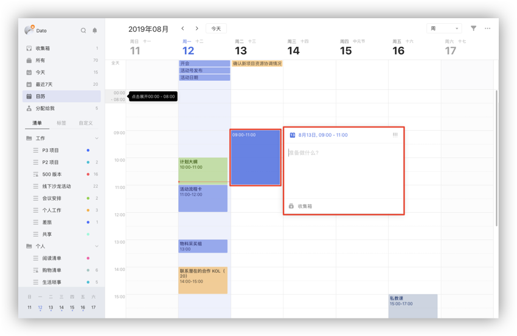
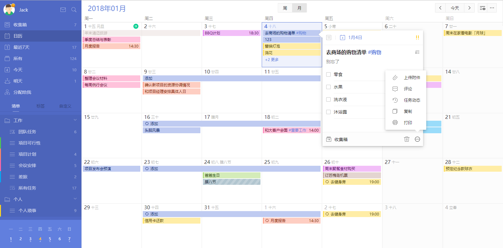
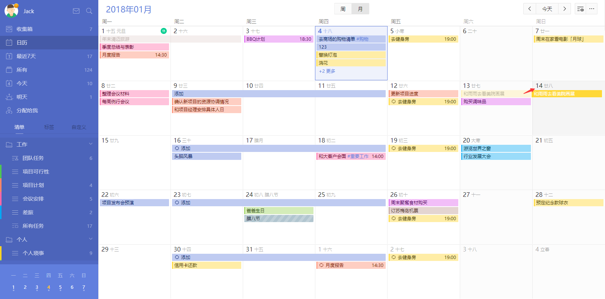
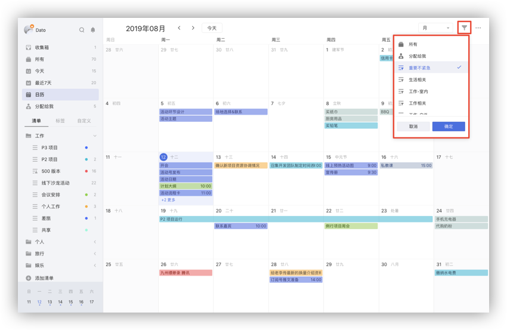
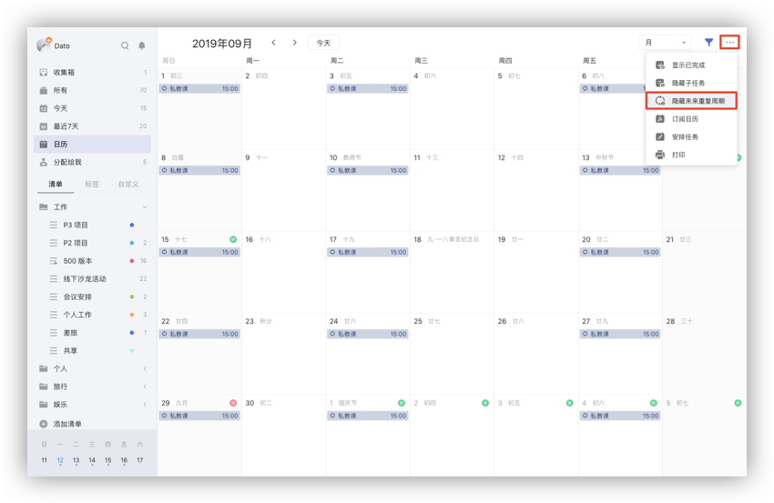
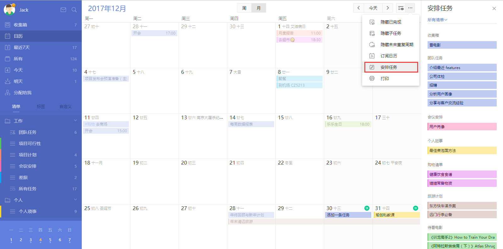
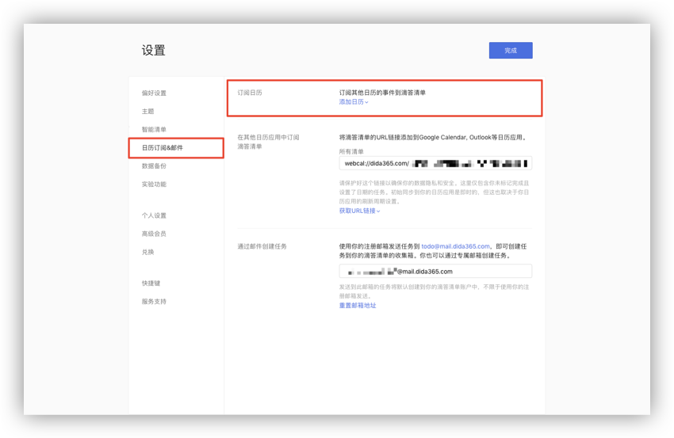
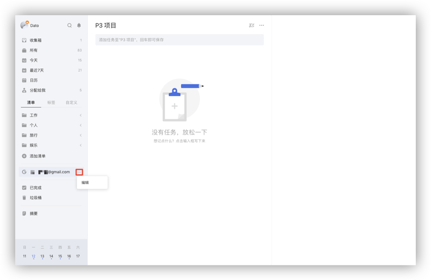

## 日历

### 日历视图

「日历视图」可以帮助您更直观地查看自己的任务计划和日程安排。

* 单击页面左上角头像进入「设置」-「智能清单」-「日历」，将日历状态改为**显示**。设置后，「日历」选项会出现在左侧边栏智能清单「最近7天」的下面。

* 点击「日历」，就可以进入日历视图查看每月任务。如果某天的任务较多，网格中显示不下时，网格中会出现「更多」按钮，点击可展开当天的全部任务。

* 农历、周数和节假日调休可以在「设置」-「通用」-「显示农历，周数与节假日」中开启。

在日历页面上方有日视图、周视图和月视图的切换按钮，点击对应按钮即可切换到相应视图。日视图和周视图分为全天任务区域和时间轴区域。

全天任务区域显示当天的全天任务和跨天任务，任务比较多的时候可以把全天区域整个展开。

时间轴区域内默认 00:00-7:00 和 21:00-24:00 两个时间段会被隐藏起来，如果想要查看这两个时间段中的任务，可以手动点击时间轴展开进行查看。
`注：时间轴任务的最小高度是半个小时，时间点的任务和持续时间不足半小时的任务默认占半小时。比如早上 9 点和早上 9 点-9 点 20 的任务都是占 9 点到 9 点半的网格。`

#### 添加任务

月视图和周视图全天任务区域中点击某天网格空白处添加该天任务，在弹窗中输入任务标题的同时可以设置时间、提醒、重复和优先级，并可以将任务移动到别的清单，再点击空白处或输入标题时回车可添加新任务。在日试图和周视图时间轴上选中网格添加任务会自动设置任务时间。

在月视图和周视图全天任务区域中，鼠标拖动选中多个网格可以创建跨天任务。

在周视图和日视图的时间轴区域中，选中后拖动可以创建带有时间段任务。

#### 编辑任务

选中某条任务，可以在详情框中修改任务详情和删除任务。

#### 拖动任务

拖动任务到其他日期对应的网格中可以快速修改任务到期日。

#### 筛选清单

点击日历视图右上角的筛选按钮，可以根据清单来筛选显示在日历中的任务。

#### 隐藏/显示已完成任务

在日历右上角「···」-「显示设置」中取消勾选「显示已完成」，可以在日历中隐藏已完成的任务，默认为隐藏。

#### 隐藏/显示子任务

在日历右上角「···」-「显示设置」中选择「显示子任务」，可以在日历对应的网格中显示该时间的子任务，默认为隐藏。 

#### 隐藏/显示未来重复周期

在日历右上角「···」-「显示设置」中选择「显示未来重复周期」，可在日历中显示每个周期的任务。

#### 安排任务

点击日历右上角「···」-「安排任务」，可以在日历中安排没有日期和时间的任务，您可以通过将任务拖拽到网格或时间轴中来设置任务日期和时间。

#### 打印日历

点击日历右上角的「···」选择「打印」，来打印日视图、周试图和月视图页面。

### 日历订阅

 #### 在其他日历中显示滴答清单的任务
 
 点击左上角头像 -「设置」-「账户」-「用户设置」，在弹出的网页中点击「日历订阅」。单击「获取 URL 链接」，您会得到一个 URL 地址，将 URL 链接复制到日历应用（ 如，谷歌日历、Outlook 日历及其他支持 URL 链接订阅的日历应用）中即可在其他日历中显示滴答清单的任务。

#### 在滴答清单中显示其他日历事件

滴答清单允许您从其他日历服务中订阅事件。点击左侧边栏头像，选择「设置」-「日历订阅」，点击「添加订阅」，可以选择订阅谷歌日历，也可以通过链接订阅其他日历。点击日历视图右上角的「···」选择「订阅日历」也可进行订阅。

* **订阅谷歌日历**：登录谷歌账号，允许滴答清单订阅谷歌日历，即可完成订阅。
* **通过链接订阅日历**：选择「URL 地址」，在弹窗中输入您想订阅日历的 URL，即可完成订阅。

点击已订阅日历后面的「编辑」，在编辑框中可以选择日历事件的状态，包括**显示**、**在日历中显示**、**隐藏**三种状态。如果不想再订阅该日历，可以点击编辑框中的「取消订阅」。 

日历事件的状态为**显示**或**在日历中显示**时才可以显示在日历中，日历事件的状态只有为**显示**时才可以在智能清单中显示。自定义智能清单也可以对日历事件进行筛选。

订阅后的日历也会显示在左侧边栏的清单列表下面，点击日历名称，可以查看日历中的任务，但是不能进行修改。点击日历名称后面的「···」，选择「编辑」图标，可以对是否展示订阅日历进行管理。

