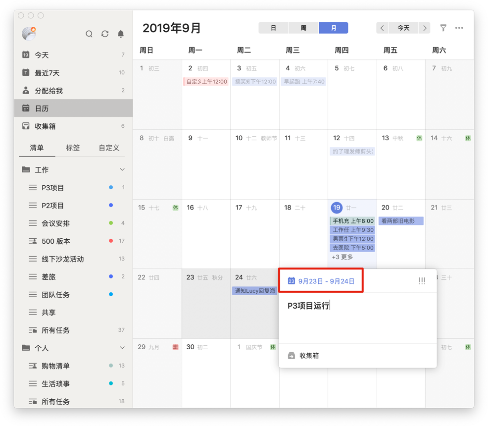
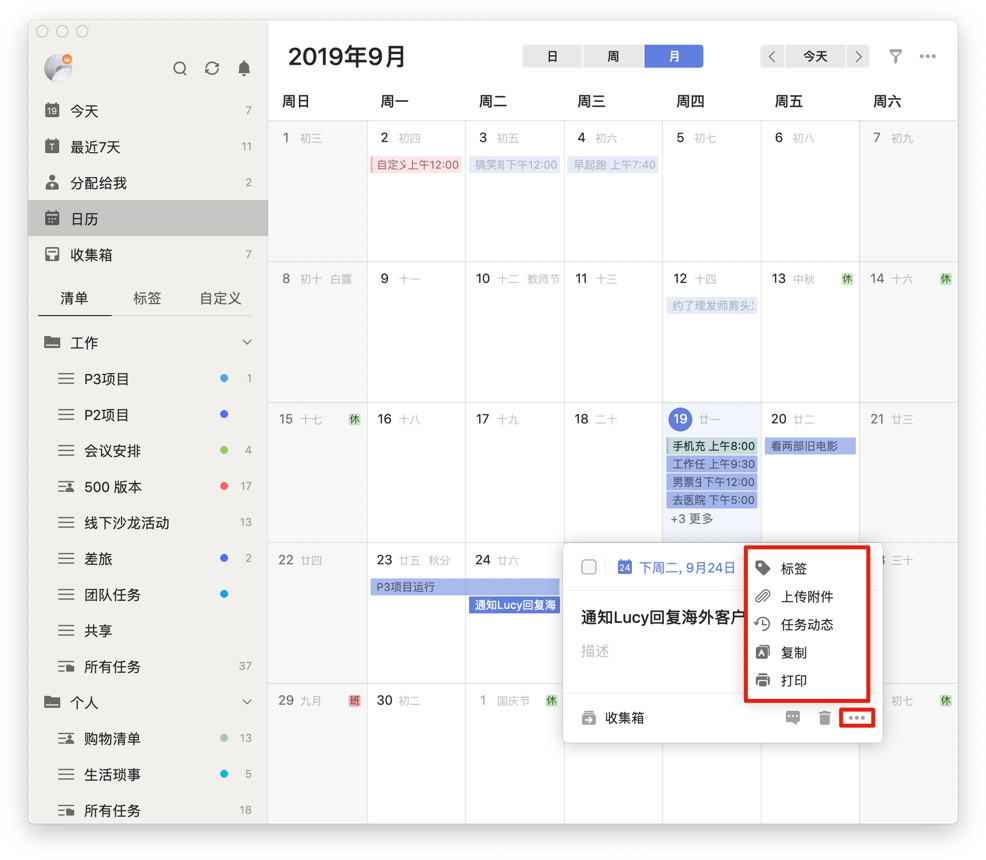
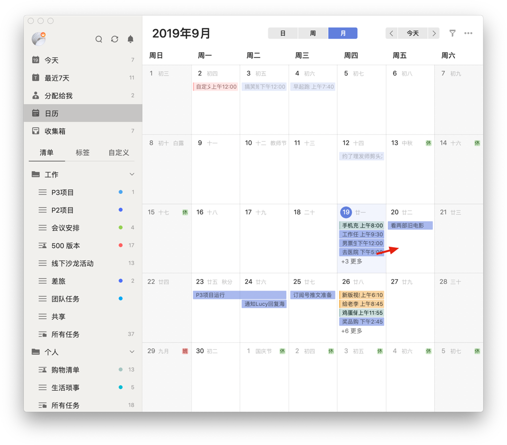
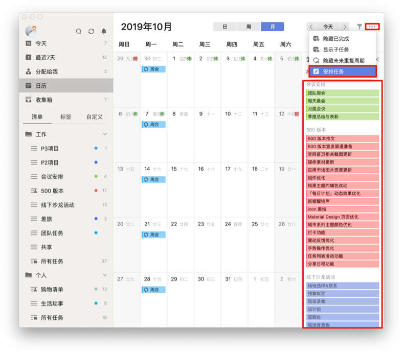

## 日历

#### 日历视图

「日历视图」可以帮助你更直观地查看自己的任务计划，安排日程。方便你在制定计划时，可以考虑到一周甚至一个月的任务安排，更好的统筹任务安排，规划时间。 `注：该功能为高级账户功能。`

* 单击页面左上角头像进入「设置」-「智能清单」，开启「日历」。
* 设置后，「日历」选项会出现在左边智能清单「最近7天」的下面。
* 点击「日历」，就可以进入日历视图查看每月任务。如果某天的任务较多，网格中显示不下时，网格中会出现“更多”按钮，点击“更多”展开当天的全部任务即可。

`注：农历和节假日调休可以在「设置」-「偏好设置」-「农历与节假日」中开启。` `注：任务色块的颜色就是所属清单的颜色，可以在侧边栏中清单右侧「...」点击编辑修改清单颜色，使任务在日历中看起来更直观。`

在日历页面上方有周视图和月视图的切换按钮，点击对应按钮即可切换到相应视图，直接查看一周任务。周视图分为全天任务区域和时间轴区域。

全天任务区域显示当天的全天任务和跨天任务，任务比较多的时候可以把全天区域整个展开。

为了提高正常工作时的效率，时间轴区域内默认00:00-7:00和21:00-00:00两个时间段会被隐藏起来，如果想要查看这两个时间段中的任务，或者您习惯在此时间段内进行高效工作，可以手动点击时间轴展开进行查看。

`注：时间轴任务色块的最小高度是半个小时，时间点的任务和持续时间不足半小时的时间段任务都是占半小时的高度。比如早上9点和早上9点-9点20的任务都是占9点到9点半的网格。`

##### 添加任务

月视图和周视图全天任务区域中点击某天网格空白处添加该天任务，在弹窗中输入任务标题的同时可以设置时间、提醒、重复、优先级和移动到别的清单，再点击空白处或输入标题时回车即可添加任务成功。在周视图时间轴上选中网格添加任务带上时间点。

月视图和周视图全天任务区域中，鼠标拖动选中多个网格可以创建跨天任务。

鼠标在时间轴区域中，选中后拖动可以创建带有时间段任务。

##### 编辑任务

选中某条任务，可以在详情框中修改任务详情和删除任务。

##### 拖动任务

拖动任务到其他日期对应的网格中可以快速修改任务到期日。

##### 筛选清单

根据自己的需要可以筛选在日历中显示的清单。

##### 隐藏/显示已完成任务

点击日历右上角的「...」选择「隐藏已完成任务」，可以在日历中不显示已完成的任务，默认为显示。

##### 隐藏/显示子任务

点击日历右上角的「...」选择「显示子任务」，可以在日历对应的网格中显示有时间的子任务，默认为隐藏。 `注：已完成的子任务和所属主任务已完成的子任务是不显示在日历上的。`

##### 显示未来重复周期

点击日历右上角的「...」选择「显示未来重复周期」，在日历中显示每个周期的任务。

##### 安排任务

点击日历右上角的「...」选择「安排任务」，可以在日历中安排没有日期的任务，方便地拖拽任务到网格或时间轴中设置日期和提醒。

#### 日历订阅

**如何在滴答清单中显示其他日历事件?**

滴答清单允许您从其他日历服务中订阅事件。点击侧边栏左上角头像，选择「设置」-「日历订阅」，点击「添加订阅」，可以选择谷歌日历订阅和通过链接订阅日历。

* **订阅谷歌日历**：登录谷歌账号，允许滴答清单订阅谷歌日历，即可完成订阅。
* **通过链接订阅日历**：选择「URL地址」，在弹窗中输入你想订阅日历的URL，即可完成订阅。
   `注：该功能为高级账户功能。`

点击已订阅日历后面的「编辑」，在编辑框中可以选择日历事件的状态显示、在日历中显示、隐藏。如果不想再订阅该日历，可以点击编辑框中的「取消订阅」。 `注：日历事件的状态为显示和在日历中显示时可以显示在日历中，日历事件只有为显示时才可以在“所有”、“今天”等智能清单中显示。自定义智能清单也可以筛选日历。`

