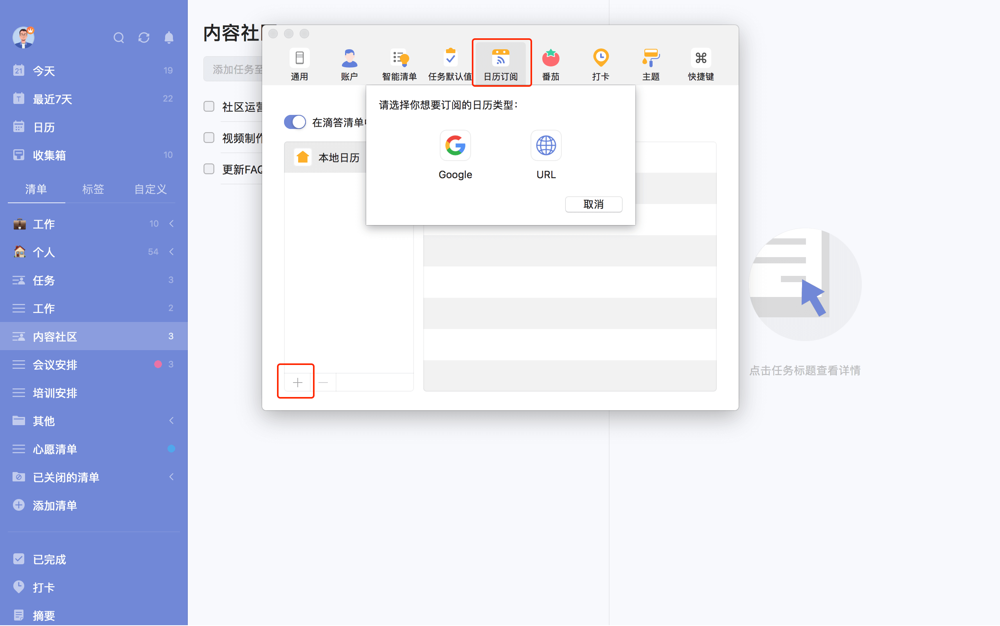

## 订阅日历

 ### 在其他日历中显示滴答清单的任务
 
 点击左上角头像 -「设置」-「账户」-「用户设置」，在弹出的网页中点击「日历订阅」。单击「获取 URL 链接」，您会得到一个 URL 地址，将 URL 链接复制到日历应用（ 如，谷歌日历、Outlook 日历及其他支持 URL 链接订阅的日历应用）中即可在其他日历中显示滴答清单的任务。

### 在滴答清单中显示其他日历事件

滴答清单允许您从其他日历服务中订阅事件。点击左侧边栏头像，选择「设置」-「日历订阅」，点击「添加订阅」，可以选择订阅谷歌日历，也可以通过链接订阅其他日历。点击日历视图右上角的「···」选择「订阅日历」也可进行订阅。

* **订阅谷歌日历**：登录谷歌账号，允许滴答清单订阅谷歌日历，即可完成订阅。
* **通过链接订阅日历**：选择「URL 地址」，在弹窗中输入您想订阅日历的 URL，即可完成订阅。

点击已订阅日历后面的「编辑」，在编辑框中可以选择日历事件的状态，包括**显示**、**在日历中显示**、**隐藏**三种状态。如果不想再订阅该日历，可以点击编辑框中的「取消订阅」。 

日历事件的状态为**显示**或**在日历中显示**时才可以显示在日历中，日历事件的状态只有为**显示**时才可以在智能清单中显示。自定义智能清单也可以对日历事件进行筛选。

订阅后的日历也会显示在左侧边栏的清单列表下面，点击日历名称，可以查看日历中的任务，但是不能进行修改。

