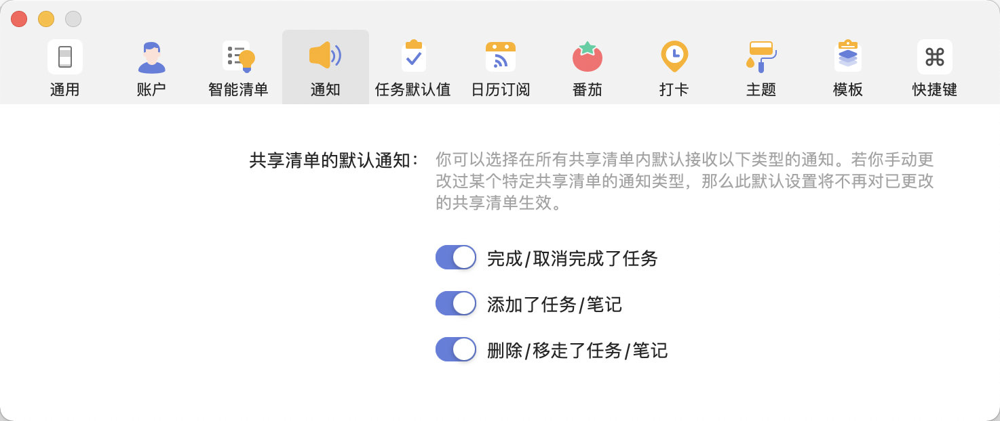
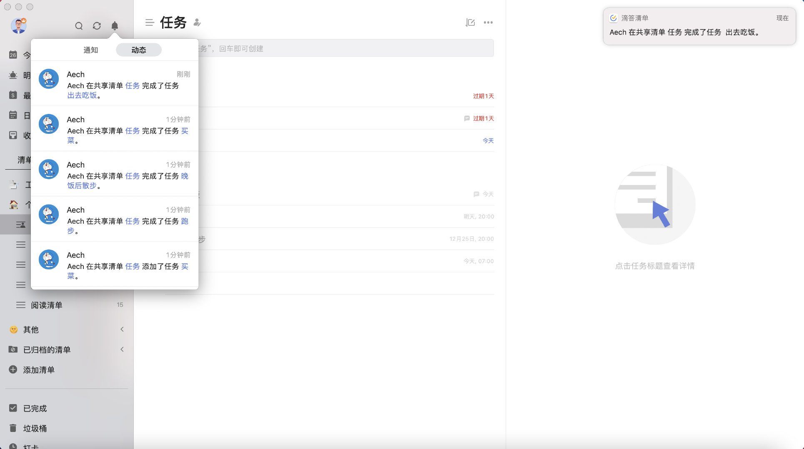
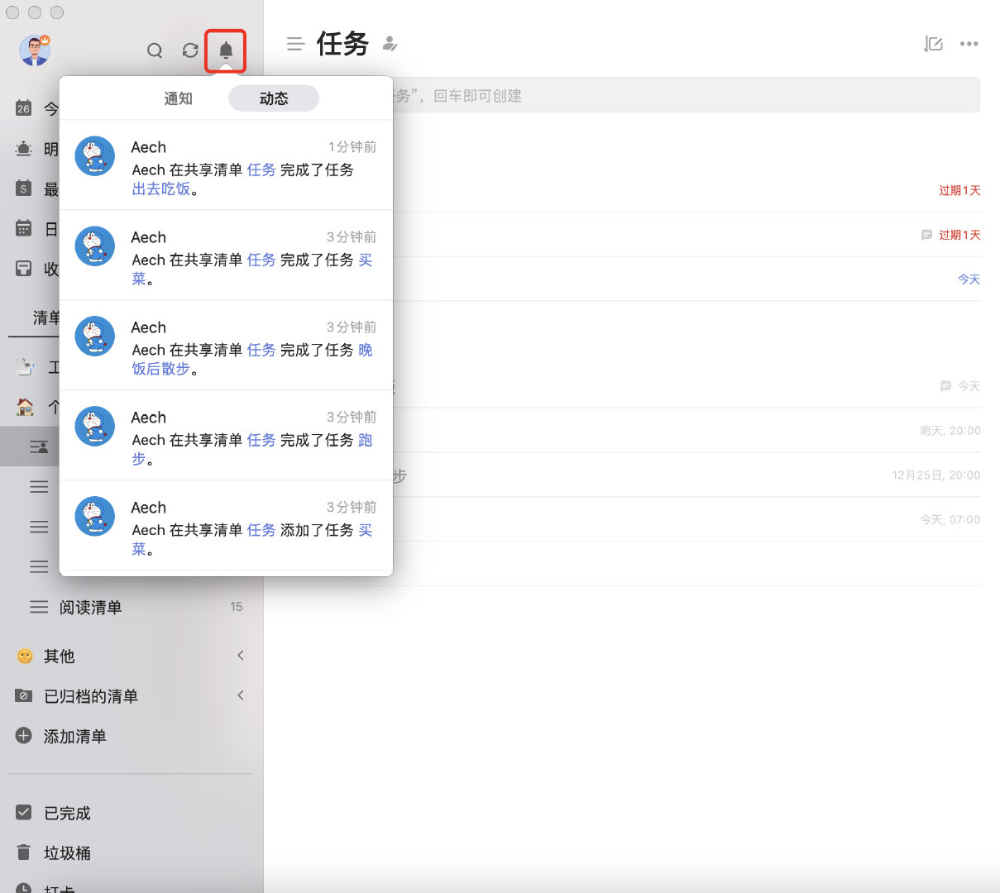
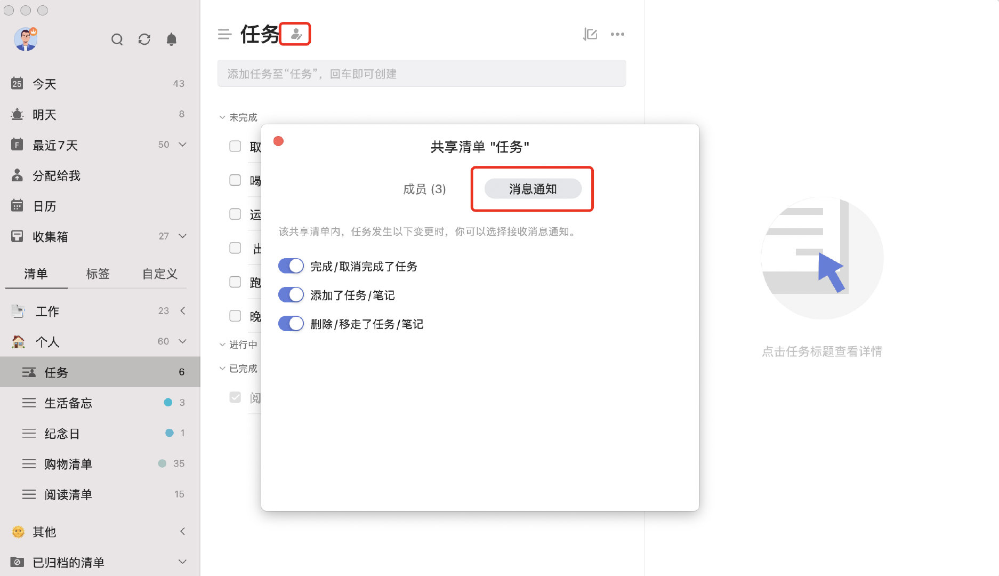

## 给共享清单设置通知权限。

「滴答清单」支持给共享清单设置通知权限。在「设置」 - 「通知」中可以开启「完成/取消完成了任务」、「添加任务/笔记」、「删除/移走了任务/笔记」等权限，开启之后权限会作用于所有共享清单。

开启之后其他成员在所有共享清单中进上述操作时，您会收到相应的系统通知。

同时在侧边栏上方的「通知中心」 - 「动态」内也有相应通知。

您也可以单独给一个共享清单设置通知权限。点击清单标题旁的「共享」按钮（或右键点击侧边栏共享清单之后点击「共享」） - 点击「消息通知」，就可以单独给当前清单开启「完成/取消完成了任务」、「添加了任务/笔记」、「删除/移走了任务/笔记」等通知权限。

