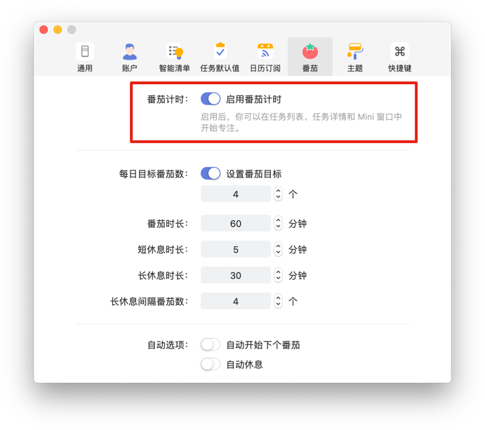
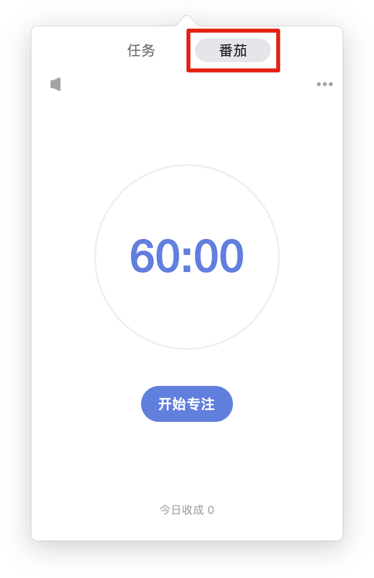

## 番茄计时

#### 开启番茄计时
如果您需要使用番茄计时，请先在设置中开启「番茄」功能。点击「头像」-「设置」-「番茄计时」，将其开启。

同时如果你想要自定义番茄的各项设置，比如：番茄时长，休息时长等，可以直接在下方进行设置。

开启后，可以在上方状态栏看到番茄计时的小窗口。

#### 两种方式开启番茄
**1.任务列表：**

在任务列表页，将鼠标移动到需要专注的任务名右侧，点击出现的「...」图标，然后选择「开始专注」即可。

**2.任务详情页：**

在任务详情页，点击右下角的「...」图标，然后选择「开始专注」即可。

