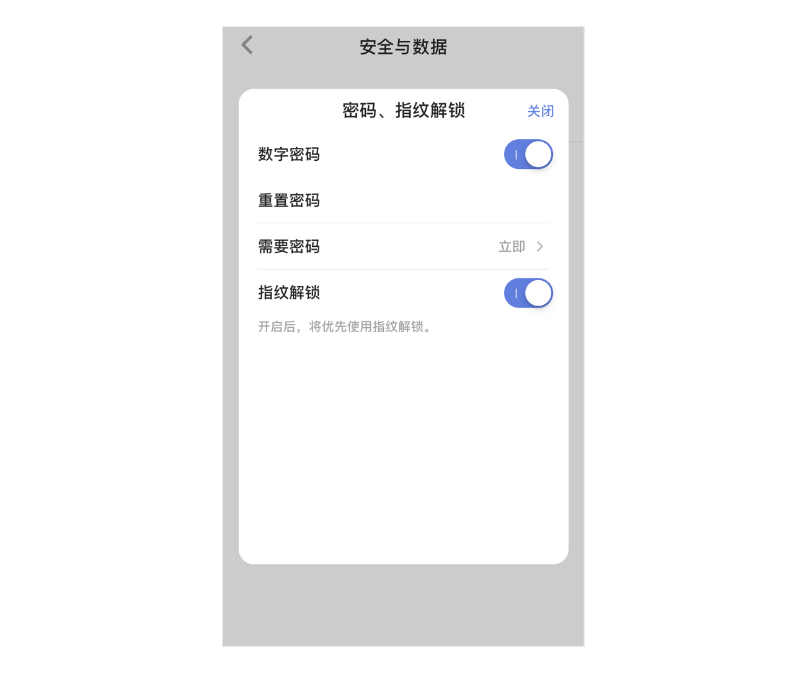

## 基础设置

### 通用

点击左上角头像 -「设置」-「通用」，可以对以下项目进行个性化设置：

* 是否**在 Dock 中显示应用图标**；
* **在 Dock 图标中显示任务数量**：可选择无、时间已过期、今天、日期已过期和今天+日期已过期 5 种显示任务数量的方式；
* **启动时优先打开**：可以选择优先打开主窗体或辅助窗体；
* **语言**：可以选择语言跟随系统、简体中文和 English 3 种语言；
* 是否**开机自启时最小化应用**；
* **智能日期识别**：开启后在添加任务时，将智能识别自然语言中的日期和时间并自动设置提醒。
* **标签识别**：开启后在添加任务时，您可以选择在任务标题中保留或移除标签文本。
* **显示农历，周数与节假日**：可选择是否在日历中显示农历、周数和节假日与调休；
* **时区**：启用后，在时间选择界面设置时间时，可以选择时区。

### 任务默认值

在「设置」中点击「任务默认值」，可以对任务日期、日期模式、提醒时间、优先级、添加到清单的位置进行设置，之后创建的新任务会自动带上这些默认设置。

`注：新任务默认设置对应用、小部件和状态栏生效，但智能清单“今天”、“明天”、“最近7天”和日历不受默认日期的影响。`

### 主题

点击左上角头像-「设置」-「主题」，滴答清单 Mac 客户端提供了 8 种纯色主题、4 种季节系列主题、12 种城市系列主题和 5 种摄影系列主题，可以根据喜好进行设置。 

