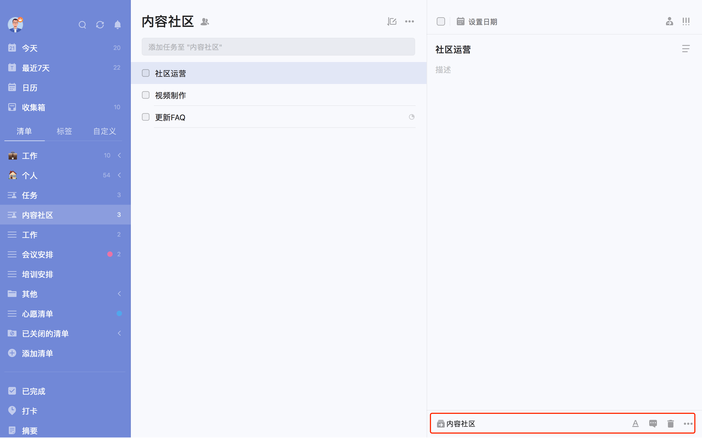
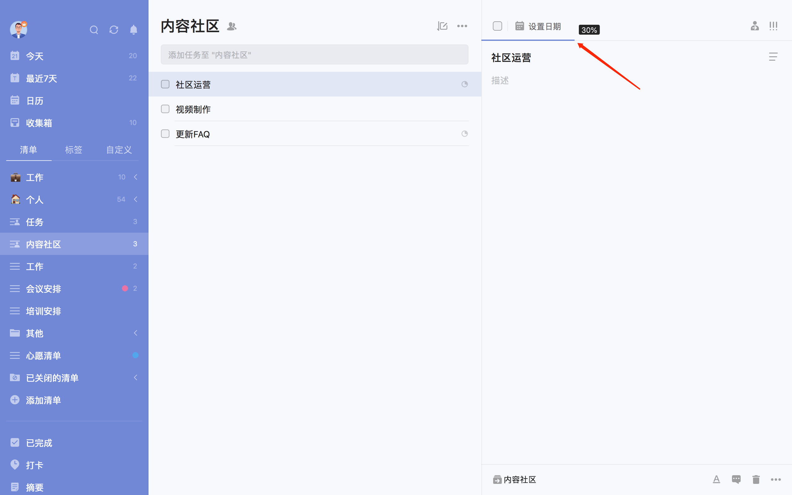
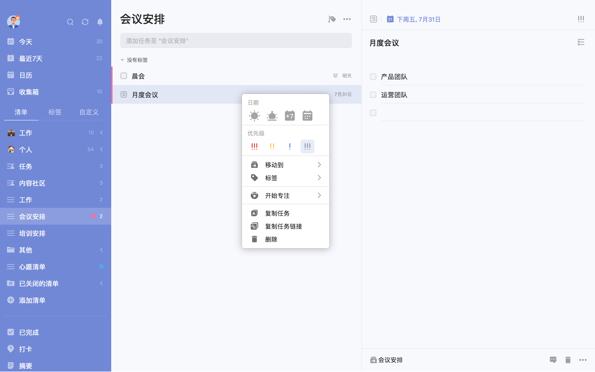

## 列表模式管理任务

### 修改任务

任务时间发生变化或任务内容需要更改，可以直接在右侧任务详情页进行编辑。

任务详情页右上角，分别有「指派」和「优先级」按钮：

* 「指派」：可以将该任务指派给共享清单中的成员，包括自己；
   `注：该任务不是共享清单，则不会显示「指派」按钮。`
* 「优先级」：包括「高」「中」「低」「无」四种优先级。

 任务详情页下端，分别有**所属清单/文件夹**、**Markdown入口**、**评论**、**垃圾桶**、**更多**。

* **所属清单/文件夹**：可以快速将任务移动到某个清单或文件夹。
* **评论**：可以对任务增加评论，若是共享任务，还可以@他人或回复他人，对方会在通知中心中收到提醒。
* **垃圾桶**，任务会被删除，若误删，可以点击弹出的「撤销」按钮来恢复任务，也可以去左侧边栏中的垃圾桶来恢复已删除任务。
* **更多**包括：
   1、「标签」：为当前任务添加标签；
	 2、「开始专注」：点击开始该任务的专注计时；
	   `注：要在「设置」-「番茄」中启用番茄计时，这里才会显示「开始专注」选项。`
   3、「上传附件」：滴答清单支持图片、音频和经常使用的文件类型（如 word和excel文件） 等；
   4、「任务动态」：你可以在这里看到此任务的历史动态，包括创建、修改、完成和取消完成等；
	 5、「复制任务」：点击可以生成任务副本；
	 6、「复制任务链接」：点击可以复制该任务的链接；
	 7、「打印」：可以将此任务的任务详情打印出来。

### 任务排序

滴答清单提供按自定义排序、按时间排序、按标题排序、按标签排序、按优先级排序、按指派人排序和按清单排序。

* **按自定义排序**：该排序模式下，长按拖动根据自己的需求排序。
* **按时间排序**：该排序下会将任务按「已过期」「今天」「最近7天」「更远」区分排序。
* **按标题排序**：按任务标题的首字母排序。
* **按标签排序**：按任务所携带的标签进行排序。
* **按优先级排序**：该排序下会将任务按高、中、低、无优先级四个等级排序。长按拖动任务从一个等级区域到另一个等级区域，自动更改任务的优先级。
* **按指派人排序**：只有共享清单中才可以使用此种排序方式。按任务的指派人进行排序，可以清晰展示共享任务的来源。
* **按清单排序**：只在智能清单、自定义智能清单以及清单文件夹中有此排序方式，方便了解各个清单下的任务情况。

### 指派任务给其他人

您只能在共享清单里指派任务。点击任务详情界面右上角的指派图标，选择您要指派的对象，被指派者会在通知中心内收到通知。

### 搜索任务

「搜索」的图标在左侧边栏的顶部。利用搜索功能，可以对任务进行全局搜索。 搜索结果包括已完成和未完成，可以自行设定搜索的条件：日期、清单、标签和状态。

### 任务进度

进入任务详情页，长按日期栏进行左右拖拽，即可对任务设置完成进度。如果任务中包含检查事项，会根据检查事项的完成比例自动计算任务进度。

### 显示已完成的任务

如果想要更好地专注在未完成的任务中，可以选择「隐藏已完成」。 在任务列表页中，点击右上角「···」-「隐藏已完成」即可隐藏已完成的任务。 

需要时，也可以随时在「已完成」清单中查看已完成的任务，或者在右上角「···」里点击「显示已完成」，将已完成任务再次显示出来。 
`注：「已完成」是智能清单，需要在「设置」-「智能清单」中将「已完成」清单设置为**显示**后才能查看。`

### 批量操作

当任务较多，且需要进行相同的设置操作时，可以通过批量操作来完成。

任务列表页上，按住「Ctrl 」（ Mac 端为「Command」) 或「Shfit 」键，鼠标可选中多个任务，然后右键进行批量操作。按住「Shfit 」键，选中第一条任务和最后一条任务，中间的所有任务会同时选中，适用于批量操作较多的任务。

可以批量完成/取消完成、修改日期、修改优先级、移动到其它清单、删除、指派给别人。若选中2个及以上任务，可以合并任务成新任务，新任务将以子任务形式呈现，但不再保留原任务的附件和评论信息，且原任务将被删除到垃圾桶。

在普通清单中合并任务，新任务默认合并到该清单中；在智能清单、自定义智能清单和所有清单中合并任务，默认合并到选中任务按自定义排序时的第一个任务所属的清单。

### 拖动任务到清单

拖动任务左侧的按钮，把任务拖到左侧边栏上的清单中，放手后清单会移动到所选清单中。

拖动任务放到“今天”、“明天”、“最近7天”智能清单中，任务会带上对应的时间。比如，昨天晚上9点的任务拖动到“今天”智能清单中，该任务的时间会变成今天晚上9点。

### 快速操作

在任务列表页上选中某条任务，右键可以快速进行设置日期、设置优先级、移动到别的清单/文件夹、添加标签、开始专注、复制任务、复制任务链接、删除任务以及将共享清单中的任务指派给其他人的操作。

在任务详情页上，把鼠标悬停在日期栏的日历图标上，出现快速设置日期框，可以选择「今天」「明天」「下周」「下月」，来快速修改日期。

