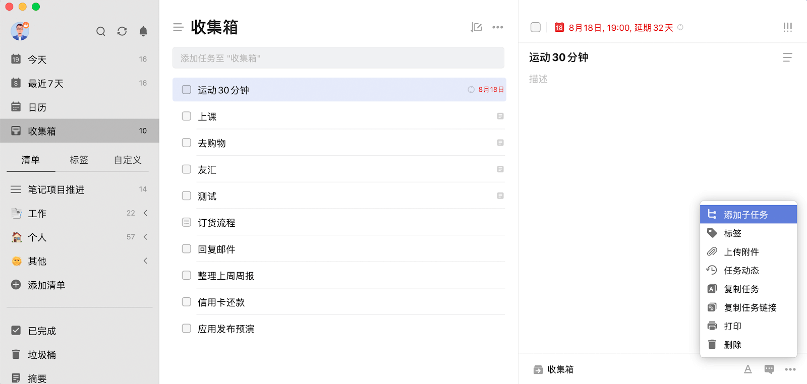
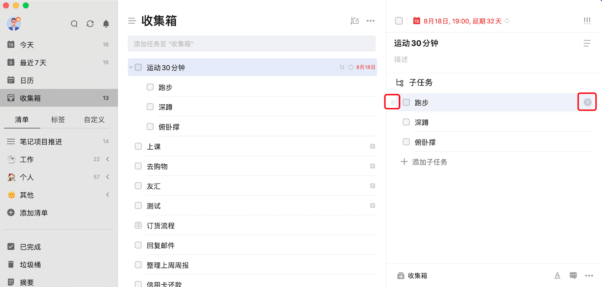
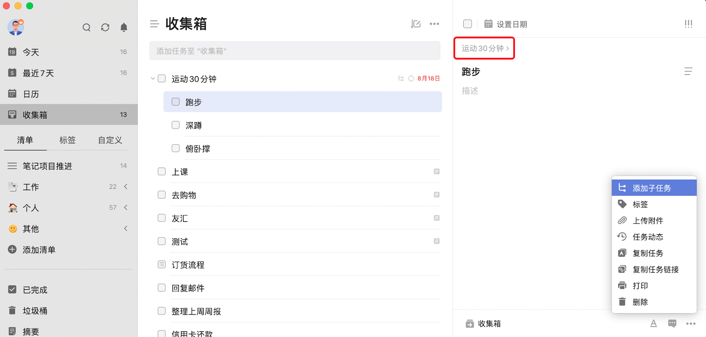

## 多级任务

在 macOS 端，点击进入「任务详情」 - 点击左下角的「···」 - 点击「添加子任务」即可在该任务下添加一个子任务,也可以在任务列表中选中父任务之后按「shift」+「enter」来快速创建子任务。选中完成输入第一个子任务之后可以按「enter」来创建第二个子任务。

点击子任务左边的「三横」即可拖动子任务，改变其顺序，点击子任务右侧的图标则可以进入子任务的详情。

在子任务详情中，可以再次点击子任务详情中的「···」 - 点击「添加子任务」来再次在子任务中添加新一层级的子任务，最多可以添加五个不同层级的任务。也可以在详情中点击子任务标题上方的父任务标题来跳转到父任务详情页。

每一个层级的子任务在功能上都与普通任务相同，即子任务可以设置时间和时间段、进行专注、在其下写任务详情、删除之后可以在「垃圾桶」中恢复、设置标签和优先级以及分配给其他人。