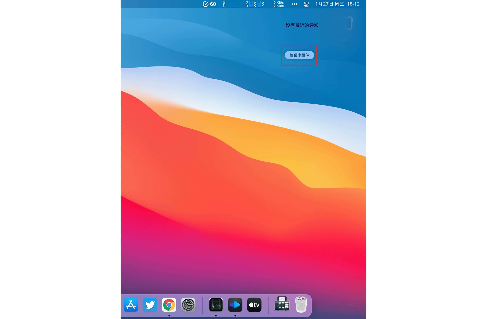

## 添加 macOS Big Sur 小组件

###添加小组件

要在 macOS Big Sur 下添加最新版的小组件，请先点击桌面右上角日期与时间来呼出通知中心。

之后点击「编辑小组件」，在左侧列表中找到滴答清单就可查看到所有小组件选项。

滴答清单总共提供四种小组件：「今日习惯」、「今日日历」、「任务」和「日历月视图」，其中「今日习惯」和「任务」小组件提供小、中、大三个不同尺寸，「日历月视图」提供中和大两种尺寸。点击下方的「小、中、大」字样即可进行选择。选择好尺寸之后点击该小部件即可将其添加到通知中心中了。

###编辑小组件

四种小组件中有「任务」和「今日日历」小组件支持编辑操作。在编辑小组件页面将鼠标悬停至小组件上方，当出现「编辑此小组件」字样时即可点击对「任务」小组件的主题、显示清单、是否显示已完成以及是否切换到夜间模式进行编辑，编辑完之后点击完成即可。

今日日历小组件支持选择是否显示已完成。

除此之外，您还可以直接在通知中心右键「任务」和「今日日历」小组件 - 选择「编辑滴答清单」来直接进行编辑操作。

