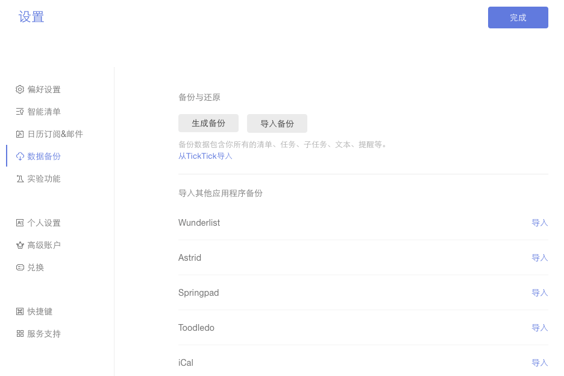

##账户设置
点击左上角头像, 选择【设置】来设置您的用户名, 修改头像和密码, 备份任务以及删除账户。同时, 在这里, 你还能看到你在滴答清单上的活跃程度。

####更改账号的邮箱地址
点击左上角头像>【设置】>【个人设置】>点击邮箱地址旁的【编辑】修改邮箱地址，修改之后需要到新邮箱地址验证邮箱。

####上传头像
点击左上角头像>【设置】>【个人设置】>单击头像,从你的电脑上传一个新的头像。

####修改密码
点击左上角头像>【设置】>【个人设置】>点击密码旁的【编辑】修改密码，修改成功即可。

####生成和导入备份
点击左上角头像>【设置】>【数据备份】。然后,点击【生成备份】按钮, 这样您就可以备份在一个以csv为后缀的备份文件。
 如果你需要导入备份后,您可以单击【导入备份】，再上传以csv为后缀的文件。

###删除账号
点击左上角头>【设置】>【个人设置】，然后点击【删除账户】。
<br/ >请注意从滴答清单删除帐户将删除所有数据,为了防止误操作,您将被要求输入你的密码确认。
<br/ >如果你忘了你的密码,建议先重置你的密码。

####从其他应用中导入任务信息

滴答清单允许从其他应用内导入任务信息，比如奇妙清单、Toodledo等。
<br/ >点击左上角头像>【设置】>【数据备份】。然后选择对应的渠道（Wunderlist,Astrid,Toodledo等等 ）上传备份文件到滴答清单。

####偏好设置
点击左上角头像>【设置】>【偏好设置】来设定你的主题、语言、时间格式、每周开始的日期、每日任务提醒的时间。

