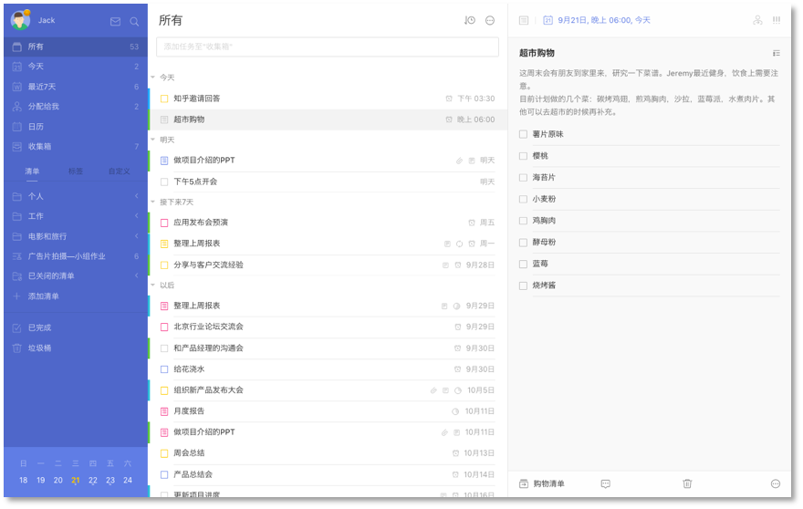
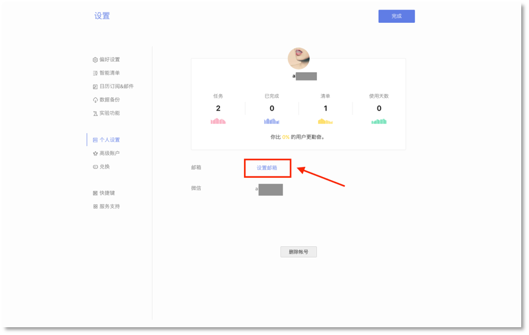

##账户设置

####注册和登录
 若您还没有注册滴答清单账户，您可以在[滴答清单](https://dida365.com)创建免费账户，点击网页右上角的【创建免费账户】，即可立即创建。

若您已有滴答清单账户，可以从[滴答清单](https://dida365.com)登陆网页版。

进入滴答清单网站，点击右上角【登录】，即可登录到您的滴答账号。

当您成功登录后, 会看到如下这样界面：

* 左侧边栏, 您可以看到所有清单（包括智能清单、普通清单和自定义智能清单）; 
* 中间是主任务栏, 显示选中清单的所有任务; 
* 右侧是任务详情页，显示选中任务的详情，也可以对任务进行多种操作。

####绑定账户
若您使用邮箱注册滴答清单账号，可以将滴答账号绑定您的微信。
 绑定后，您就可以使用微信账号免密码登录滴答清单，也可以使用微信公众号的服务，在微信中创建和查询任务。
 绑定方法：
点击左上角头像-【设置】-【个人设置】-【玩转微信公众号】，按提示绑定微信即可。

 若您使用微信账号注册滴答清单，可以绑定邮箱，就能够通过邮箱创建任务。
 绑定方法：点击左上角头像-【设置】-【个人设置】，点击【设置邮箱】即可绑定您的邮箱。

 若您使用 QQ 账号或微博账号登陆滴答清单，也可以绑定您的邮箱和微信，绑定方法同上。
 `注：非 QQ 账号登陆的用户，无法绑定 QQ 账号。`
####个人设置
点击左上角头像, 选择【设置】-【个人设置】，可以对账户进行设置。
* 点击头像可以上传一个新头像；
* 点击昵称可以直接输入新的昵称；
* 点击邮箱地址旁的【修改邮箱】修改邮箱地址，修改之后需要到新邮箱地址验证邮箱；
* 点击密码旁的【修改密码】，即可成功修改密码；
* 滑动到底，点击【删除账户】即可删除账户；
 `注：从滴答清单删除帐户将删除所有数据,为防止误操作,会要求您输入密码进行确认。如果你忘了密码,可以先重置密码。`
 `注：删除使用微信、微博和 QQ 注册的账户时，会请您手动输入“我确认删除账户”方能继续进行操作 。`
* 同时在这里，还能看到你在滴答清单上的活跃程度。

####偏好设置
点击左上角头像-【设置】-【偏好设置】，可以根据你的使用偏好来进行设置。
* 主题：支持蓝色/黑色两种主题；
* 语言：下拉框选择语言；
* 时间格式：可以选择12小时制/24小时制；
* 每周开始的日期：日历中的每周开始日期，支持周日/周一/周六；
* 开启每日提醒：打开每日提醒开关后，可以自行设定每一天的提醒时间；
* 开启智能识别日期：打开智能识别日期开关后，可以自行选择是否保留文本中的时间信息。

