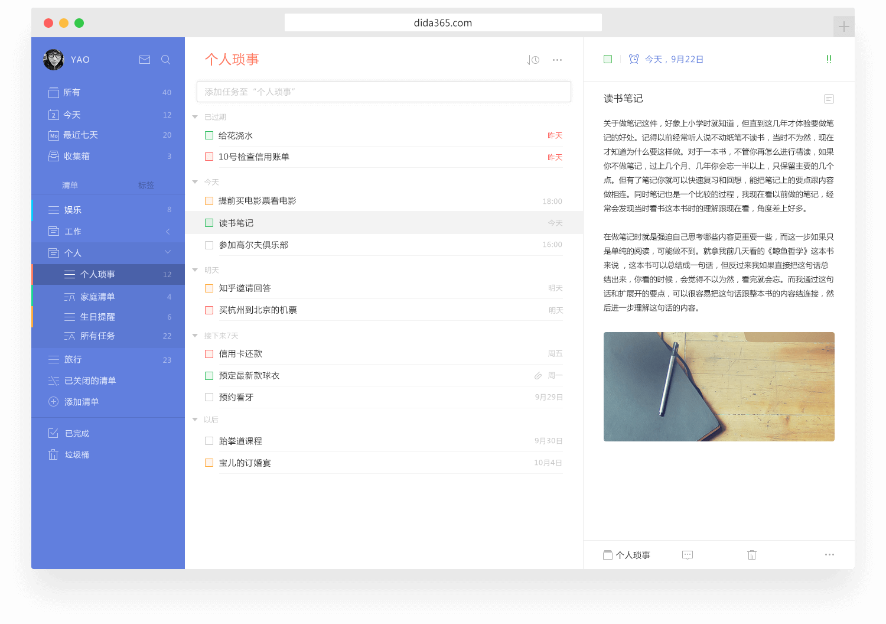

##账户设置

####注册和登录
 若您还没有注册滴答清单账户，您可以在[滴答清单](https://dida365.com)创建免费账户，点击网页右上角的「创建免费账户」，即可立即创建。

若您已有滴答清单账户，可以从[滴答清单](https://dida365.com)登陆网页版。

进入滴答清单网站，点击右上角「登录」，即可登录到您的滴答账号。

当您成功登录后, 会看到如下这样界面：

 左侧是清单列表栏, 您可以看到所有设置为显示或自动的的清单（包括智能清单、实体清单和自定义智能清单）; 
 中间是主任务栏, 显示选中清单中的所有任务; 
 右侧是任务详情页，显示选中任务的详情，也可以对任务进行多种操作。

####个人设置
点击左上角头像, 选择【设置】-【个人设置】可以对账户进行设置。
* 点击头像可以上传一个新头像；
1. 点击昵称可以直接输入新的昵称；
1. 点击邮箱地址旁的【修改邮箱】修改邮箱地址，修改之后需要到新邮箱地址验证邮箱；
1. 点击密码旁的【修改密码】，即可成功修改密码；
1. 滑动到底，点击【删除账户】即可删除账户；
 *注：从滴答清单删除帐户将删除所有数据,为了防止误操作,将要求您输入密码进行确认。如果你忘了你的密码,可以先重置密码。*
1. 
同时在这里，你还能看到你在滴答清单上的活跃程度。

####偏好设置
点击左上角头像-【设置】-【偏好设置】，可以根据你的使用偏好来进行设置。
* 主题：支持两种主题；
* 语言：下拉框选择语言；
* 时间格式：可以选择12小时制/24小时制；
* 每周开始的日期：日历中的每周开始日期，支持周日/周一/周六；
* 开启每日提醒：打开每日提醒开关后，可以自行设定每日任务提醒的时间；
* 开启智能识别日期：打开智能识别日期开关后，可以自行选择是否保留文本中的时间信息。

####生成和导入备份(本部分转移到数据子目录)
点击左上角头像-【设置】-【数据备份】。然后,点击【生成备份】按钮, 这样您就可以备份一个以csv为后缀的文件。
 如果你需要导入备份,您可以单击【导入备份】，再上传以csv为后缀的文件。

####从其他应用中导入任务信息（该部分转移到数据子目录）

滴答清单允许从其他应用内导入任务信息，比如奇妙清单、Toodledo等。
<br/ >点击左上角头像-【设置】-【数据备份】。然后选择对应的渠道（Wunderlist,Astrid,Toodledo等等 ）上传备份文件到滴答清单。

