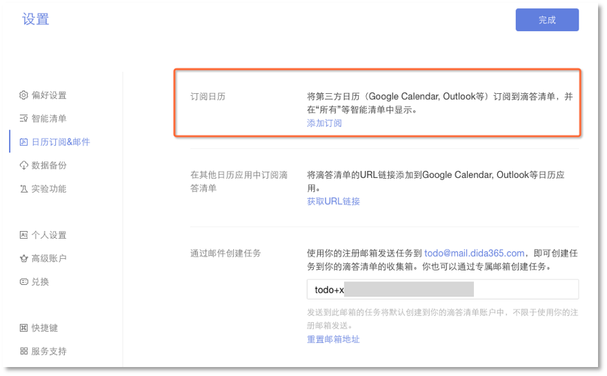
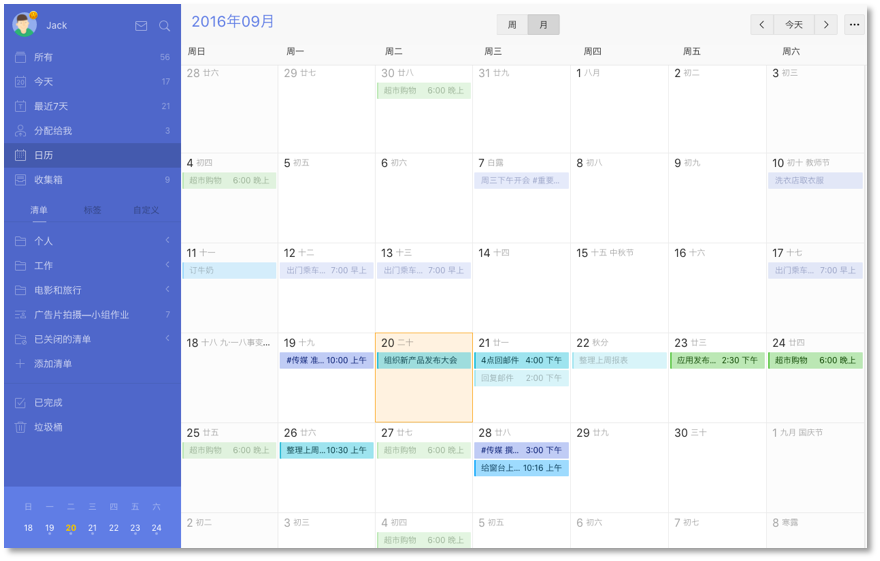

##日历

#### 日历订阅

** 如何在其他日历中显示滴答清单的任务?**
 点击页面左上角头像进入【设置】-【日历订阅&邮件】。单击【获取URL链接】,你会得到一个URL地址，将URL链接复制到日历应用（ Google Calendar,  Outlook 及其他支持 URL 链接订阅的日历应用）中。

 除了第三方日历应用，您还可以将滴答清单的任务添加在系统日历中。以iOS为例:
* 进入【设置】-邮件、联系人、日历选择【添加账户】；
* 选择【其他】，单击【添加订阅日历】，然后输入你从滴答清单获取的URL链接。

**如何在滴答清单中显示日历事件?**

这个功能允许您订阅其他日历，如谷歌日历。
 `注：该功能为高级账户功能。`
* 点击页面左上角头像，选择【设置】-【日历订阅&邮件】；
* 在左侧面板选择【添加订阅】，然后输入你想订阅日历的URL。

####日历视图
「日历视图」能够将任务显示在日历中，更直观、清晰。
 `注：该功能为高级账户功能。`
* 单击页面左上角头像进入【设置】-【智能清单】，开启【日历】。
* 设置后，【日历】选项会出现在左边智能清单【最近7天】的下面。
* 点击【日历】,就可以进入日历视图查看任务。
* 拖动任务到其他日期可以快速修改任务到期日，点击日期可以直接添加当日任务，单击某条任务可直接编辑任务内容。

####Mini日历
【Mini日历】存在于清单栏下端，是一个小日历。
 `注：该功能为高级账户功能。`
* 点击页面左上角头像进入【设置】-【实验功能】-启用【Mini日历】。
* 设置后,一个小日历将显示在清单栏的底部。
* 有小圆点的日期表示该日期有未完成的任务，点击日期将显示所有相关的任务。您还可以单击任何日期进入任务界面，添加当日任务。

