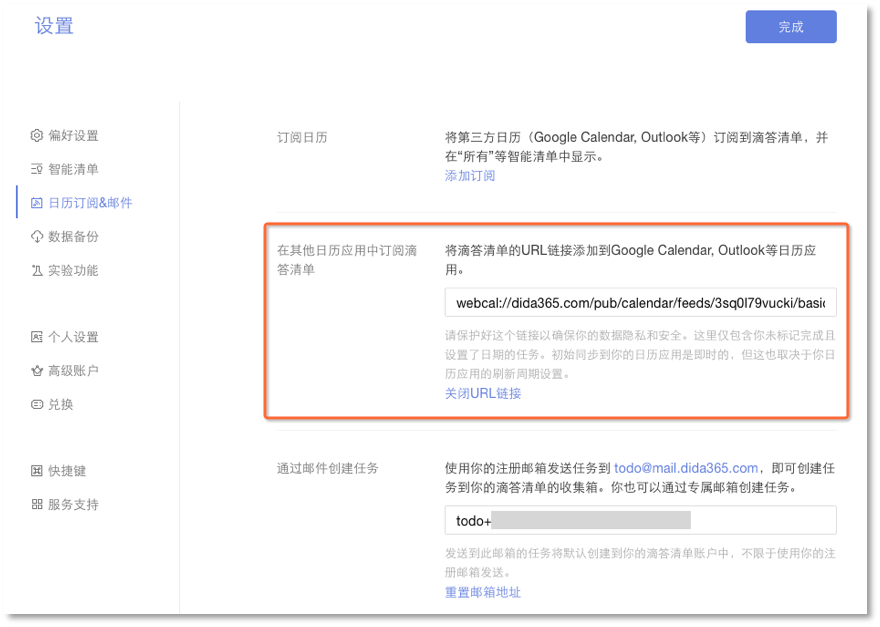
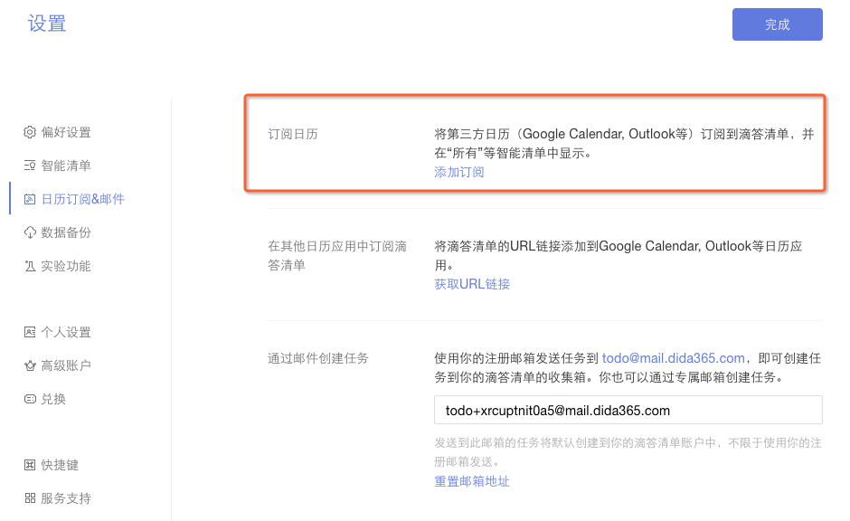
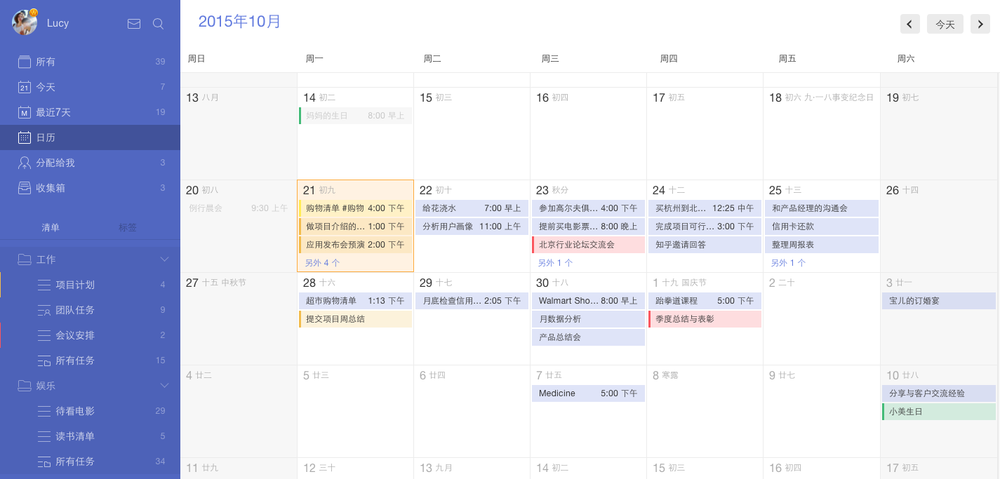

##日历

#### 如何在其他日历中显示滴答清单的任务?
滴答清单允许将任务导入自己的日历应用。点击页面左上角头像进入【设置】-【日历订阅&邮件】。单击【获取URL链接】,你会得到一个URL地址，复制并手动将我们提供的链接添加到日历应用( Google Calendar,  Outlook 及其他日历应用)。

 或者,您可以添加在其他日历应用程序提供的URL。以iOS为例:
 1. 去【设置】-邮件、联系人、日历选择【添加账户】
 2. 选择【其他】,然后单击【添加订阅日历】,然后输入你从滴答清单获取的URL。

####如何在滴答清单中显示日历事件?
这个功能允许您订阅其他日历服务,如谷歌日历。
 目前是一个仅向高级账户开放的功能。
 1. 点击页面左上角头像，选择【设置】-【日历订阅&邮件】。
 2. 在左侧面板选择【添加订阅】，然后输入你想订阅日历的URL。

####日历视图
“日历视图”显示任务像日历一样,更直观、清晰。它是一个仅对高级账户开放的功能。
 1. 单击页面左上角头像进入【设置】-【智能清单】，开启【日历】。
 2. 设置后，【日历】选项卡出现在左边智能清单【最近7天】的下面。
 3. 点击【日历】,就可以在日历检查你的任务。点击任何日期或单击任务编辑直接添加任务。
 

####Mini日历
【Mini日历】是一个小日历，可以快速查看你在哪天有任务。是一个仅对高级账户开放的功能。
 1. 点击页面左上角头像进入【设置】-【实验功能】-启用【Mini日历】。
 2. 设置后,一个小日历将显示在左面板的底部。
 3. 黄色突出显示的日期表明有任务,点击日期将显示所有相关的任务。您还可以单击任何日期为当天直接添加任务。
 
