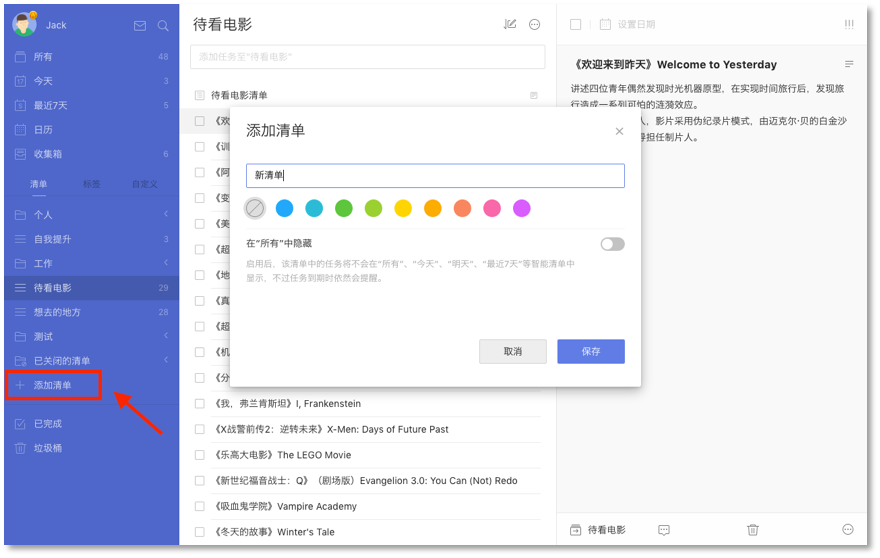
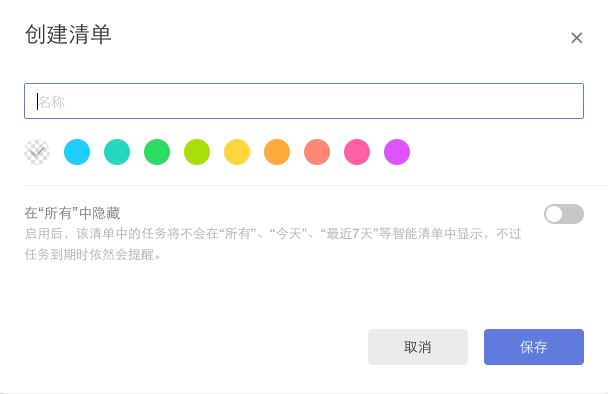
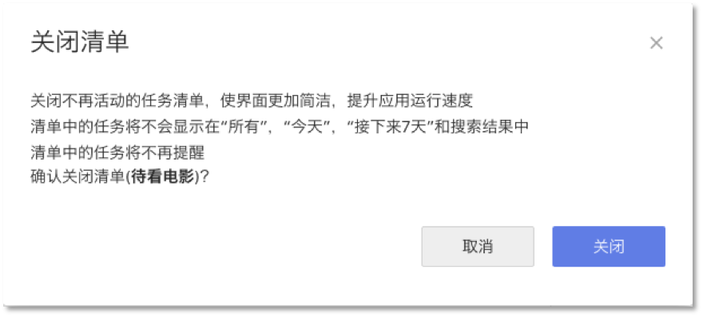
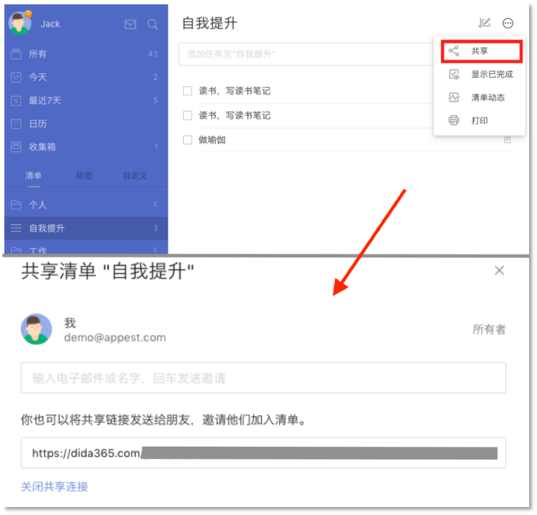
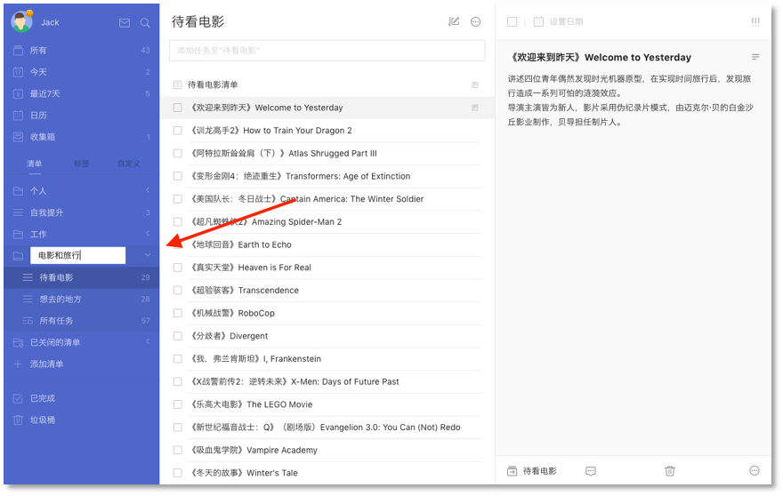

## 清单创建及管理

####清单的类型
* 智能清单：滴答清单的默认清单，如【今天】【明天】【最近七天】【收集箱】等；
 `注：【收集箱】是一个临时存储盒，不可被删除，用于存储所有没有被分配一个特定清单的任务；`
 `注：【分配给我】是收集来自不同的共享清单中分配给你的任务，你可以在这个清单中查看你在不同团队中的任务。`
* 普通清单：用户所创建的清单，如【生活】【工作】【会议】等；
* 自定义智能清单：用户通过筛选所创建的智能清单。

####创建普通清单
点击页面左侧边栏的【添加清单】 按钮可以直接创建一个您的自定义清单。

####管理普通清单
单击清单名旁的「···」,可以对清单进行【编辑】【关闭】【删除】的操作。
* 单击【编辑】,可以改变清单名称,选择颜色,或者选择是否在“所有”中显示该清单的内容。
<br/ >

* 单击【关闭】，可以关闭任务清单。
 

* 点击【删除】，将会删除该清单及清单下的任务。

 

####自定义智能清单
在【设置】-【智能清单】中开启【自定义智能清单】，在左侧边栏的【清单】和【标签】旁边会出现【自定义】。

 点击【添加智能清单】，即可创建自己的智能清单。
 可以使用【清单】【日期】【优先级】【标签】【分配给】五个筛选条件来添加智能清单中的任务。
 `注：当前没有带标签的任务时，【标签】筛选项不显示；` 
 `注：当前没有共享清单时，【分配给】筛选项不显示。` 

 点击自定义智能清单右侧的「···」可以对智能清单进行编辑和删除。

####共享清单
选择一个清单，点击任务界面上方的「···」图标，选择【共享】,目前支持邮箱邀请和共享链接：
* 输入受邀请人的电子邮件地址；
* 创建分享链接并发送给好友。

 共享清单中的任务可以指派给参与共享的成员。
点击任务，在右侧任务详情页右上角的

####打印清单
选择一个清单，点击任务界面上方的「···」图标，选择【打印】。在印刷之前,将有一个打印预览,可以设置纸张大小,边距等。

####文件夹
文件夹是清单的合集，你可以拖动清单进行合并，自行设定文件夹名。
 删除文件夹时，文件夹中的清单不会被删除，会单独显示在清单栏。
