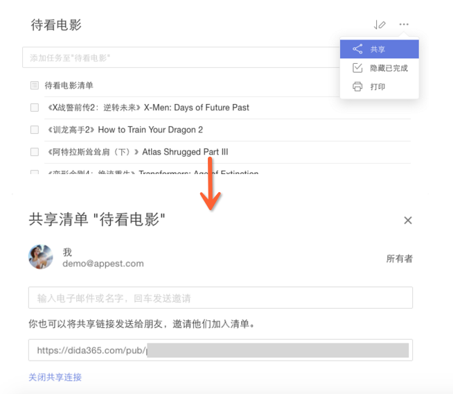

## 清单管理
点击页面左侧边栏的 【创建清单】 按钮可以直接创建一个您的自定义清单。 点击清单旁边的「···」按钮可以对该清单进行操作, 比如编辑, 删除, 打印等。
<br/ >

####编辑清单
单击清单名旁的「···」,然后单击【编辑】,你可以改变清单名称,或者选择颜色,或者选择是否在“所有”中显示该清单的内容。
<br/ >

####自定义智能清单
在【设置】-【智能清单】中开启“自定义智能清单”，在左侧边栏的“清单”和“标签”旁边会出现“自定义”。
 点击“添加智能清单”，即可创建自己的智能清单，可以使用“清单”“日期”“优先级”“标签”“分配给”五个筛选条件来添加智能清单中的任务。
`当前没有带标签的任务时，“标签”筛选项不显示；` 
`当前没有共享清单时，“分配给”筛选项不显示。` 
 点击自定义智能清单右侧的「···」可以对智能清单进行编辑和删除。

####分享清单给好友
选择一个清单，点击任务界面上方的「···」图标，选择【共享】,然后直接输入受邀请人的电子邮件地址，或者直接创建分享链接，然后发送给好友。
<br/ >

####打印清单
选择一个清单，点击任务界面上方的「···」图标，选择【打印】。在印刷之前,你将有一个打印预览,您可以设置纸张大小,边距等。

####关闭清单
为了保持界面清爽, 同时提高应用运行速度, 您可以将不常用的或者不活跃的任务列表暂时关闭。
 点击某一个清单旁边的「···」按钮，再选择【关闭】。
 关闭列表后, 其任务将不再被展示在“所有”, “今天”, “接下来七天” 和搜索结果中。同时, 列表中的任务也不会再收到提醒。

####删除清单
点击某一个清单旁边的「···」按钮，再选择【删除】。
<br/ >请注意一旦删除列表,这个列表中的所有任务将被删除。所以,删除列表时小心谨慎。

####“收集箱”是什么?
“收集箱”是一个预定义的清单,不能被删除。
<br/ >它的工作原理就像一个临时存储盒,用于存储所有没有被分配一个特定清单的任务。
<br/ >当你没有创建其他清单时，“所有”显示的即是“收集箱”。

####“分配给我”是什么?
“分配给我”也是一个预定义的清单。你可以在【设置】>【智能清单】>【分配给我】开启。
<br/ >它的作用是收集来自不同的共享清单中分配给你的任务， 有了这个智能清单，你可以一键查看你在不同团队中的任务。

