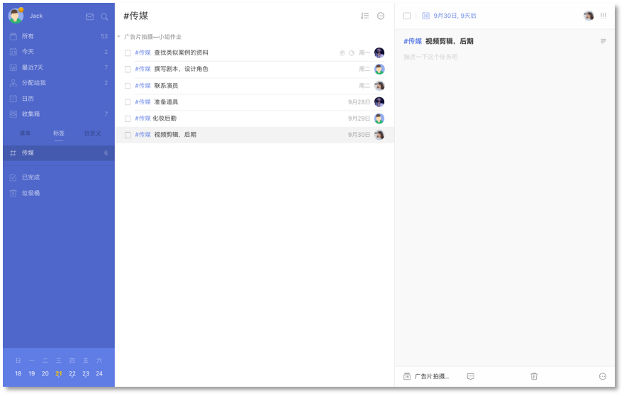

# 筛选

滴答清单支持您通过以下方式对自己的任务进行筛选。

####标签
您可以对任务设置不同的标签，标签选项卡显示在清单栏。
 有未完成任务的标签会显示在标签选项卡下，点击某个标签，带有该标签的任务将会汇总显示在中间的任务栏页面。

####优先级
您也可以通过优先级对任务进行筛选。
 对任务标注优先级，然后您可以在【今天】【明天】【最近七天】等智能清单中选择【按优先级排序】，从而筛选出重要程度高的任务。
 当您任务较多时，对任务标注优先级，会更好的帮助您分出任务的轻重缓急。
