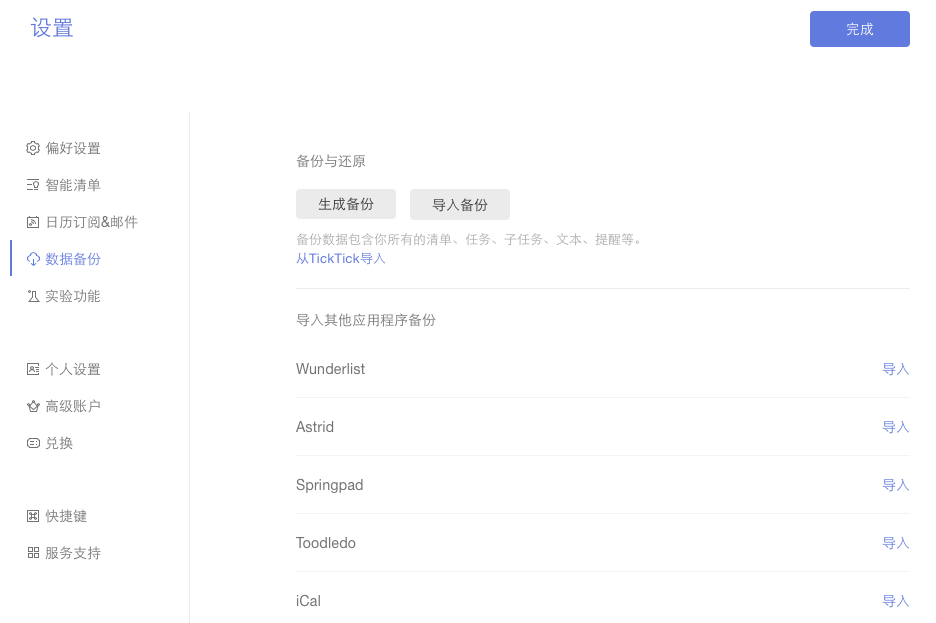

## 数据

####生成和导入备份
点击左上角头像-【设置】-【数据备份】。然后,点击【生成备份】按钮, 这样您就可以备份一个以csv为后缀的文件。

 如果你需要导入备份,您可以单击【导入备份】，再上传以csv为后缀的文件。

####从其他应用中导入任务信息（该部分转移到数据子目录）

滴答清单允许从其他应用内导入任务信息，比如奇妙清单、Toodledo等。
<br/ >点击左上角头像-【设置】-【数据备份】。然后选择对应的渠道（Wunderlist,Astrid,Toodledo等等 ）上传备份文件到滴答清单。

