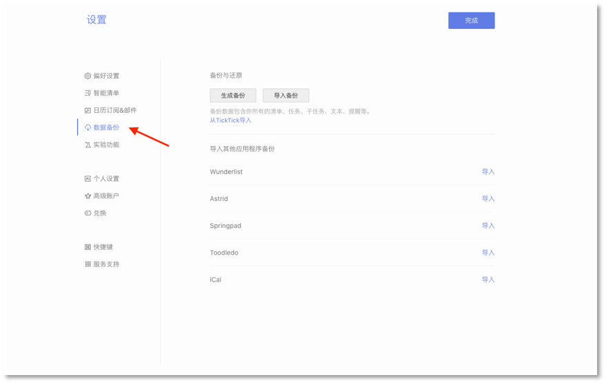

## 数据

####生成和导入备份
点击左上角头像-【设置】-【数据备份】。然后,点击【生成备份】按钮, 这样您就可以备份一个以csv为后缀的文件。
 如你需要导入备份,您可以单击【导入备份】，再上传以csv为后缀的文件。
 `注：若一天内备份次数过多，会提示“你今天已经备份过多次，请明天再试。”`

####从其他应用中导入任务信息

滴答清单可以从其他应用导入任务信息。
<br/ >点击左上角头像-【设置】-【数据备份】。然后选择对应的渠道（Wunderlist,Astrid,Toodledo等等 ）上传备份文件到滴答清单。

####账户迁移
 如果你是 TickTick 用户，现在准备转到滴答清单或已经开始使用滴答清单，可以进行数据迁移。

如何迁移？
 登陆网页版[滴答清单](http://www.dida365.com/)。迁移方式有两种：
 1. 自助迁移：打开[数据迁移页面](http://dida365.com/import/#ticktick), 输入 TickTick 用户名和密码，点击导入即可。
 2. 人工迁移：当自助迁移出现问题时，用您的注册邮箱发送邮件到support@dida365.com 提交申请，我们将会在一个工作日之内受理您的数据迁移请求。

*注：密码中带特殊字符会转移失败，所以建议在转移前如果密码带特殊字符的暂时更改一下密码，转移后再改回。*

高级账户如何迁移？
 滴答清单支持将 TickTick 账号下的数据（包括付款信息）导入到滴答清单账号内。
 如您是TickTick的高级账户，且为支付宝付款，则直接进行数据迁移即可。如您非支付宝付款，请用您的注册邮箱将您的滴答账户信息发送到我们的邮箱supprot@appest.com ，我们将为您进行人工迁移。

