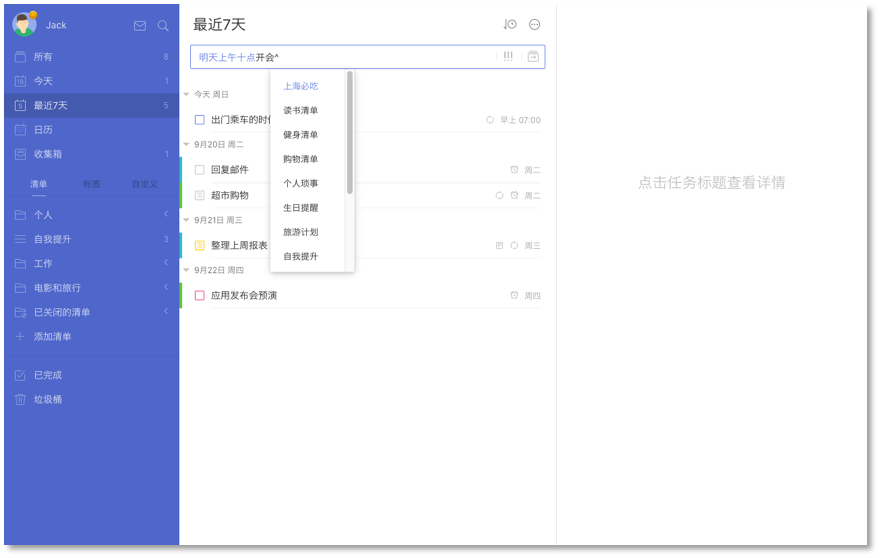
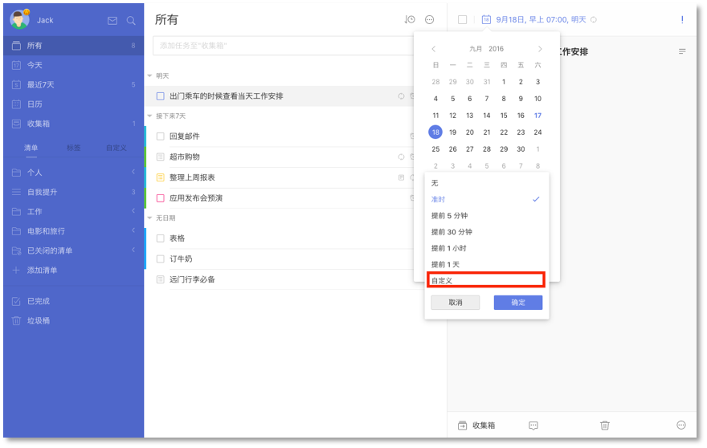
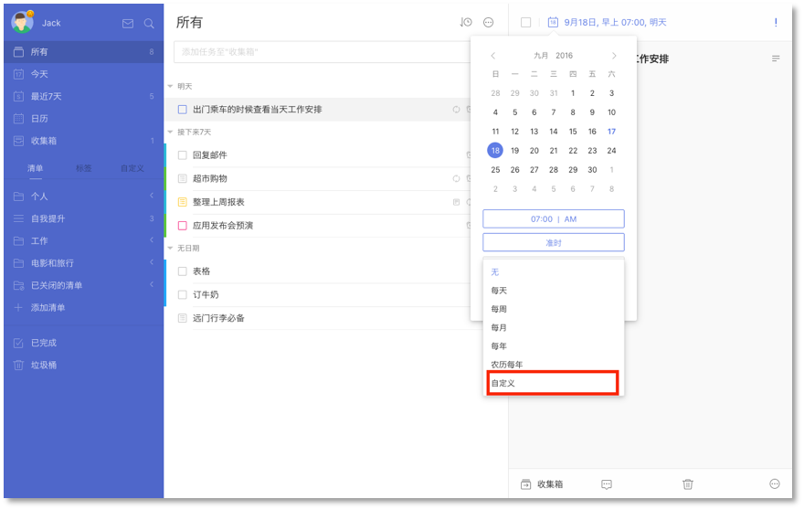
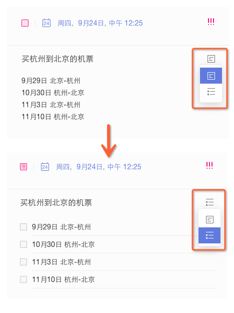
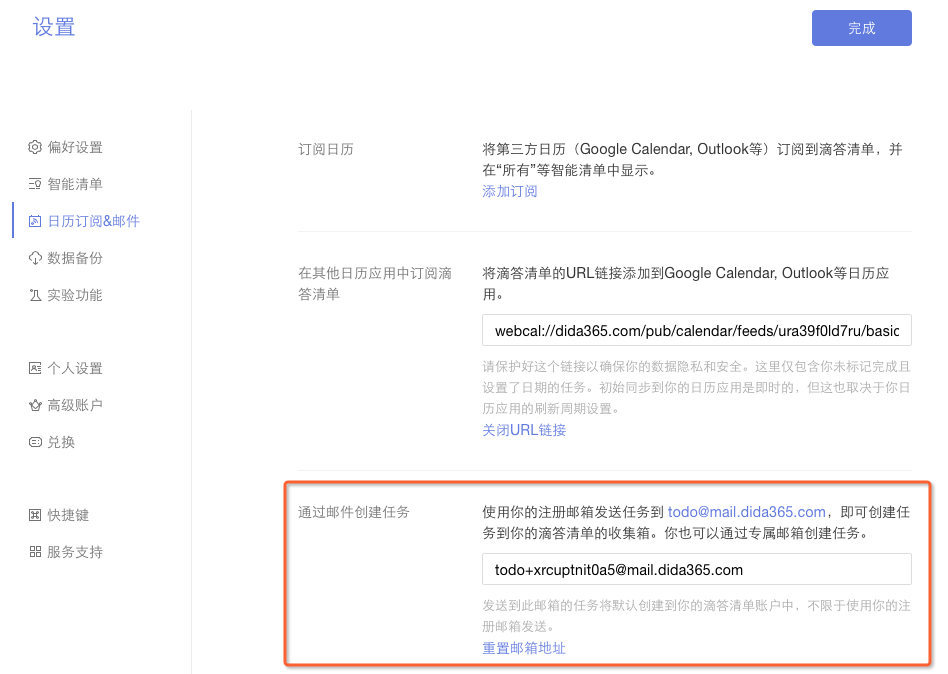
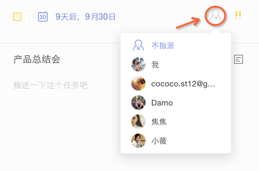
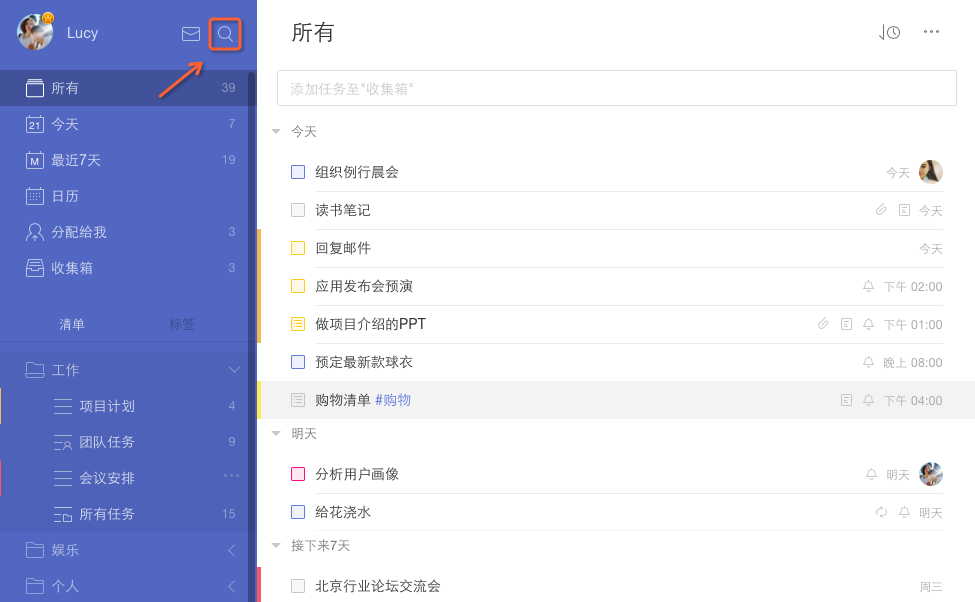

##任务创建以及管理

####创建新任务
在中间页面顶部的输入栏输入任务内容, 按回车键保存 ，即创建成功。
 任务会保存在选中的对应列表中； 若没有选中列表,则任务默认保存在【收集箱】中。
* 在输入栏内输入「^」，可以将任务添加到指定清单；
* 在输入栏内输入「*」，可以快速为添加的任务设置日期；
* 在输入栏内输入任务，文本中的日期和时间显示高亮，将自动为任务设定到期日和提醒时间。
  `注：进入【设置】-【偏好设置】即可开启自然语言识别。`
 `注：不想显示文本中的日期和时间，可在【设置】-【偏好设置】中选择隐藏。`

####设置提醒
创建了任务后，点击任务进入右侧详情页，点击到期时间，可以为任务设置提醒。
 担心一次提醒容易错过，可以设置两次或多次提醒。
 如果默认提醒中没有你需要的时间，可以点击【自定义】，支持以【分钟】【小时】【天】的时间单位进行提醒。

  `注：免费用户可为单条任务设置两次提醒，高级账户最多可设置五次提醒。`

####设置重复
如果你需要做一些按周期循环的事情，比如每月15号查看信用卡账单，可以创建重复任务。
 点击到期时间, 可以设置该任务为重复任务。
 支持「每天」、「每周」、「每月」、「每年」的间隔重复；点击自定义, 可以更为个性化的设置重复任务，如该任务是以到期日重复还是以实际完成日期重复。
  `注：到期重复：任务按日期重复，如每周三重复，与完成与否无关；`
  `注：完成重复：任务按周期重复，如每隔三天重复，任务完成后才会进入下一个循环。`

#做到这里！！
#### 创建列表任务
成功创建任务后，右侧任务详情界面，点击如图所示位置的列表，将文本模式转为列表模式。
  列表任务一般用来添加子任务如购物清单；或者是将大任务拆分成小任务或者具体步骤。

####设置任务优先级

选择一个任务,然后点击任务详细信息页面的右上角「!!!」图标。您可以设置【高】,【中】,【低】和【无优先级】。

####上传任务附件

先选定一个任务,在任务详细信息页面右下角，单击「···」,选择【附件上传】来为任务添加附件。
<br/ >支持照片，音频和经常使用的文件类型如word , excel等。

####添加评论
在右侧栏任务的详细界面, 点评论图标, 则可对该任务进行评论。
<br/ >若该任务是共享的任务, 则共享成员均能对此任务发表评论。而且你还可以直接@回复别人的评论，然后对方会在TickTick通知中心立刻收到提醒并可以直接去查看。

####给任务进行排序
【收集箱】以及所有您自己建立的清单都可以进行自定义排序, 日期排序, 字母排序和优先级排序。
 如果选择自定义排序, 则可以长按来拖动任务进行排序。【所有】、【今天】、【最近7天】等自定义清单目前暂不支持自定义排序。
 如果是共享的清单，还可以按照指派人来排序。

####通过邮件添加任务
除了直接在网页端添加任务, 你也可以通过邮件创建任务。
 点击左上角头像-【设置】-【日历订阅&邮件】, 查看系统为你自动生成的专属的邮件地址, 您只需要直接在邮件标题中将任务内容写入, 通过任意邮箱发送到该地址, 任务便会自动建立。
 
 点击重置, 会重新为您生成一个新的邮件地址。或者, 您可以使用您在滴答清单上注册的邮箱, 直接将任务发送至[todo@mail.dida365.com](todo@mail.dida365.com), 任务同样会自动生成。 您同时可以在邮件标题中加入时间如November 13th 来快速设定任务到期时间。

####指派任务给其他人
你只能在分享给他人的清单里指派任务。
 点击任务详情界面的指派图标，选择你要指派的对象或者是不指派给任何人。被指派者会在应用内收到通知。
 

####添加标签
给任务添加标签便于您更加快捷的管理同一类别的任务。
 标签列表是默认隐藏的, 因此您首先要将其设置为显示:左上角头像-【设置】-【智能清单】-启用【分类标签】。
 给任务添加列表只需要您在需要标注的词语或者字前加 「#」即可: 比如「#工作」，需要注意的是，标签「#XX」前后需要留有一个空格，方便系统识别。
 您可以给一个任务添加最多五个标签; 当点击标签时, 所有被打上该标签的任务都会显示出来。

 

####将任务打印出来
先选择一个任务,在右下角任务详细信息页面单击「···」,选择【打印】。在打印之前,您可以进行打印预览,来可以改变纸张大小,边距等。

####任务动态
任务动态功能目前仅限高级用户使用, 能够让您追踪到每一个任务的修改记录。
 首先, 在【实验功能】中启用【任务动态】。
 启用该功能后, 选择一个任务，点击页面右下角的「···」，再选择【任务详情】即可。

 

####搜索任务
【搜索】的图标在左侧面板的顶部。利用搜索功能，可以对任务进行全局搜索。

####任务进度
进入任务详情页，光标放在日期栏下划线处，日期栏会显示进度条百分比，单击即可设定。任务打钩完成时，进度条会向右侧自动跳满。

