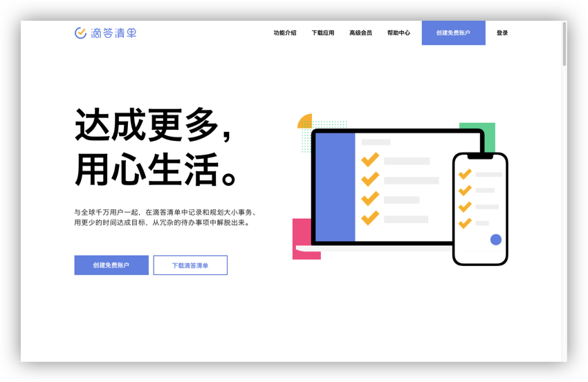

# Web 端

#### 欢迎使用 Web 端滴答清单。

页面右上角分别为：

* **功能介绍**：滴答清单的功能介绍；
* **下载应用**：滴答清单所有平台的客户端均可下载；
* **高级会员**：可以在此处了解高级帐号的独有功能；
* **帮助中心**：如果您在使用滴答清单过程中遇到困惑，请到此处寻找帮助。如果没有解决您的疑问，请至「帮助中心」-「反馈与建议」中进行反馈，或发邮件到 support@dida365.com。
* **登录**：已有滴答帐号，点此处登录帐号；
* **创建免费账户**：任何人均可在此处创建免费帐号。

