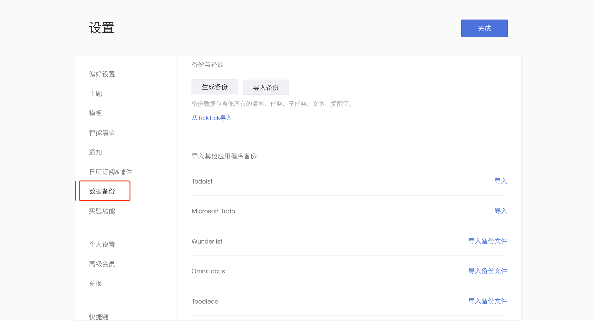

## 帐号数据迁移

### 生成和导入备份

点击左上角头像 -「设置」-「数据备份」。然后，点击「生成备份」按钮，这样您就可以备份一个以 .csv 为后缀的文件。  如您需要导入备份，您可以单击「导入备份」，再上传以 .csv 为后缀的文件即可。 

### 从其他应用中导入任务

若您希望将其他应用的任务移入滴答清单，可以点击左上角头像 -「设置」-「数据备份」。

然后选择对应的应用（Todoist，Microsoft Todo，Wunderlist，OmniFocus，Toodledo，iCal等）上传备份文件到滴答清单。

### 帐号迁移

如果您是 TickTick 用户，现在使用滴答清单，可以进行帐号迁移。 

迁移方式有两种：

* **自助迁移**：打开[数据迁移页面](http://dida365.com/import/#ticktick), 输入 TickTick 用户名和密码，点击导入即可。
* **人工迁移**：当自助迁移出现问题时，用您的注册邮箱发送邮件到support@dida365.com 提交申请，我们将会在一个工作日之内受理您的数据迁移请求。
   `注：如果密码中带特殊字符会迁移失败，所以建议在迁移前暂时更改一下密码。`

#### 高级帐号的迁移

滴答清单支持将 TickTick 高级帐号迁移到滴答清单，若您是 TickTick 的高级帐号，且高级帐号未到期，则迁移到滴答清单后，依然享有高级帐号权限。

* 1.支付宝付款的TickTick高级帐号，直接进行数据迁移即可，高级帐号会迁移到滴答清单。
* 2.如您非支付宝付款，请用您的注册邮箱将 TickTick 帐号信息、滴答帐号信息以及支付信息发送到我们的邮箱 supprot@dida365.com ，我们将为您进行人工迁移。

