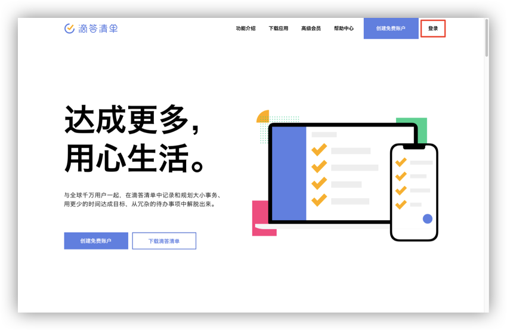
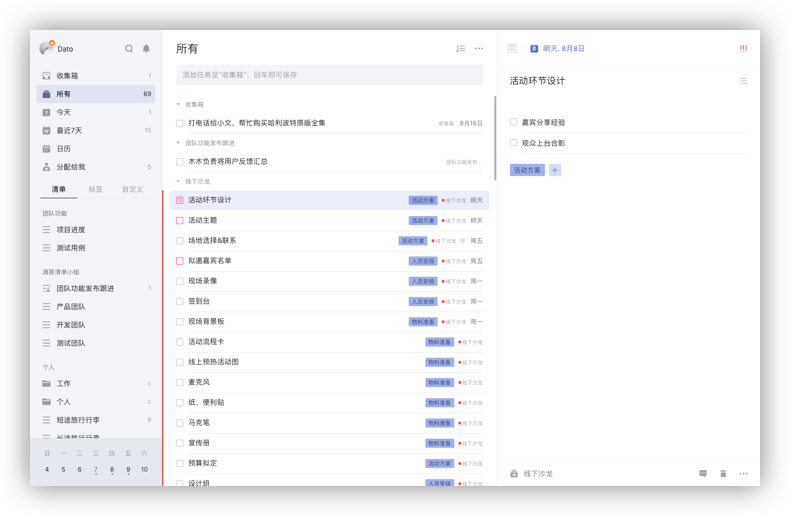
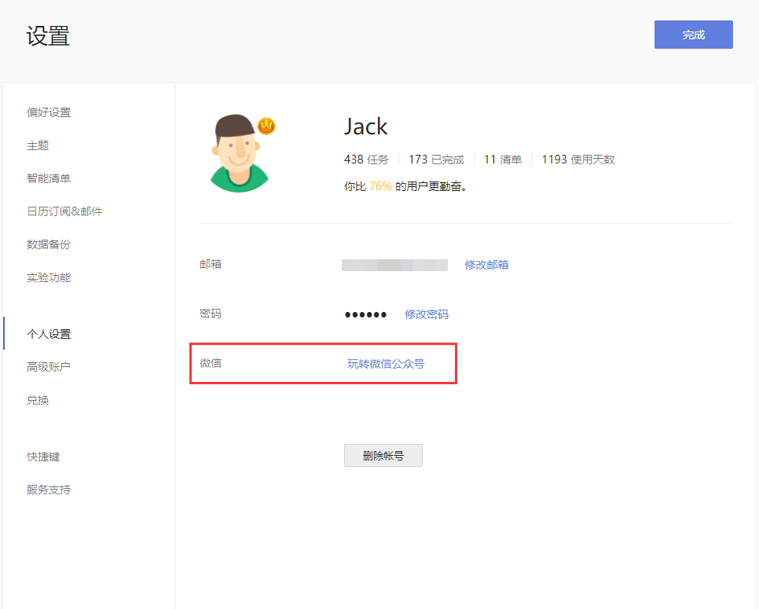
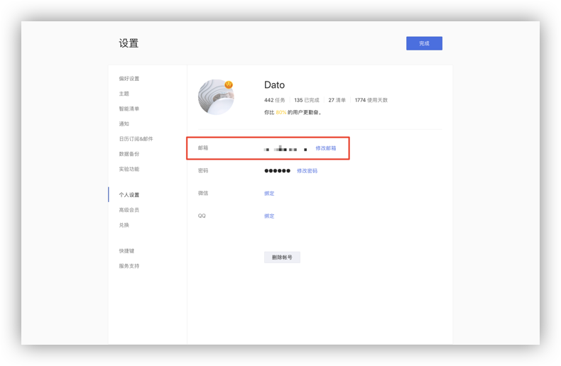
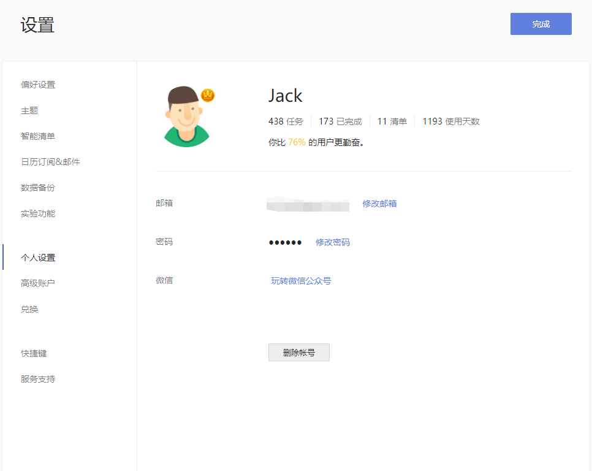

## 帐号

### 注册和登录

若您还没有注册滴答清单帐号，您可以在[滴答清单](https://dida365.com)创建免费账户，点击网页右上角的「创建免费账户」，即可立即创建。

若您已有滴答清单帐号，可以从[滴答清单](https://dida365.com)登陆网页版。

进入滴答清单网站，点击右上角「登录」，即可登录到您的滴答账号。

当您成功登录后, 会看到如下这样界面：

* 左侧边栏, 您可以看到所有清单（包括智能清单、普通清单和自定义智能清单）和标签; 
* 中间是任务列表页, 显示选中清单的所有任务; 
* 右侧是任务详情页，显示选中任务的详情，也可以对任务进行多种操作。

### 绑定账户

若您使用手机号/邮箱注册滴答清单账号，可以将滴答账号绑定您的微信/QQ。

绑定后，您就可以使用微信/QQ账号免密码登录滴答清单，也可以使用微信公众号的服务，在微信中创建和查询任务。

**绑定方法**：
点击左上角头像-「设置」-「个人设置」-「微信」/「QQ」，按提示绑定微信/QQ即可。

 若您使用微信/QQ账号注册滴答清单，可以绑定手机号/邮箱，能够通过邮箱创建任务。
 绑定方法：点击左上角头像-「设置」-「个人设置」，点击「邮箱」，输入邮箱地址并点击「发送验证码」，滴答会发送验证码到要绑定的邮箱，正确输入验证码和密码即可绑定成功。

 若您使用微博账号登陆滴答清单，也可以绑定您的手机号、邮箱、微信和QQ，绑定方法同上。  `注：非微博账号登陆的用户，无法绑定微博账号。`

### 退出登录

如果你需要退出登录，点击头像，选择「退出登录」即可。

### 免费帐户

通过以上方式注册的滴答账户均为免费账户，任何人都可以免费创建滴答清单帐户。  免费帐户可以使用这篇指南中介绍的所有核心功能和更多其他功能。

### 高级帐户

滴答清单高级帐户有诸多专享功能，能帮你更好的使用滴答清单，支持按月订购和按年订购。  要了解滴答清单高级帐户专享功能详情，请访问[滴答清单高级帐户页面](https://www.dida365.com/about/upgrade)。

### 忘记密码

如果您忘记了登录密码，在登录页面中点击登录框下方的[忘记密码](https://www.dida365.com/sign/requestRestPassword)进行密码重置。

在打开的网页中输入你的注册手机号或邮箱，点击重置密码。  去手机短信查收验证码或去注册邮箱查收重置密码链接，按照指示重新设置密码即可。

### 个人设置
点击左上角头像, 选择「设置」-「个人设置」，可以对账户进行设置。在这里还能看到你在滴答清单上的使用情况。

* 点击头像可以上传一个新头像，上传时可以选择缩放头像大小；

* 点击昵称可以直接输入新的昵称；

* 点击邮箱地址旁的「修改邮箱」修改邮箱地址，修改之后需要到新邮箱地址验证邮箱，若邮箱未验证，邮箱后面会显示警告图标；

* 点击密码旁的「修改密码」，即可修改密码；

* 滑动到底，点击「删除账户」即可删除账户。
 `注：从滴答清单删除帐户将删除所有数据,为防止误操作,会要求您输入密码进行确认。并会邀请您手动勾选“我已经明确删除账号后我的全部数据将删除”和“我确认要删账号”，进行确认后方能继续操作 。`

