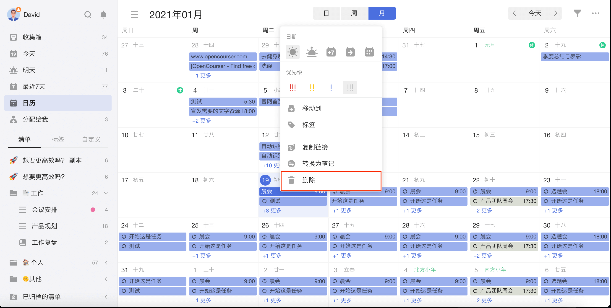
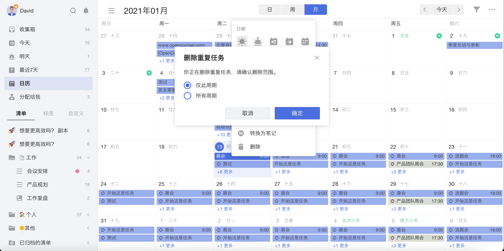
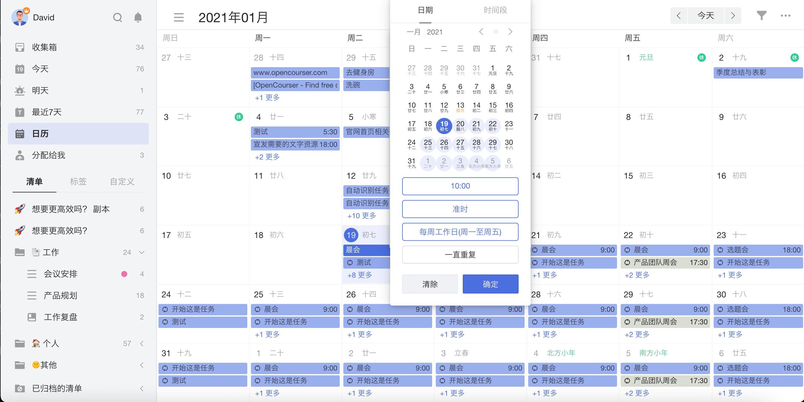
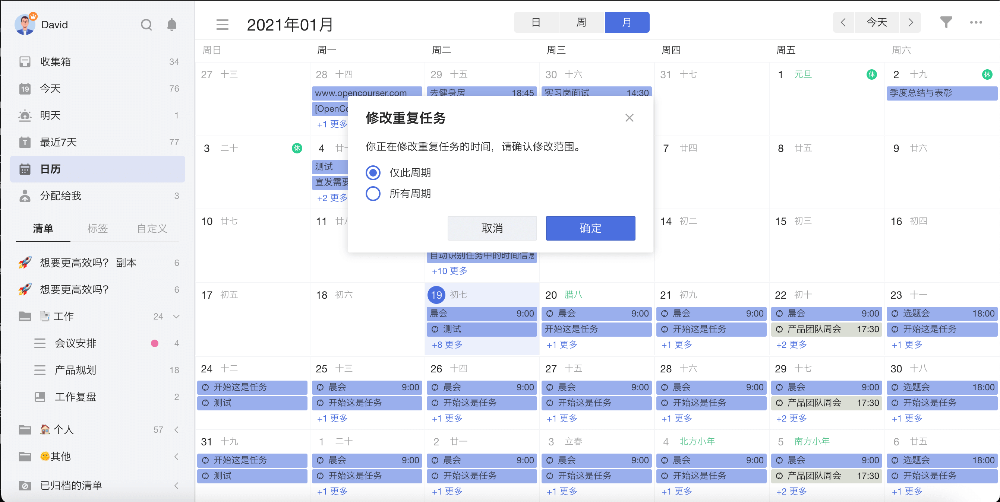

### 修改单个周期

在日历视图上，开启「显示所有重复周期」后，可以对当前的重复任务周期，或未来的某个重复周期进行删除或修改时间设置。
右键点击需要删除的重复任务周期，选择「删除」，即会弹窗询问删除范围。
您可以选择「仅此周期」，或「所有周期」。

右键点击任务，在菜单中点击「日期」图标，打开时间与提醒设置窗口，修改时间或日期后点击右下角的「确定」按钮，即会弹窗询问修改范围。
您可以选择「仅此周期」，或「所有周期」。

